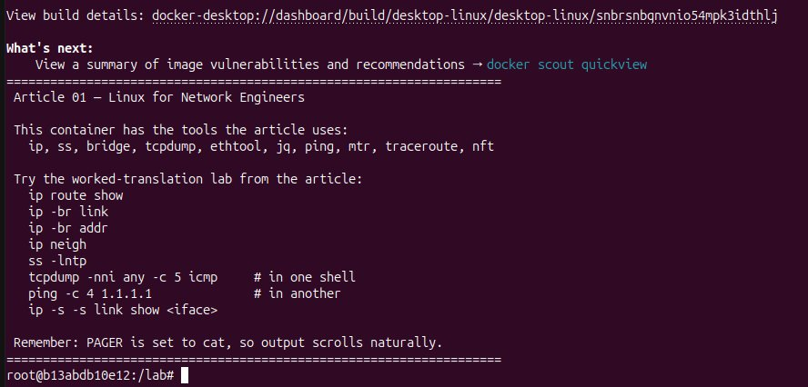
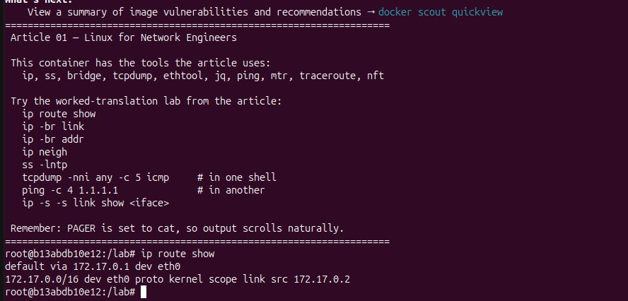
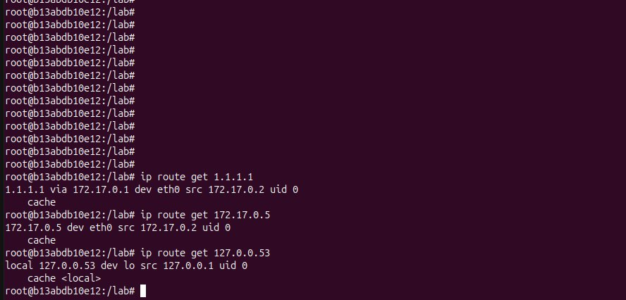
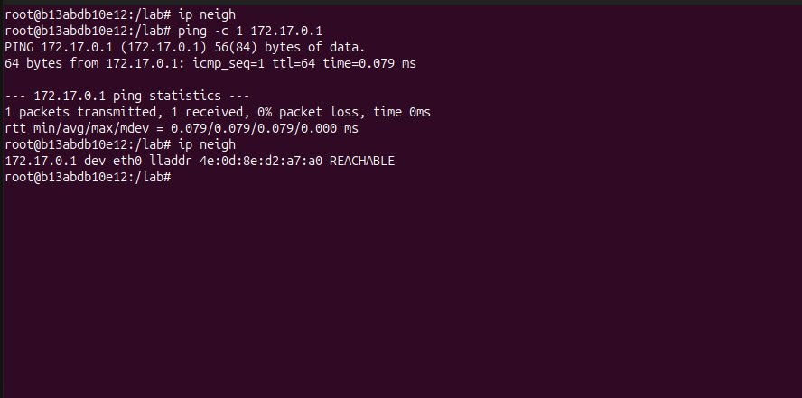

# Lab A01 — Read a Linux Box

Pairs with: [Article 1 — Linux for Network Engineers](../../wiki/article-01-linux-for-network-engineers.md)

## What this lab teaches

Observation, not construction. By the end you should be able to walk into any Linux host and find your bearings with the same handful of commands you've used to find your bearings on a router for the last fifteen years. The lab exercises every row of [Article 1's translation table](../../wiki/article-01-draft.md#the-translation-table) at least once, on a real Linux box, with output you can read.

The walk-through deliberately keeps to one network interface and never builds a topology. Topology building is Article 2's lab.

## Prerequisites

- Docker (or another OCI container runtime) installed and functional. The [Docker Desktop docs](https://docs.docker.com/desktop/) cover GUI install on macOS/Windows; on Linux follow the engine install for your distro.
- Comfortable enough at the shell to copy commands, read output, and start a second terminal.
- About 30 minutes the first time, 10 minutes on repeats.

If you prefer Docker Desktop's GUI, you can navigate to **Builds → Import builds**, select the Dockerfile from this lab, and use the build pane instead of `docker build`. The commands below assume a Linux/macOS CLI.

## The setup

The container source is in [`containers/article-01/`](../../containers/article-01/) at the repo root. Build it once, then run it interactively:

```bash
docker build -t netmod/article-01 containers/article-01
docker run -it --rm \
  --cap-add=NET_ADMIN \
  --cap-add=NET_RAW \
  --name article-01 \
  netmod/article-01
```

`NET_ADMIN` lets you configure interfaces and routes; `NET_RAW` lets `tcpdump` open packet sockets. Both apply only inside the container's own network namespace — your host's networking is untouched. The container runs as root so you can skip `sudo` on every command.

You should now have a `root@...:/lab#` prompt with the MOTD listing the commands below. Everything from here runs inside that prompt.

> **Assumption: default Docker networking.** The walk-through hardcodes `172.17.0.0/16` for the bridge subnet and `172.17.0.1` for the gateway, which are Docker's out-of-the-box defaults for the `bridge` network. If you have customised Docker (`bip` in `/etc/docker/daemon.json`, Docker Desktop with a remapped subnet, a corporate-VPN collision that forced you off `172.17.0.0/16`, or you ran the container on a user-defined network), your numbers will differ. Confirm yours with the first two commands of the lab:
>
> ```bash
> ip -br addr show dev eth0    # your address and prefix
> ip route show                # the "default via X" line gives your gateway
> ```
>
> Substitute those two values wherever the rest of the lab uses `172.17.0.0/16` or `172.17.0.1`. Every other command in the lab is independent of the subnet choice.



## The exercise

### Read the routing table

The first question on a router is always "what does this box know how to reach." Same question on Linux:

```bash
ip route show
```

In a default Docker run, you will see two lines: a default route via the Docker bridge gateway (typically `172.17.0.1`) on `eth0`, plus the connected route for the bridge subnet (the `/16` you are attached to). That is the entire routing table this box has, and reading it is the same act as reading a router's, just shorter.



Walk each field of the output. The first token is the destination prefix (`default` is the kernel's name for `0.0.0.0/0`). `via X` is the next-hop. `dev Y` is the egress interface. `proto Z` is the **who installed this route** field — values you will see in the wild include `kernel` (autoconfigured from an address), `static` (an admin typed `ip route add`), `dhcp` (a DHCP client wrote it), `bgp` / `ospf` / `isis` (a routing daemon installed it). That field has no IOS equivalent; it is genuinely new vocabulary worth pinning down now.

Ask the kernel which route it would actually use for specific destinations:

```bash
ip route get 1.1.1.1
ip route get 172.17.0.5
ip route get 127.0.0.53
```

Each call returns the winning route, the egress interface, the source IP the kernel would pick, and a `uid` that tells you which process credential context the lookup happened in. This is the closest equivalent to `show ip cef <prefix>` on IOS — it tells you what *will* happen, not what's *in the table*.



Now look at every routing table, not just `main`:

```bash
ip rule show
ip route show table local
ip route show table 100
```

`ip rule show` lists the policy-routing rule database. Three default rules: priority `0` "match all, look in table `local`"; priority `32766` "look in `main`"; priority `32767` "look in `default`." Linux always consults three tables in this order, and what you usually call "the routing table" is just table `main`. Table `local` holds the kernel's automatically-installed routes for the box's own IPs (broadcast routes, host routes for assigned addresses) — read it once and you will recognise the shape forever after. Table `100` returns `Error: ipv4: FIB table does not exist.` because no one has installed a route into it yet — Linux creates tables lazily, on first use. The error is the kernel telling you the truth, not a bug.


### List interfaces and addresses

```bash
ip -br link
ip -br addr
```

The brief output is one row per interface: name, state, MAC for `link`; name, state, address list for `addr`. This is your `show ip interface brief`, and it scales — on a real box with sixty interfaces it stays readable.

You will see more than two interfaces in the container. `lo` and `eth0` are the ones you care about — `lo` is the always-present loopback and `eth0` is the namespaced veth end the Docker bridge attached. The rest (`tunl0`, `gre0`, `gretap0`, `erspan0`, `ip_vti0`, `ip6_vti0`, `sit0`, `ip6tnl0`, `ip6gre0`) are pseudo-interfaces the kernel registers when their tunnel modules load. They are all `DOWN`, carry no addresses, and exist as a side-effect of having a fully-featured kernel. The `ip -br addr` view filters them out visually because they have no addresses to display under them. Skip past them; the only interface doing real work here is `eth0`.


For details on a specific interface, drop the brief flag and add `-d` (detailed):

```bash
ip -d link show eth0
```

The detailed view shows interface type (`veth` for the Docker side of the bridge attachment — the container is the namespaced end of a veth pair), MTU, MAC, queue counts, GSO/GRO settings, and the link-netns the other end of the veth lives in. Most of this matters more on hardware NICs than on veths, but you can see the shape.


Same for addresses, with a peek at scope and lifetime:

```bash
ip addr show dev eth0
```

Note the `valid_lft forever preferred_lft forever` on the address — that means the address is statically assigned with no DHCP lease timer. On a DHCP-assigned interface you would see real numbers ticking down.


### Add and remove an address

The point of this exercise is to feel how immediate Linux's running state is. There is no config mode, no commit, no `wr mem` — the command takes effect when you press Return, and it disappears at reboot unless persisted.

```bash
ip addr add 192.0.2.1/24 dev lo
ip -br addr show dev lo
```

You just added an address from the documentation-reserved `TEST-NET-1` block to the loopback. Confirm with `ip route get 192.0.2.99` — the kernel will tell you it would source from `192.0.2.1` via `lo`. Now take it back:

```bash
ip addr del 192.0.2.1/24 dev lo
ip -br addr show dev lo
```

Gone. No persistence work was done; the kernel never wrote anything to disk; the address was a property of the running kernel for the lifetime of those two commands. This is the operating model Linux gives you everywhere — `ip` and `nft` are imperative against running state, and Article 4 covers how to make the state stick.


### Read and manipulate the neighbor table

The ARP table (and its IPv6 sibling, NDP) lives in `ip neigh`:

```bash
ip neigh
```

Probably empty on a fresh container — you haven't talked to anyone yet. Generate a conversation:

```bash
ping -c 1 172.17.0.1
ip neigh
```

You now have one entry: the Docker bridge gateway, in state `REACHABLE`. Wait sixty seconds without sending more traffic to it and re-read; the state transitions to `STALE`. Wait longer or actively contradict (`ip neigh flush dev eth0` plus a ping to a non-existent address) and you can see `FAILED`. Each state has a meaning the kernel uses to decide whether to re-ARP before sending a frame.



Force the table empty and re-populate:

```bash
ip neigh flush dev eth0
ip neigh
ping -c 1 172.17.0.1
ip neigh
```

You can also install a static entry directly, the equivalent of IOS `arp 10.0.0.5 0011.2233.4455 ARPA`:

```bash
ip neigh add 172.17.99.99 lladdr 00:11:22:33:44:55 dev eth0
ip neigh
ip neigh del 172.17.99.99 dev eth0
```

The added entry shows up as `PERMANENT`. Useful when you need to override learning, debug "is this MAC reaching us at all" cases, or work around a broken next-hop that won't answer ARP.

### Add and remove a static route

Same operating model, applied to the routing table. The container's only route to the outside world goes through the Docker bridge gateway; install a more-specific static route to a documentation prefix and watch `ip route get` follow it:

```bash
ip route add 198.51.100.0/24 via 172.17.0.1 dev eth0 proto static
ip route show
ip route get 198.51.100.42
```

The route appears in `ip route show` with `proto static`, distinguishing it from the kernel-installed connected route and the gateway-installed default. The `ip route get` call resolves through it. `proto static` is the closest thing Linux has to the `S` source character in `show ip route` on IOS.

Replace it atomically:

```bash
ip route replace 198.51.100.0/24 via 172.17.0.1 dev eth0 proto static mtu 1400
ip route show 198.51.100.0/24
```

The route is updated in place; you still see one entry for `198.51.100.0/24`, now with `mtu 1400` attached. `ip route replace` is one of the few commands worth memorising for its semantics: it adds if absent, updates if present, and does so without the brief gap a `del`+`add` pair would create on a busy box. The IOS equivalent is "two commands and a hope."


There is a sharp gotcha worth pinning here, because it surprises engineers coming from any vendor CLI. The kernel keys routes by **`(destination, table, metric, tos)`** — those four fields together are the route's *identity*. Everything else (`via`, `dev`, `mtu`, `proto`, `cwnd`, `rtt`, and so on) is an *attribute* of that identity. So `ip route replace` updates attributes; it does not let you reach in and rewrite the key. Try to "replace" with a different metric and you do not get a replacement — you get a second route alongside the first, because as far as the kernel is concerned you asked for a route that did not exist yet. If you want to change a metric, you `del` the old and `add` the new. The lesson is the same one every Linux primitive teaches: the kernel does exactly what you ask, the surprise is always in the model.

Take it back:

```bash
ip route del 198.51.100.0/24
ip route show
```

You are back to the two-line table you started with.

### Break it and put it back

Next, we're going to break the default route, verify it is broken, then put it back and verify the fix. This is just to see the behavior.

Record what the default route looks like so you can put it back exactly:

```bash
ip route show default
```

Capture the gateway from that output (the `via` value) — you'll need it in a moment. Then delete it:

```bash
ip route del default
ip route show
ping -c 2 -W 1 1.1.1.1
```

The routing table now shows only the connected route for the bridge subnet. The ping fails immediately with `Network is unreachable` because there doesn't exist a route so the kernel doesn't send it into a black hole.

Put the default route back. Substitute the gateway you captured above for `172.17.0.1` if yours differs:

```bash
ip route add default via 172.17.0.1 dev eth0
ip route show
ping -c 2 1.1.1.1
```

Two lines back, ping works again. 

### Read an `nftables` ruleset

The article describes the `nftables` shape — table → chain → rule, attached to a kernel hook — and tells you depth is Article 4. The point of this section is recognition only: see an empty ruleset on a real box, build the minimal three-level example from the article, watch it take effect immediately, and remove it. Same operating model as `ip addr add` / `del`; different layer of the stack.

A fresh container has no firewall configured:

```bash
nft list ruleset
```

Empty output. That is itself diagnostic — it tells you nothing is filtering packets on this box. On a production Linux host you'd see whatever `firewalld`, `ufw`, or the local admin loaded; here you start from zero, which is the right place to see the structure.

Build the article's minimal example, one piece at a time so you feel the layering:

```bash
nft add table inet filter
nft list ruleset
nft 'add chain inet filter input { type filter hook input priority 0; policy drop; }'
nft list ruleset
nft add rule inet filter input ct state established,related counter accept
nft add rule inet filter input iif lo counter accept
nft add rule inet filter input ip saddr 172.17.0.0/16 tcp dport 22 counter accept
nft list ruleset
```

The final `list ruleset` shows the exact text block the article walked you through. **Read it top to bottom like an ACL with named sections.** `table inet filter` is the container; `chain input` attaches to the `input` hook with policy `drop` (implicit deny); the three rules are the reflexive stateful permit, the loopback exception, and the management-subnet SSH permit. `ct` is connection tracking, `iif` is incoming interface. The `counter` keyword on each rule is what lets you prove which rule matched: `nft list ruleset` prints `packets N bytes M` next to any rule that carries one, and the numbers tick up in place as traffic hits.

Now confirm the firewall is doing something. The `input` hook only sees packets destined to this box, so generate one:

```bash
ping -c 1 127.0.0.1
nft list ruleset
```

The ping works, and the `iif lo` rule's counter has gone from zero to `packets 1 bytes 84` (one ICMP echo reply on `lo`). The other two rules are still zero. That is your proof of match — no guessing which rule fired.


Now try a destination on `eth0`:

```bash
ping -c 1 -W 1 172.17.0.1
nft list ruleset
```

The outbound ICMP echo leaves on `eth0`; the reply lands on the `input` hook and is matched by `ct state established,related counter accept` (the conntrack entry remembers the outbound). That rule's counter has gone up by one; `iif lo` is unchanged. If the `ct state` rule weren't there, the reply would fall through to `policy drop` and the ping would fail. This functions like a stateful firewall and not stateless ACLs that require bidirectional pairs.


If you want a clean read per test, `nft reset counters` zeroes them in place without touching the rules. Logging a matched packet to the kernel journal — the IOS-ACL `log` equivalent — is an Article 4 topic; counters are enough proof of match for the recognition-level work this lab is doing.

Tear it all down:

```bash
nft flush ruleset
nft list ruleset
```

Gone. The ruleset was kernel state for the lifetime of those commands; nothing was written to disk. The same "running kernel as source of truth" model you felt with `ip addr add` / `del` applies here, and Article 4 covers `/etc/nftables.conf` for making it stick.

### List sockets

The Linux equivalent of "what services does this box expose" is `ss`:

```bash
ss -lntp
```

For the options, `l` is "listening", `n` is "numeric only", `t` is tcp, and `p` is process name. In a fresh container this is empty: no service is listening. That is itself diagnostic — it confirms the box offers nothing on TCP — but to make the section screenshot-worthy, start a listener:

```bash
nc -l -p 8080 &
ss -lntp
```

You will see TCP `*:8080` in `LISTEN`, owned by `nc`. The `p` flag attached the process name. The `*` in the address column means the listener accepted on all addresses; bind to a specific one and you would see it here. Established connections come from `ss -tnp`:

```bash
ss -tnp
```

Empty unless something is talking. Try the rich filter language `ss` ships with — this is the feature that earns it its keep over `netstat`:

```bash
ss -ltn state listening 'sport = :8080'
```

The filter syntax lives in `ss(8)` and is worth ten minutes of reading. It supports `state X`, `dport`, `sport`, `dst`, `src`, and boolean combinations with `and` / `or`, all evaluated in-kernel rather than on a scrape of `/proc`. On a busy host the difference is real.

Clean up the listener when you're done with the section:

```bash
kill %1
ss -lntp
```


### Capture some packets

You need two shells inside the container. Open a second one from your host:

```bash
docker exec -it article-01 bash
```

In the second shell, start a basic capture:

```bash
tcpdump -nni any -c 10 icmp
```

In the first shell, generate traffic:

```bash
ping -c 4 1.1.1.1
```

The capture window shows four request/reply pairs. The interface name in the `tcpdump` output tells you which interface the kernel chose for each direction — which is your `traceroute` of the local forwarding decision, basically.


Re-run the capture with `-e` to see link-layer headers:

```bash
tcpdump -nni any -e -c 10 icmp
```

Source and destination MACs become visible alongside the IP fields. That flag is the one you reach for the moment a layer-2 problem looks plausible — duplicate MACs, a port stuck on the wrong VLAN, an unexpected device in the path.

Write a capture to disk and read it back:

```bash
tcpdump -nni any -c 20 -w /tmp/icmp.pcap icmp &
ping -c 5 1.1.1.1
wait %1
tcpdump -nnr /tmp/icmp.pcap
```

The `-w` writes pcap-format; `-r` reads it back. `pcap` files open directly in Wireshark — the convention everywhere reaches `tcpdump -w` and then a richer tool from there.

Drive the BPF filter syntax a little harder. Capture only ICMP echo *requests*, not replies:

```bash
tcpdump -nni any -c 5 'icmp[icmptype] == icmp-echo'
```

That filter syntax is the same one Wireshark uses in its display filters, and the same one a thousand engineering tickets you have seen begin with. Internalise it; you will reach for it for the rest of your career.

### Reachability — `ping`, `traceroute`, `mtr`

Three tools, one job: prove the network believes it can deliver to a destination, and find out where it doesn't.

`ping` you know:

```bash
ping -c 4 1.1.1.1
```

> **If outbound ICMP is blocked on your network** — common on corporate laptops, guest wifi, and behind some VPN profiles — `ping 1.1.1.1` will hang or fail and the rest of this section is uninteresting. Confirm egress works at all with `curl -sS https://1.1.1.1 -o /dev/null && echo ok`; if that prints `ok`, your egress is fine and only ICMP is blocked. Substitute a TCP-based reachability check (`curl -v https://1.1.1.1`) wherever this section uses `ping`.

`traceroute` does the same TTL-walk trick you have used for years:

```bash
traceroute -n 1.1.1.1
```

`mtr` runs traceroute repeatedly and aggregates loss and latency per hop into one continuous view. It is closer to how a network engineer actually wants to read path data:

```bash
mtr -nrwc 10 1.1.1.1
```

`-n` no DNS, `-r` report mode (exit after the run), `-w` wide output, `-c 10` ten cycles. Read the resulting table column-wise: hop number, address, loss%, packets sent, last/avg/best/worst latency. Loss in the middle of the path with no loss at the destination is usually a hop-level ICMP rate limit; loss at the destination means real loss. Network engineers reach for `mtr` first more often than they reach for `ping` because of this.

### Counters in depth

```bash
ip -s link show dev eth0
```

After the work you have done above, the TX and RX packet counts on `eth0` will have moved well into the hundreds. This is the equivalent of `show interfaces | include packets`. Run it before and after a known workload and you can see what each interface actually did.

Double the `-s` for drop categorisation:

```bash
ip -s -s link show dev eth0
```

The expanded view splits TX errors by cause (carrier, fifo, collisions, window) and RX errors the same way. On a misbehaving NIC that is what tells you which subsystem to chase.


`ethtool -S` goes deeper, into NIC-internal stats:

```bash
ethtool -S eth0
```

Driver-specific names, so the exact set varies, but on a real NIC this is where ring-buffer drops, checksum-offload counters, and per-queue statistics live. In the container the underlying driver is `veth`, so most lines are zero (you will see lots of `rx_queue_0_xdp_*` and `rx_pp_*` family counters at zero) — but the shape is the same as what you get on a real box, and that is worth seeing once.


### Structured output and `jq`

The single most consequential difference between iproute2 and a router CLI is that every command can emit JSON. The implications run through every later article in the series; this is where you internalise the pattern.

```bash
ip -j addr show | jq
```

The whole address tree as a JSON array. Filter to a single interface's first address:

```bash
ip -j addr show dev eth0 | jq '.[0].addr_info[0].local'
```

Pull the routing table as a list of next-hop tuples:

```bash
ip -j route show | jq '.[] | {dst, gateway, dev, proto}'
```

Find every interface whose name starts with `e`:

```bash
ip -j link show | jq '.[] | select(.ifname | startswith("e")) | .ifname'
```

These one-liners replace what used to be hundred-line screen-scraping scripts on a router. From Article 6 onward the series leans on this pattern constantly — every tool that talks to a Linux box prefers to read JSON from `ip`, `bridge`, `ss`, `nft`, `networkctl`, and friends.

## Verification

You've done the lab successfully if you can:

- Read the four-field shape of an `ip route show` entry (destination / via / dev / proto) without looking it up.
- Predict what `ip route get <addr>` will return before you run it.
- Reach for `ip -br link` and `ip -br addr` without thinking about which is which.
- Capture traffic with `tcpdump` using the five flags worth memorizing (`-i any`, `-w`, `-nn`, `-c`, `-e`).
- Delete and restore the default route without panicking, and describe why your shell didn't drop.
- Read an `nftables` ruleset top-to-bottom and name each level (table / chain / rule) without looking it up.
- Write a one-liner that pipes `ip -j` output through `jq` to answer a specific question.

## Automated tests

Each section of this lab has a corresponding test script in [`tests/`](./tests/). The scripts are self-contained: they set up any required state, check it, and restore everything on exit. Run them at any point while the container is up — they don't conflict with each other and they don't leave lasting changes.

Mount the `tests/` directory into the container and run any script by number:

```bash
docker run -it --rm \
  --cap-add=NET_ADMIN \
  --cap-add=NET_RAW \
  -v "$(pwd)/labs/lab-a01-translation/tests:/lab/tests:ro" \
  netmod/article-01 \
  /lab/tests/test.sh 1
```

Or list all available parts:

```bash
/lab/tests/test.sh
```

| # | Section | What the script checks |
|---|---------|------------------------|
| 1 | Routing table | Default route, connected route, `ip rule` priorities, table local, table 100 absent |
| 2 | Interfaces | `lo` and `eth0` present and UP, IPv4 address, MTU, veth type, `valid_lft forever` |
| 3 | Address lifecycle | `ip addr add` assigns address, `ip route get` resolves through it, `ip addr del` removes it |
| 4 | Neighbor table | Flush empties table, ping populates REACHABLE entry, static PERMANENT entry add/del |
| 5 | Static routes | Add `198.51.100.0/24`, verify proto static, `ip route replace` updates in place without duplicates, delete |
| 6 | Break and restore | Deletes default route (confirms unreachable), restores it (confirms reachable) — always exercises both states |
| 7 | nftables | Builds the three-rule example, verifies `iif lo` and `ct state` counters increment, flushes |
| 8 | Sockets | `nc` listener on 8080, `ss` basic and filter syntax, socket gone after kill |
| 9 | tcpdump | Live ICMP capture, `-w`/`-r` pcap round-trip, BPF echo-request-only filter |
| 10 | Reachability | `ping` loopback/gateway/external, `mtr` report mode |
| 11 | Counters | `ip -s link` RX/TX non-zero, `-s -s` extended breakdown, `ethtool -S` |
| 12 | JSON / jq | `ip -j` returns valid JSON, single-address extraction, route tuple filter, name-prefix select |

### Fault injection

Tests 3, 5, and 7 accept `--inject-fault` to deliberately break a precondition and show what the failure output looks like:

```bash
/lab/tests/test.sh 3 --inject-fault   # skip ip addr add → address-absent failures
/lab/tests/test.sh 5 --inject-fault   # skip ip route add → route-absent failures
/lab/tests/test.sh 7 --inject-fault   # install policy-drop without ct state rule first
```

Test 6 always exercises both the broken and the fixed state — no flag needed.

## Cleanup

In each shell:

```bash
exit
```

`--rm` on the original `docker run` cleans up the container when the **first** shell (the one launched by `docker run`) exits — that's the shell whose PID 1 owns the container's lifetime. If you opened the second shell via `docker exec` and exit *that* one first, the container keeps running until you exit the original `docker run` shell too. Nothing persists once it's gone. Run the container again whenever you want to repeat the exercises; the output will be identical because the starting state is identical.

About forty-five distinct commands, two shells, one container, and nothing touched on your host's networking.

## Further reading

- [`ip(8)`](https://man7.org/linux/man-pages/man8/ip.8.html) — the iproute2 entry point
- [`ip-route(8)`](https://man7.org/linux/man-pages/man8/ip-route.8.html), [`ip-rule(8)`](https://man7.org/linux/man-pages/man8/ip-rule.8.html), [`ip-neighbour(8)`](https://man7.org/linux/man-pages/man8/ip-neighbour.8.html)
- [`ss(8)`](https://man7.org/linux/man-pages/man8/ss.8.html) — modern `netstat` replacement
- [`tcpdump(8)`](https://man7.org/linux/man-pages/man8/tcpdump.8.html) and [`pcap-filter(7)`](https://man7.org/linux/man-pages/man7/pcap-filter.7.html) — BPF filter syntax
- [`ethtool(8)`](https://man7.org/linux/man-pages/man8/ethtool.8.html) — NIC-level configuration and statistics
- [`jq` manual](https://jqlang.org/manual/) — the structured-output companion you'll reach for constantly
