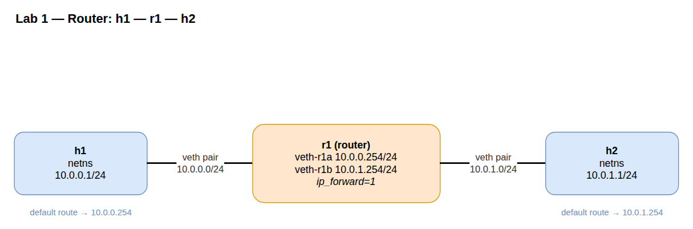

# Lab A02 — Router out of nothing

Part of **[Lab A02 — Topologies from `iproute2`](./README.md)**. Read the README first for the [container setup](./README.md#the-setup), prerequisites, and persistence/cleanup conventions — every command below runs inside that one Docker workbench at the `root@workbench:/lab#` prompt.

Three namespaces in a line: `h1 — r1 — h2`. Two veth pairs. Static routes on the hosts, forwarding enabled on `r1`. By the end, `h1` pings `h2` through `r1` and `tcpdump` on `r1` shows the packets crossing both legs.



## Preamble: a namespace is a kernel object

Before wiring anything, prove to yourself that a network namespace is just an inode the kernel hands out and that a process's membership in one is a symlink in `/proc`. The `$$` variable is just the current shell process PID.

```bash
# Your shell's current net namespace (the host's)
readlink /proc/$$/ns/net

# Create r1 and enter it
ip netns add r1
ip netns exec r1 bash

# Inside r1: same question, different answer
readlink /proc/$$/ns/net
exit
```

The two `readlink` outputs look like `net:[4026531840]` and `net:[4026532567]` — same shape, different inode number. That number is the namespace's identity inside the kernel; every process whose `/proc/<pid>/ns/net` symlink resolves to that inode is "in" that namespace. `ip netns exec` works by opening that inode and calling `setns(2)` on it before forking the shell. There is no other magic.

While you have a shell in `r1`, look at the rest of the `ns/` directory:

```bash
ip netns exec r1 ls -l /proc/$$/ns/
```

You will see `net` pointing at a different inode than the host, while `mnt`, `pid`, `user`, `uts`, `ipc`, `cgroup`, and `time` still point at the host's. That is what "isolated for networking, unisolated for everything else" looks like on disk. Containers like Docker would flip several of these at once; `ip netns exec` only flips `net`.

> **You may see more than just `lo` in a fresh namespace.** On many hosts, `ip netns exec r1 ip link` lists a set of `DOWN` tunnel devices alongside `lo` — `tunl0`, `gre0`, `gretap0`, `erspan0`, `sit0`, `ip6tnl0`, `ip_vti0`, and friends. These are *not* the container's interfaces leaking in. The kernel auto-creates one fallback device per loaded tunnel module (`ipip`, `gre`, `sit`, `ip_vti`, …) in **every** network namespace, and those modules live in the host kernel the container shares — so the container and `r1` show the same set. They are unconfigured (`0.0.0.0` / `::`), carry no traffic, and won't collide with anything you build here, so ignore them. The proof that `r1` really is isolated is what's *missing* from the list: there's no `eth0`, the veth the container uses to reach the Docker bridge. To see only the interfaces you add, scope by type — `ip -n r1 -br link show type veth`.

Delete `r1` before continuing — we'll recreate it in a moment as part of the topology:

```bash
ip netns del r1
```

## Build the topology

```bash
# Three namespaces
ip netns add h1
ip netns add r1
ip netns add h2

# Bring loopback up in each (some daemons sulk without it)
for ns in h1 r1 h2; do ip -n $ns link set lo up; done

# Two veth pairs: h1<->r1 and r1<->h2
ip link add veth-h1 type veth peer name veth-r1a
ip link add veth-h2 type veth peer name veth-r1b

# Place ends in their namespaces
ip link set veth-h1  netns h1
ip link set veth-r1a netns r1
ip link set veth-r1b netns r1
ip link set veth-h2  netns h2

# Address both sides of both links
ip -n h1 addr add 10.0.0.1/24 dev veth-h1
ip -n r1 addr add 10.0.0.254/24 dev veth-r1a
ip -n r1 addr add 10.0.1.254/24 dev veth-r1b
ip -n h2 addr add 10.0.1.1/24 dev veth-h2

# Bring everything up
ip -n h1 link set veth-h1  up
ip -n r1 link set veth-r1a up
ip -n r1 link set veth-r1b up
ip -n h2 link set veth-h2  up

# Default routes on the hosts pointing at the router leg in their subnet
ip -n h1 route add default via 10.0.0.254
ip -n h2 route add default via 10.0.1.254

# Turn r1 into a router
ip netns exec r1 sysctl -w net.ipv4.ip_forward=1
```

That is twenty-ish commands and you have a working router. Confirm:

```bash
ip -n h1 -br addr show
ip -n r1 -br addr show
ip -n h2 -br addr show
ip -n r1 route show
ip netns exec r1 sysctl net.ipv4.ip_forward    # should be 1
```

## Verify forwarding

In one terminal, start `tcpdump` on both legs of `r1`:

```bash
ip netns exec r1 tcpdump -i veth-r1a -n icmp &
ip netns exec r1 tcpdump -i veth-r1b -n icmp &
```

In another terminal (from the root container, like we did in lab 1), ping across:

```bash
ip netns exec h1 ping -c 3 10.0.1.1
```

You should see ICMP echo request *and* reply on both interfaces in the `tcpdump` output, and `0% packet loss` from `ping`. That is what "forwarding" means at the packet level: the same flow shows up on the ingress leg and the egress leg of the middle namespace, with the TTL decremented by one between them.

Kill the backgrounded `tcpdump` processes when you're done:

```bash
kill %1 %2
```

## Test your work

The lab ships an automated checker. From the `/lab` prompt, after you've built the topology:

```bash
./tests/test.sh 1
```

It is **verify-only and non-destructive** — it builds and deletes nothing. It auto-discovers whatever namespace names and IP addresses you actually used (so it still passes if you renamed `h1`/`r1`/`h2` or chose different subnets), then checks the lab's objective: the middle namespace forwards, each host routes to the other via it, one host pings the other end to end, and — the real proof — `tcpdump` on **both** of the router's legs sees the ICMP, so the traffic genuinely transits the router rather than taking a same-subnet shortcut. It prints `PASS`/`FAIL` per check and exits non-zero if anything fails.

The `tests/` directory is mounted read-only by the compose workbench. If you launched the container with the raw `docker run` command instead, add `-v "$(pwd)/labs/lab-a02-topologies/tests:/lab/tests:ro"` to it first.

## Optional extensions

**Asymmetric routing.** Delete the return route on `h2` and retry the ping:

```bash
ip -n h2 route del default
ip netns exec h1 ping -c 3 10.0.1.1   # request goes, reply lost
```

`tcpdump` on `veth-r1b` will show the echo request leaving `r1` toward `h2`, and the echo reply leaving `h2` — but `h2`'s reply has no route back to `10.0.0.0/24`, so it never reaches `r1`. This is the most common "ping works one way" failure mode in production, demonstrated in five seconds. Restore with `ip -n h2 route add default via 10.0.1.254`.

**A third host on the router.** Add an `h3` namespace, a third veth pair, a third IP on `r1` (e.g., `10.0.2.254/24`), and verify `h1` reaches `h3`. Same four-move idiom, no new vocabulary.

## Comprehension Questions ##
1.) Explain how executing the ping process in the namespace is actually getting isolated from the other interfaces from the kernel object perspective
2.) How many namespaces does r1 actually exist in from this lab?

<details>
<summary>Answers (click to expand)</summary>

**1.** A network namespace is a kernel object — a `struct net` that owns its own list of interfaces (`net_device`s) and routing tables. `ip netns exec h1 ping …` opens `h1`'s namespace handle and calls `setns(2)` to point the process at that `struct net` before it `exec`s `ping`; from then on every interface and route lookup the kernel does for that process is scoped to that one object, so it can only see `h1`'s interfaces (`veth-h1` and `lo`). Only the `net` namespace is swapped — `mnt`, `pid`, `user`, … stay the host's — which is why it's isolated for networking and nothing else. It can't reach another namespace's interfaces without a `veth` pair and routes wiring them together.

**2.** One. `ip netns add r1` creates a single network namespace (one `struct net`, kept alive by the bind mount at `/var/run/netns/r1`). `r1` *is* that namespace, not a device — here it acts as a router/gateway between the two subnets, with the veth pairs as the links and `r1` the node that forwards between them once `ip_forward` is on.

</details>

## Teardown

```bash
for ns in h1 r1 h2; do ip netns del $ns; done
```

Verify with `ip netns list` (should be empty if this was your only lab) and `ip link show` (no `veth-*` interfaces should remain — they were garbage-collected when their namespaces died).

---

Next: **[Lab A02 — Switch out of nothing](./lab-2-switch.md)** builds the L2 half of the picture — a bridge with three hosts hung off it.
