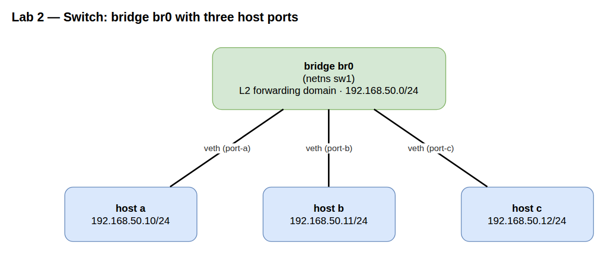

# Lab A02 — Switch out of nothing

Part of **[Lab A02 — Topologies from `iproute2`](./README.md)**. Read the README first for the [container setup](./README.md#the-setup), prerequisites, and persistence/cleanup conventions — every command below runs inside that one Docker workbench at the `root@workbench:/lab#` prompt.

A bridge inside a `sw1` namespace, three host namespaces (`a`, `b`, `c`) each connected to the bridge via a veth pair. All three hosts in the same `/24`. No router — this is pure L2.



## Build

```bash
# Four namespaces: one switch, three hosts
ip netns add sw1
ip netns add a
ip netns add b
ip netns add c
for ns in sw1 a b c; do ip -n $ns link set lo up; done

# The bridge lives inside sw1
ip -n sw1 link add br0 type bridge
ip -n sw1 link set br0 up

# Three veth pairs, one per host
ip link add veth-a type veth peer name port-a
ip link add veth-b type veth peer name port-b
ip link add veth-c type veth peer name port-c

# Host ends go to the host namespaces
ip link set veth-a netns a
ip link set veth-b netns b
ip link set veth-c netns c

# Bridge ends go to sw1 and get enslaved to br0
for p in port-a port-b port-c; do
  ip link set $p netns sw1
  ip -n sw1 link set $p master br0
  ip -n sw1 link set $p up
done

# Address the hosts in 192.168.50.0/24
ip -n a addr add 192.168.50.10/24 dev veth-a
ip -n b addr add 192.168.50.11/24 dev veth-b
ip -n c addr add 192.168.50.12/24 dev veth-c
ip -n a link set veth-a up
ip -n b link set veth-b up
ip -n c link set veth-c up
```

No router, no routes — same subnet, ARP-resolves-everything topology. Confirm:

```bash
ip -n sw1 link show master br0    # three ports, all UP
bridge -n sw1 link show            # same data, columnar
```

## Verify L2 forwarding

```bash
ip netns exec a ping -c 3 192.168.50.11   # a → b
ip netns exec a ping -c 3 192.168.50.12   # a → c
```

Both should succeed. Now look at what the bridge learned:

```bash
bridge -n sw1 fdb show br br0
```

You will see entries like `aa:bb:cc:... dev port-b master br0` for each host's MAC. That is the Linux equivalent of `show mac address-table` on IOS: which MAC was last seen on which port. Compare against the host MACs:

```bash
for ns in a b c; do ip -n $ns -br link show veth-$ns; done
```

The MACs in the FDB on `sw1` are the same MACs the hosts advertise on their `veth-*` ends. That correspondence is the entire job of a learning bridge.

## Watch ARP do its thing

Clear `a`'s ARP cache and ping `c` while `tcpdump`'ing on the bridge:

```bash
ip -n a neigh flush all
ip netns exec sw1 tcpdump -i br0 -e -n arp or icmp &
ip netns exec a ping -c 1 192.168.50.12
kill %1
```

You should see a broadcast ARP request (`ff:ff:ff:ff:ff:ff` destination) from `a`, a unicast ARP reply from `c`, and then ICMP echo request/reply between the two MACs. The first packet is the only one that floods; everything after is unicast because the bridge already learned the MACs.

## Test your work

From the `/lab` prompt, after building the bridge:

```bash
./tests/test.sh 2
```

**Verify-only and non-destructive.** It auto-discovers the bridge namespace and the hosts hung off it (whatever you named them, whatever subnet you used), then checks the two things that matter: same-subnet hosts can ping each other over the bridge, and the bridge actually **learned their MACs** (`bridge fdb`) on its ports — proving the frames were switched, not delivered some other way. `PASS`/`FAIL` per check, non-zero exit on failure. (The `tests/` directory is mounted read-only by the compose workbench.)

## Optional extension — VLAN filtering

Turn the dumb bridge into a managed 802.1Q switch:

```bash
# look for the bridge options on https://man7.org/linux/man-pages/man8/ip-link.8.html
# vlan_filtering is 0 for off (default) or 1 for on.
ip -n sw1 link set br0 type bridge vlan_filtering 1

# a and b in VLAN 10, c in VLAN 20
bridge -n sw1 vlan add vid 10 dev port-a pvid untagged
bridge -n sw1 vlan add vid 10 dev port-b pvid untagged
bridge -n sw1 vlan add vid 20 dev port-c pvid untagged

# Remove VLAN 1 (the default) from the access ports
bridge -n sw1 vlan del vid 1 dev port-a
bridge -n sw1 vlan del vid 1 dev port-b
bridge -n sw1 vlan del vid 1 dev port-c

bridge -n sw1 vlan show
```

Retry the pings: `a → b` still works (same VLAN), `a → c` now fails (different broadcast domain). That is a switched LAN split into two by a one-line filter change — same primitive every enterprise top-of-rack does, exposed at the bottom of the stack.

## Comprehension Questions
1.) With which command do you see which MAC address the bridge learned on which port, and what is the IOS equivalent of that table?
2.) After `ip -n a neigh flush all`, the first packet of `a → c` floods to every port while everything after it is unicast. Which frame is the flooded one, and why does the bridge have to flood it?
3.) The bridge `br0` has no IP address anywhere in this lab, yet the three hosts communicate fine. Why does a bridge not need an IP to forward frames — and what would giving it one let it do that it cannot do now?
4.) After you enable `vlan_filtering 1` and split the ports into VLAN 10 and VLAN 20, `a → c` stops working. At which layer is that frame dropped, and which single command shows you the per-port VLAN membership responsible?


<details>
<summary>Answers (click to expand)</summary>

**1.** `bridge fdb show br br0` (or `bridge -n sw1 fdb show br br0` from outside the namespace). It lists each learned MAC against the port it was last seen on (`dev port-X master br0`). The IOS equivalent is `show mac address-table`.

**2.** The flooded frame is `a`'s **broadcast ARP request** ("who has 192.168.50.12?"), destination `ff:ff:ff:ff:ff:ff`. A bridge must send broadcasts out every port in the domain — and at that instant it may not know which port `c` is on either. `c`'s ARP **reply** is unicast, and once the bridge has learned both MACs every following ICMP frame is unicast, forwarded only out the one learned port.

**3.** A bridge forwards at L2 — it decides purely on destination MAC and its learned forwarding database; IP addresses live a layer up and play no part in that decision. Giving `br0` an IP would make the bridge itself an **endpoint** on the segment (an SVI): it could be pinged, source/sink its own traffic, and — with forwarding on — route between this segment and another (exactly Lab 4). It is never needed for plain switching.

**4.** At **L2, on egress**. The VLAN-filtering bridge tags `a`'s frame with VID 10 and refuses to send it out `port-c`, which is only a member of VID 20, so it never reaches `c`. `bridge -n sw1 vlan show` displays the per-port VID membership responsible.

</details>

## Teardown

```bash
for ns in sw1 a b c; do ip netns del $ns; done
```

---

Next: **[Lab A02 — Compose them](./lab-3-compose.md)** wires this bridge to a router leg from [Lab 1](./lab-1-router.md) for the full `host — switch — router — switch — host` chain.
