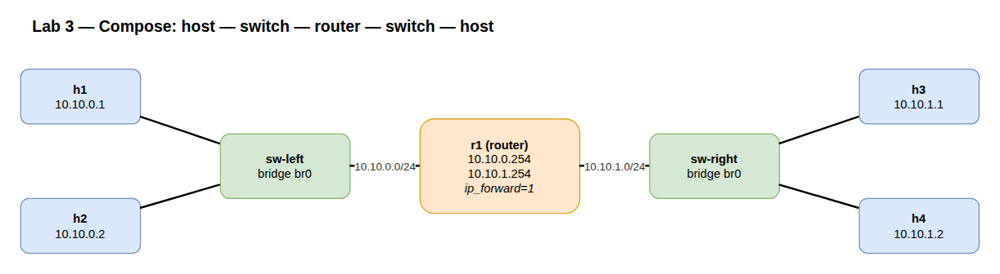

# Lab A02 — Compose them

Part of **[Lab A02 — Topologies from `iproute2`](./README.md)**. Read the README first for the [container setup](./README.md#the-setup), prerequisites, and persistence/cleanup conventions — every command below runs inside that one Docker workbench at the `root@workbench:/lab#` prompt. This lab assumes you have done [Lab 1 — Router](./lab-1-router.md) and [Lab 2 — Switch](./lab-2-switch.md); it reuses both shapes. As you go through this, make sure you understand what each command is doing. The comments in the commands are brief summaries, but you should be able to make that mental connection to your existing network stack as you enter each line. 

Wire Lab 2's bridge to a Lab 1 router leg. Two hosts on each side, a switch each side, a router in the middle. `sw-left` and its hosts share `10.10.0.0/24`. `sw-right` and its hosts share `10.10.1.0/24`. `r1` has a leg in each, with `10.10.0.254` and `10.10.1.254`. Forwarding on, default routes on the hosts pointing at their gateway. End to end, `h1` pings `h4`.



## Build

```bash
# Namespaces: two switches, one router, four hosts
# you can choose to use the loops or decompose them into individual commands for
# muscle memory
for ns in sw-left sw-right r1 h1 h2 h3 h4; do ip netns add $ns; done
for ns in sw-left sw-right r1 h1 h2 h3 h4; do ip -n $ns link set lo up; done

# Bridges, one per switch namespace
ip -n sw-left  link add br0 type bridge
ip -n sw-right link add br0 type bridge
ip -n sw-left  link set br0 up
ip -n sw-right link set br0 up

# Host-to-switch veth pairs (4 of them)
ip link add veth-h1 type veth peer name p-h1
ip link add veth-h2 type veth peer name p-h2
ip link add veth-h3 type veth peer name p-h3
ip link add veth-h4 type veth peer name p-h4

# Place host ends
ip link set veth-h1 netns h1
ip link set veth-h2 netns h2
ip link set veth-h3 netns h3
ip link set veth-h4 netns h4

# Place bridge ends and enslave
# again, use the loop or write out individual for muscle memory
for pair in "sw-left:p-h1" "sw-left:p-h2" "sw-right:p-h3" "sw-right:p-h4"; do
  sw=${pair%:*}; p=${pair#*:}
  ip link set $p netns $sw
  ip -n $sw link set $p master br0
  ip -n $sw link set $p up
done

# Switch-to-router veth pairs (these end up enslaved on the switch side,
# addressed on the router side — same trick switches and routers use IRL)
ip link add veth-sl type veth peer name r1-left
ip link add veth-sr type veth peer name r1-right
ip link set veth-sl netns sw-left
ip link set veth-sr netns sw-right
ip link set r1-left  netns r1
ip link set r1-right netns r1
ip -n sw-left  link set veth-sl master br0
ip -n sw-right link set veth-sr master br0
ip -n sw-left  link set veth-sl up
ip -n sw-right link set veth-sr up

# Host addresses
ip -n h1 addr add 10.10.0.1/24 dev veth-h1
ip -n h2 addr add 10.10.0.2/24 dev veth-h2
ip -n h3 addr add 10.10.1.1/24 dev veth-h3
ip -n h4 addr add 10.10.1.2/24 dev veth-h4
for h in h1 h2 h3 h4; do ip -n $h link set veth-$h up; done

# Router addresses + bring up
ip -n r1 addr add 10.10.0.254/24 dev r1-left
ip -n r1 addr add 10.10.1.254/24 dev r1-right
ip -n r1 link set r1-left  up
ip -n r1 link set r1-right up

# Default routes on hosts
ip -n h1 route add default via 10.10.0.254
ip -n h2 route add default via 10.10.0.254
ip -n h3 route add default via 10.10.1.254
ip -n h4 route add default via 10.10.1.254

# Forwarding on r1
ip netns exec r1 sysctl -w net.ipv4.ip_forward=1
```

## Verify

Same-subnet through the switch:

```bash
ip netns exec h1 ping -c 2 10.10.0.2     # h1 → h2, via sw-left only
ip netns exec h3 ping -c 2 10.10.1.2     # h3 → h4, via sw-right only
```

Cross-subnet through the router:

```bash
ip netns exec h1 ping -c 2 10.10.1.1     # h1 → h3, full chain
ip netns exec h1 ping -c 2 10.10.1.2     # h1 → h4, full chain
```

Trace the path:

```bash
ip netns exec h1 traceroute -n 10.10.1.2
```

Three hops: `h1`'s gateway (`10.10.0.254`, which is `r1`'s left leg), then `h4` itself. The switches don't show up — they're L2 and `traceroute` is an L3 tool. That absence is the point: a Linux bridge is invisible to anything above it, exactly like a managed switch sitting between two routers.

Confirm the bridges learned what you'd expect:

```bash
bridge -n sw-left  fdb show br br0
bridge -n sw-right fdb show br br0
```

Each bridge has FDB entries for its two hosts' MACs plus `r1`'s leg MAC. That's the entire L2 worldview of each switch — three MACs, three ports, no further.

## Test your work

From the `/lab` prompt, after building the full chain:

```bash
./tests/test.sh 3
```

**Verify-only and non-destructive.** It auto-discovers the router (the namespace that forwards and has two subnets) and the hosts on each side, then checks both behaviours the topology is meant to show: **same-subnet** hosts reach each other *on-link* through their switch (not via the router), and **cross-subnet** hosts reach each other *through* the router — proven by `tcpdump` on both router legs. `PASS`/`FAIL` per check. (The `tests/` directory is mounted read-only by the compose workbench.)

## Comprehension Questions:
1.) With which command can you list all interfaces attached to br0 in the sw-left namespace?
2.) With which command would you see all of the ARP entries in the router to verify visibility on both domains? Be sure to run the ping between each of the hosts before validating this to ensure the ARP entries are present.
3.) From looking at the interface state on sw-left `ip link show`, what are some reasons br0 would show down?
4.) What is the difference between `lsns` and `ip netns list` outputs? 

<details>
<summary>Answers (click to expand)</summary>

**1.** `ip -n sw-left link show master br0` lists the interfaces enslaved to `br0` (equivalently `bridge -n sw-left link show`).

**2.** `ip -n r1 neigh show` — the neighbour/ARP table (the modern replacement for `arp -n`). After you've pinged between hosts so `r1` has resolved both legs, it shows neighbours on both `r1-left` (10.10.0.x) and `r1-right` (10.10.1.x), proving the router has L2 visibility into both broadcast domains.

**3.** A bridge's operational state follows its ports, so `br0` reads down if you never ran `ip link set br0 up` (admin-down → `state DOWN`), or if no enslaved port is up/connected (`NO-CARRIER` — a veth end isn't up, or its peer is down). It only goes `UP,LOWER_UP` once the bridge *and* at least one member port are up.

**4.** `ip netns list` shows only the **network** namespaces created via `ip netns` (those bind-mounted under `/var/run/netns/`); it won't list netns made by Docker or `unshare` that aren't named there. `lsns` lists **all** namespaces of every type (net, mnt, pid, user, …) with their owning PIDs, however they were created — so `lsns -t net` can show more than `ip netns list`.

</details>

## What you've built

This is the smallest non-trivial network: two broadcast domains separated by a router, hosts on each, traffic verified both within and across. Once you have built it from `ip` commands, the same shape in YAML (Containerlab), in iptables-NAT'd Docker, or in a Kubernetes CNI bridge-mode config reads identically — same primitives, different wrapper.

## Teardown

```bash
for ns in sw-left sw-right r1 h1 h2 h3 h4; do ip netns del $ns; done
```

---

Next: **[Lab A02 — SVIs](./lab-4-svi.md)** gives a VLAN-aware bridge a routed presence per VLAN, turning an L2 switch into a layer-3 switch.
