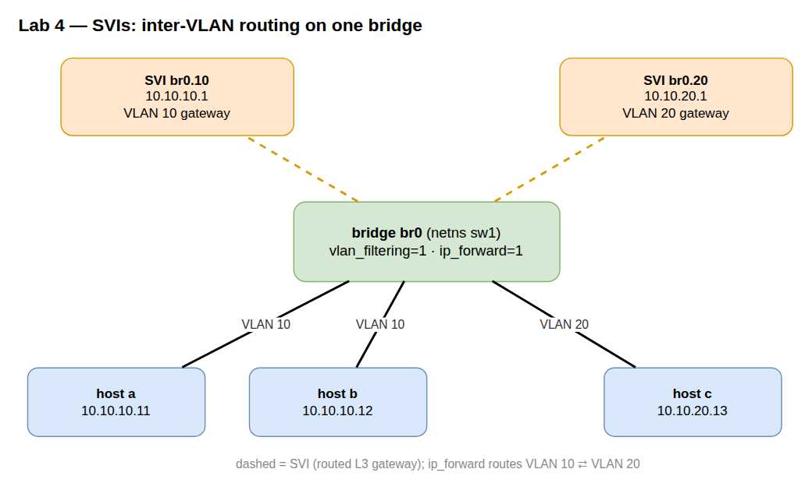

# Lab A02 — SVIs: routing between VLANs on one bridge

Part of **[Lab A02 — Topologies from `iproute2`](./README.md)**. Read the README first for the [container setup](./README.md#the-setup), prerequisites, and persistence/cleanup conventions — every command below runs inside that one Docker workbench at the `root@workbench:/lab#` prompt. This lab builds conceptually directly on the VLAN-filtering extension at the end of [Lab 2 — Switch](./lab-2-switch.md).

One VLAN-aware bridge in a `sw1` namespace, two VLANs, and an **SVI** (Switched Virtual Interface) per VLAN giving each one an L3 gateway. Hosts `a` and `b` live in VLAN 10, host `c` in VLAN 20. Same-VLAN traffic stays L2; cross-VLAN traffic is routed by the bridge itself through its SVIs. By the end, `sw1` is a layer-3 switch built from nothing but `iproute2`.

An SVI is not a new primitive. It is the same `eth0.100` VLAN subinterface from the article (`ip link add link … type vlan id …`), created on a **bridge** instead of a physical NIC. Give that interface an IP and the bridge gains a routed presence in the VLAN.

The SVI is just one way to hang an L3 identity off a switch. When there is no VLAN filtering, you can address the bridge device itself (`ip addr add ... dev br0`) for a single untagged segment — the degenerate, one-VLAN SVI. And when you need an address that must not depend on any port at all — a router-ID for OSPF/BGP, an anycast service IP — the idiomatic anchor is a `dummy` interface (the article's black-hole interface): it is always up, so the address survives every link flap. Same idea each time — an interface is a routed identity — only the interface *type* changes with what the identity needs to survive.



## Build

```bash
# One switch namespace, three hosts
ip netns add sw1
ip netns add a
ip netns add b
ip netns add c
for ns in sw1 a b c; do ip -n $ns link set lo up; done

# VLAN-aware bridge
ip -n sw1 link add br0 type bridge vlan_filtering 1
ip -n sw1 link set br0 up

# One veth pair per host, host end into the host ns, bridge end enslaved
for h in a b c; do
  ip link add veth-$h type veth peer name port-$h
  ip link set veth-$h netns $h
  ip link set port-$h netns sw1
  ip -n sw1 link set port-$h master br0
  ip -n sw1 link set port-$h up
done

# Access-port VLAN membership: a,b in VLAN 10; c in VLAN 20 (untagged toward the host)
ip netns exec sw1 bridge vlan add vid 10 dev port-a pvid untagged
ip netns exec sw1 bridge vlan add vid 10 dev port-b pvid untagged
ip netns exec sw1 bridge vlan add vid 20 dev port-c pvid untagged

# Drop the default VLAN 1 from the access ports
# This is done to prevent traffic that natively runs on vlan 1 from being sent
# out of the port and to be explicit about which vlan is on the port.
for p in port-a port-b port-c; do ip netns exec sw1 bridge vlan del vid 1 dev $p; done

# verify the vlan port assignment
bridge -n sw1 vlan list

# Let the bridge itself receive tagged frames for VLAN 10 and 20 toward the CPU.
# This `self` line is the step everyone forgets — without it the bridge never
# delivers VLAN-tagged frames to its own SVIs and inter-VLAN routing silently dies.
ip netns exec sw1 bridge vlan add vid 10 dev br0 self
ip netns exec sw1 bridge vlan add vid 20 dev br0 self

# The SVIs: a VLAN interface on the bridge per VLAN, each the gateway for its subnet
# note that you don't *have* to name them like a subinterface. You could
# use "tacos20" instead of "br0.20" in the example below and it would still
# be valid. Confusing to future you, but still valid.
ip -n sw1 link add link br0 name br0.10 type vlan id 10
ip -n sw1 link add link br0 name br0.20 type vlan id 20
ip -n sw1 addr add 10.10.10.1/24 dev br0.10
ip -n sw1 addr add 10.10.20.1/24 dev br0.20
ip -n sw1 link set br0.10 up
ip -n sw1 link set br0.20 up

# Turn the switch into a router between its two SVIs
ip netns exec sw1 sysctl -w net.ipv4.ip_forward=1

# Host addressing + default route to the SVI gateway in each host's VLAN
ip -n a addr add 10.10.10.11/24 dev veth-a; ip -n a link set veth-a up
ip -n b addr add 10.10.10.12/24 dev veth-b; ip -n b link set veth-b up
ip -n c addr add 10.10.20.13/24 dev veth-c; ip -n c link set veth-c up
ip -n a route add default via 10.10.10.1
ip -n b route add default via 10.10.10.1
ip -n c route add default via 10.10.20.1
```

> **If `type vlan` errors out** with "Operation not supported", the `8021q` kernel module
> isn't loaded. It auto-loads on most hosts the moment you create the first VLAN interface;
> if yours doesn't, run `modprobe 8021q` on the **host** (not in the container) and retry.

Confirm the shape before testing:

```bash
ip netns exec sw1 bridge vlan show          # access ports untagged in their VID; br0 'self' in 10 and 20
ip -n sw1 -br addr show                       # br0.10 = 10.10.10.1, br0.20 = 10.10.20.1
ip -n sw1 route                               # two connected routes, one per SVI subnet
```

## Verify

**Same VLAN — pure L2, no router involved:**

```bash
ip netns exec a ping -c 2 10.10.10.12          # a → b, both in VLAN 10
```

**Across VLANs — routed by the bridge through its SVIs:**

```bash
ip netns exec a ping -c 2 10.10.20.13          # a (VLAN 10) → c (VLAN 20)
ip netns exec a traceroute -n 10.10.20.13      # exactly one hop: 10.10.10.1, the SVI
```

The single hop is the whole point. `a` has no route to `10.10.20.0/24`, so it sends the packet to its default gateway `10.10.10.1` (the `br0.10` SVI). The bridge, with forwarding on, routes it to the `10.10.20.0/24` connected route on `br0.20`, retags it into VLAN 20, and delivers it to `c`. 

Watch the retag happen:

```bash
ip netns exec sw1 tcpdump -i br0.20 -e -n icmp &
ip netns exec a ping -c 2 10.10.20.13
kill %1
```

On `br0.20` you see the echo request arriving with **source MAC = the SVI's MAC**, not `a`'s — proof the frame was routed (new L2 header) rather than bridged. `a`'s MAC never appears in VLAN 20.

## Test your work

From the `/lab` prompt, after building the SVIs:

```bash
./tests/test.sh 4
```

**Verify-only and non-destructive.** It auto-discovers the layer-3 switch — a namespace that forwards and reaches two subnets through **VLAN interfaces (SVIs)** on a VLAN-filtering bridge — and confirms it really is an SVI setup, that **same-VLAN** hosts talk on-link (L2), and that **inter-VLAN** hosts are routed *through the SVIs* (proven by `tcpdump` on both SVIs). `PASS`/`FAIL` per check. (The `tests/` directory is mounted read-only by the compose workbench.)

## Optional extension — prove the isolation is real

Turn forwarding back off and retry the cross-VLAN ping:

```bash
ip netns exec sw1 sysctl -w net.ipv4.ip_forward=0
ip netns exec a ping -c 2 10.10.20.13          # fails: SVIs exist but nothing routes between them
ip netns exec sw1 sysctl -w net.ipv4.ip_forward=1   # restore
```

With forwarding off, the two SVIs are just two interfaces on the same box that refuse to pass traffic between their subnets — which is exactly the default, secure posture. Inter-VLAN routing is a thing you *opt into* with one sysctl.

## Comprehension Questions
1.) What is the difference between `ip link add <name>` and `ip link add link <existing name>`?
2.) The build insists on `bridge vlan add vid 20 dev br0 self`. What does the `self` keyword refer to, and what specifically breaks if you forget that line?
3.) Both `a → b` (same VLAN) and `a → c` (different VLAN) succeed, but only one of the two is *routed*. Which command on `sw1`, and which detail in its output, proves which packets were routed versus switched?
4.) `sw1` now does L2 within a VLAN and L3 between VLANs. Which single setting turns the L3 behaviour on, and is its value shared with the rest of the box or private to this namespace?

<details>
<summary>Answers (click to expand)</summary>

**1.** `ip link add <name> type <kind>` creates a standalone device. `ip link add link <parent> name <name> type vlan id N` creates a device **stacked on** an existing one — `link <parent>` names its lower device. For an SVI, `link br0` makes `br0.10` ride on the bridge; drop `link` and the new interface has nothing underneath it.

**2.** `self` means the operation applies to the bridge device's **own** VLAN table (its host/CPU port), not to a bridge port — it declares the bridge itself a member of that VID, so tagged frames for it are delivered up to the SVIs. Forget `… dev br0 self` for VID 20 and the bridge never hands VLAN 20 frames to `br0.20`: the SVI and the route both exist, but inter-VLAN traffic into/out of VLAN 20 silently dies (the test's `br0.20=0`).

**3.** `ip netns exec sw1 tcpdump -i br0.20 -e -n` while pinging `a → c`. The tell is the **source MAC**: a *routed* frame leaving the SVI carries `br0.20`'s MAC (the router rewrote the L2 header), whereas a *switched* same-VLAN frame keeps the original host's MAC. (`traceroute` showing a single hop at the SVI, or a TTL decremented by one, says the same thing.)

**4.** `net.ipv4.ip_forward` (`sysctl -w net.ipv4.ip_forward=1` in `sw1`). It is **per network namespace** — on in `sw1` only; the host and every other namespace keep their own value, and a fresh namespace starts with it off.

</details>

## Teardown

```bash
for ns in sw1 a b c; do ip netns del $ns; done
```

---

Next: **[Lab A02 — Trunks](./lab-5-trunk.md)** carries these VLANs, tagged, over a single link between two separate switches.
