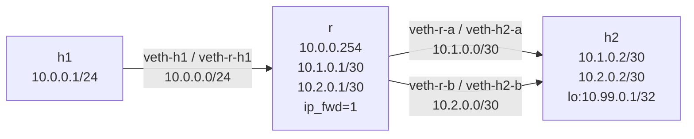

# Lab A03 — Routing and Failover

Part of **[Lab A03 — Common Network-Admin Tasks](./README.md)**. Read the README first for the [container setup](./README.md#the-setup), prerequisites, and cleanup conventions — every command below runs inside the Docker workbench at the `root@workbench:/lab#` prompt.

This lab builds two path-redundancy patterns: metric-based primary/backup and ECMP multipath. By the end, `ip route get` shows exactly which next-hop a specific destination would take, and you can swap between patterns and verify the change.



`h2` has two veth connections back to `r` on separate /30s. `r` reaches `h2`'s loopback (`10.99.0.1`) via either path. You will install a metric-based pair first, then replace it with an ECMP route and observe the difference.

## Build the topology

```bash
# Create namespaces
ip netns add h1
ip netns add r
ip netns add h2

# h1 ↔ r link  (10.0.0.0/24)
ip link add veth-h1 type veth peer name veth-r-h1
ip link set veth-h1 netns h1
ip link set veth-r-h1 netns r

ip -n h1 addr add 10.0.0.1/24 dev veth-h1
ip -n r  addr add 10.0.0.254/24 dev veth-r-h1

ip -n h1 link set veth-h1 up
ip -n r  link set veth-r-h1 up

# r ↔ h2 first path  (10.1.0.0/30)
ip link add veth-r-a type veth peer name veth-h2-a
ip link set veth-r-a netns r
ip link set veth-h2-a netns h2

ip -n r  addr add 10.1.0.1/30 dev veth-r-a
ip -n h2 addr add 10.1.0.2/30 dev veth-h2-a

ip -n r  link set veth-r-a up
ip -n h2 link set veth-h2-a up

# r ↔ h2 second path  (10.2.0.0/30)
ip link add veth-r-b type veth peer name veth-h2-b
ip link set veth-r-b netns r
ip link set veth-h2-b netns h2

ip -n r  addr add 10.2.0.1/30 dev veth-r-b
ip -n h2 addr add 10.2.0.2/30 dev veth-h2-b

ip -n r  link set veth-r-b up
ip -n h2 link set veth-h2-b up

# h2 loopback destination address
ip -n h2 link set lo up
ip -n h2 addr add 10.99.0.1/32 dev lo

# Forwarding and routing
ip netns exec r sysctl -w net.ipv4.ip_forward=1
ip -n h1 route add default via 10.0.0.254
ip -n h2 route add 10.0.0.0/24 via 10.1.0.1   # h2's return path via path A
```

## Part A — Inspect the routing table

Before adding any failover routes, look at what the kernel knows:

```bash
ip -n r route show                    # connected routes only
ip -n r route show proto kernel       # routes installed from address assignments
ip -n r route show table all          # every table including local
ip -n r route get 10.99.0.1           # FIB lookup — no route yet, should error
```

## Part B — Metric-based primary/backup

Add two routes to the same destination with different metrics:

```bash
ip -n r route add 10.99.0.1/32 via 10.1.0.2 metric 100   # primary
ip -n r route add 10.99.0.1/32 via 10.2.0.2 metric 200   # backup
```

Verify:

```bash
ip -n r route show 10.99.0.1/32       # shows both routes, lower metric listed first
ip -n r route get 10.99.0.1           # should say "via 10.1.0.2" (metric 100 wins)
ip netns exec h1 ping -c 3 10.99.0.1  # reaches h2's loopback
```

Simulate path A failure and watch the backup activate:

```bash
ip -n r route del 10.99.0.1/32 via 10.1.0.2 metric 100
ip -n r route get 10.99.0.1           # now says "via 10.2.0.2"
ip netns exec h1 ping -c 3 10.99.0.1  # still reaches h2
```

Restore path A:

```bash
ip -n r route add 10.99.0.1/32 via 10.1.0.2 metric 100
```

## Part C — ECMP multipath

Remove the metric routes and install an ECMP route instead:

```bash
ip -n r route del 10.99.0.1/32 via 10.1.0.2 metric 100
ip -n r route del 10.99.0.1/32 via 10.2.0.2 metric 200

ip -n r route add 10.99.0.1/32 \
    nexthop via 10.1.0.2 weight 1 \
    nexthop via 10.2.0.2 weight 1
```

Verify:

```bash
ip -n r route show 10.99.0.1/32       # one route with two nexthop entries
ip -j -n r route get 10.99.0.1 | jq '.[0].nexthops // "single nexthop"'
ip netns exec h1 ping -c 3 10.99.0.1  # still reaches h2
```

## Test your work

From the `/lab` prompt, after building the topology and installing either the metric-based routes (Part B) or the ECMP route (Part C):

```bash
./tests/test.sh 1
```

The test is **verify-only and non-destructive**. It auto-discovers the router namespace, finds the routes to the dual-homed destination, confirms ECMP or metric-based failover is configured correctly, and verifies end-to-end reachability.

## Optional extension

1. Add a non-default routing table: `ip -n r route add 10.99.0.1/32 via 10.1.0.2 table 100`. Verify with `ip -n r route show table 100`. Then query it: `ip -n r route get 10.99.0.1 fibmatch` vs without `fibmatch`.

2. Explore `ip route show proto X` for each proto value you see — `kernel`, `static`. What is the difference between a `kernel` route and a `static` one?

## Comprehension questions

<details>
<summary>Answers (click to expand)</summary>

**1. What is the difference between metric-based failover and ECMP? When would you use each?**

Metric-based: two routes to the same prefix with different metrics. The lower-metric route is used; the higher-metric one is only used if the lower-metric one is deleted (no automatic failover on link-down — you need a daemon like FRR or BFD for that). ECMP: one route entry with multiple nexthops, all equally preferred. Traffic is distributed across all active paths simultaneously. Use metric-based when you want deterministic primary/backup behavior; use ECMP when you want load distribution.

**2. Why does `ip route get 10.99.0.1` show one specific nexthop even with an ECMP route?**

`ip route get` performs the kernel's FIB lookup for the given destination, including the per-flow hash. The same destination always produces the same nexthop selection for the same source/destination pair (the hash is over the 5-tuple). Try varying the source: `ip -n r route get 10.99.0.1 from 10.0.0.1` vs `from 10.0.0.2`.

**3. What does the `proto` field on a route mean?**

It indicates who installed the route: `kernel` = installed automatically when an address was assigned to an interface (connected routes), `static` = installed manually with `ip route add`, `dhcp` = installed by a DHCP client. Routing daemons (ospf, bgp, etc.) use their own names. `proto static` is useful for filtering: `ip route show proto static`.

</details>

## Teardown

```bash
for ns in h1 r h2; do ip netns del "$ns"; done
```

Verify with `ip netns list` (should be empty) and `ip link show` (no `veth-*` interfaces should remain).

---

Next: **[Lab A03 — Stateful ACL and Capture](./lab-2-acl-stateful.md)** adds an `nftables` forward chain with `policy drop` and stateful packet filtering.
