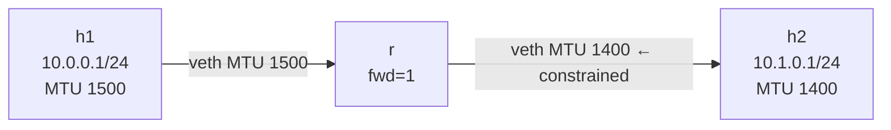

# Lab A03 — MTU and PMTU Discovery

Part of **[Lab A03 — Common Network-Admin Tasks](./README.md)**. Read the README first for the [container setup](./README.md#the-setup), prerequisites, and cleanup conventions.

This lab constrains the MTU on one link in a path, then uses `ping -M do -s` to probe path MTU. The kernel caches the discovered PMTU and `ip route get` reveals it.



The h1→r leg has the standard 1500-byte MTU. The r→h2 leg is constrained to 1400 bytes. A packet from h1 with DF set that exceeds 1400 bytes will cause r to generate an ICMP Fragmentation Needed message back to h1, and h1 will cache the PMTU.

## Build the topology

```bash
ip netns add h1
ip netns add r
ip netns add h2

# h1 ↔ r  (standard MTU 1500)
ip link add veth-h1 type veth peer name veth-r-h1
ip link set veth-h1 netns h1
ip link set veth-r-h1 netns r
ip -n h1 addr add 10.0.0.1/24 dev veth-h1
ip -n r  addr add 10.0.0.254/24 dev veth-r-h1
ip -n h1 link set veth-h1 up
ip -n r  link set veth-r-h1 up

# r ↔ h2  (constrained MTU 1400)
ip link add veth-h2 type veth peer name veth-r-h2
ip link set veth-h2 netns h2
ip link set veth-r-h2 netns r
ip -n h2 addr add 10.1.0.1/24 dev veth-h2
ip -n r  addr add 10.1.0.254/24 dev veth-r-h2

# Set the MTU on BOTH sides of the constrained link
ip -n r  link set veth-r-h2 mtu 1400
ip -n h2 link set veth-h2 mtu 1400

ip -n h1 link set veth-h1 up
ip -n h2 link set veth-h2 up
ip -n r  link set veth-r-h2 up

ip netns exec r sysctl -w net.ipv4.ip_forward=1
ip -n h1 route add default via 10.0.0.254
ip -n h2 route add default via 10.1.0.254
```

## Verify the MTU configuration

```bash
ip -n r  link show                        # veth-r-h2 shows mtu 1400
ip -n h2 link show veth-h2                # also 1400
ip -n h1 link show veth-h1                # 1500 (unchanged)
```

## Probe path MTU

```bash
# Small ping — fits in 1400 bytes: header(28) + payload(1372) = 1400 — should succeed
ip netns exec h1 ping -M do -c 3 -s 1372 10.1.0.1 && echo "OK (fits)"

# Larger ping — exceeds 1400: header(28) + payload(1450) = 1478 > 1400 — should fail with MTU info
ip netns exec h1 ping -M do -c 1 -s 1450 10.1.0.1 || echo "FAILED (as expected — exceeds path MTU)"
```

The failure message from `ping` should say something like:
```
ping: local error: message too long, mtu=1400
```

## Inspect the PMTU cache

After the failed probe, the kernel caches the path MTU:

```bash
ip -n h1 route get 10.1.0.1
# Look for: cache  mtu 1400  expires Xs
```

The `mtu 1400` in the route cache entry means h1 now knows not to send frames larger than 1400 bytes to 10.1.0.1 without fragmentation. This entry expires (typically a few minutes) and then h1 will try the full MTU again.

```bash
# Show all cached routes
ip -n h1 route show cache

# Clear the PMTU cache (forces re-discovery on next large packet)
ip -n h1 route flush cache

# After flush, the mtu cache entry is gone
ip -n h1 route get 10.1.0.1
```

## Test your work

```bash
./tests/test.sh 10
```

The test reads the per-interface MTUs from `ip -j link`, verifies the constrained link has MTU 1400 and the standard link has MTU 1500, runs `ping -M do` with both a small (fits) and large (too big) payload, and checks that `ip route get` shows a cached `mtu 1400` after the failing probe.

## Optional extension

Set a per-route PMTU hint without probing:

```bash
ip -n h1 route add 10.1.0.1/32 via 10.0.0.254 mtu 1400
```

Now `ip route get 10.1.0.1` shows the MTU constraint without needing an ICMP frag-needed. This is useful when the bottleneck router filters ICMP and PMTU discovery cannot work automatically.

## Comprehension questions

<details>
<summary>Answers (click to expand)</summary>

**1. What does `ping -M do` mean and what does the `do` stand for?**

`-M do` sets the DF (Don't Fragment) bit in the IP header. `do` means "prohibit fragmentation." The alternatives are `want` (set DF but allow local fragmentation), and `dont` (don't set DF, allow fragmentation). With `do`, if a router along the path needs to fragment the packet to fit a smaller link MTU, it generates ICMP Fragmentation Needed and drops the packet — which is exactly what PMTU discovery relies on.

**2. What is a "black-hole router" in the context of PMTU discovery?**

A router that generates ICMP Fragmentation Needed messages but those messages are filtered by a firewall before they reach the sender. The sender never learns the path MTU, so large DF-set packets are silently dropped. TCP connections appear to hang or perform very slowly; UDP never works above a certain payload size. Mitigation: `tcp_mtu_probing=1` (TCP probes smaller MSS sizes even without ICMP feedback), or fixing the firewall to pass ICMP type 3 code 4.

**3. Why set the MTU on BOTH sides of the constrained veth pair?**

Setting only one side means the other side can still send packets up to its own MTU. For a symmetric path (both ends exchange large packets), the constrained side would receive them fine but the other side's large egress would hit the bottleneck anyway. Setting both sides ensures both directions are consistently constrained and `ip link show` on either side shows the true path limit.

</details>

## Teardown

```bash
for ns in h1 r h2; do ip netns del "$ns"; done
```

---

Next: **[Lab A03 — Services (NTP, Syslog, LLDP)](./lab-11-services.md)** runs `chrony`, `rsyslog` TCP forwarding, and per-namespace `lldpd` in a two-node topology.
