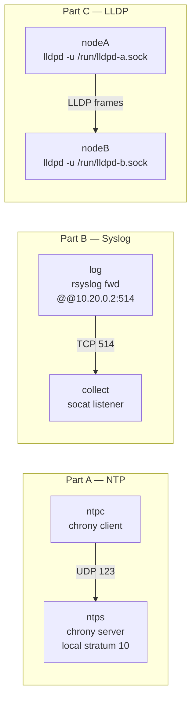

# Lab A03 — Services (NTP, Syslog, LLDP)

Part of **[Lab A03 — Common Network-Admin Tasks](./README.md)**. Read the README first for the [container setup](./README.md#the-setup), prerequisites, and cleanup conventions.

This lab runs three "helper plane" services inside network namespaces — each in its own namespace, sharing only a veth link:

- **Part A**: `chrony` as an offline NTP server (`local stratum 10`) and client.
- **Part B**: `rsyslog` forwarding logs over TCP to a collector (the `@@host:514` stanza).
- **Part C**: `lldpd` per-namespace with separate control sockets, showing LLDP neighbor discovery.



## Part A — NTP with chrony

```bash
ip netns add ntps
ip netns add ntpc

ip link add veth-ntps type veth peer name veth-ntpc
ip link set veth-ntps netns ntps
ip link set veth-ntpc netns ntpc
ip -n ntps addr add 10.10.0.1/24 dev veth-ntps
ip -n ntpc addr add 10.10.0.2/24 dev veth-ntpc
ip -n ntps link set veth-ntps up
ip -n ntpc link set veth-ntpc up
```

Configure chrony on the server (`ntps`):

```bash
cat > /tmp/chrony-server.conf <<'EOF'
local stratum 10
allow 10.10.0.0/24
bindaddress 10.10.0.1
port 123
driftfile /tmp/chrony-server.drift
logdir /tmp
EOF

ip netns exec ntps chronyd -f /tmp/chrony-server.conf -d &
```

Configure chrony on the client (`ntpc`):

```bash
cat > /tmp/chrony-client.conf <<'EOF'
server 10.10.0.1 iburst minpoll 0 maxpoll 0
bindaddress 10.10.0.2
driftfile /tmp/chrony-client.drift
logdir /tmp
EOF

ip netns exec ntpc chronyd -f /tmp/chrony-client.conf -d &
```

Verify (allow a few seconds for initial sync):

```bash
sleep 5
ip netns exec ntpc chronyc sources -v
# Look for "^*" marking the selected source with good Reach and offset

ip netns exec ntpc chronyc tracking
# Shows last offset, RMS offset, and stratum (should be 11 — server is 10)
```

## Part B — Syslog forwarding

```bash
ip netns add log
ip netns add collect

ip link add veth-log type veth peer name veth-collect
ip link set veth-log netns log
ip link set veth-collect netns collect
ip -n log     addr add 10.20.0.1/24 dev veth-log
ip -n collect addr add 10.20.0.2/24 dev veth-collect
ip -n log     link set veth-log up
ip -n collect link set veth-collect up
```

Start a TCP syslog collector on `collect` with `socat`:

```bash
rm -f /tmp/syslog-collected.log
ip netns exec collect socat -u \
    TCP-LISTEN:514,reuseaddr,fork \
    OPEN:/tmp/syslog-collected.log,creat,append &
sleep 1
```

Configure rsyslog on `log` to forward everything to the collector:

```bash
cat > /tmp/rsyslog-fwd.conf <<'EOF'
module(load="imuxsock")
module(load="iminternal")

*.* @@10.20.0.2:514
EOF

ip netns exec log rsyslogd -f /tmp/rsyslog-fwd.conf \
    -i /tmp/rsyslogd-log.pid \
    -n &
sleep 2
```

Inject a test message:

```bash
ip netns exec log logger -t testapp "hello from log namespace"
sleep 1
cat /tmp/syslog-collected.log
# Should contain "hello from log namespace"
```

## Part C — LLDP neighbor discovery

```bash
ip netns add nodeA
ip netns add nodeB

ip link add veth-a type veth peer name veth-b
ip link set veth-a netns nodeA
ip link set veth-b netns nodeB
ip -n nodeA addr add 10.30.0.1/24 dev veth-a
ip -n nodeB addr add 10.30.0.2/24 dev veth-b
ip -n nodeA link set veth-a up
ip -n nodeB link set veth-b up
```

Each `lldpd` instance gets its own control socket so they don't share a single daemon:

```bash
# nodeA — unique socket path
ip netns exec nodeA lldpd -u /run/lldpd-a.socket &

# nodeB — unique socket path
ip netns exec nodeB lldpd -u /run/lldpd-b.socket &

# Allow time for initial LLDP frames to be sent and received
sleep 5
```

Query neighbors:

```bash
ip netns exec nodeA lldpcli -u /run/lldpd-a.socket show neighbors
# Should show nodeB's chassis/port information

ip netns exec nodeB lldpcli -u /run/lldpd-b.socket show neighbors
# Should show nodeA's chassis/port information
```

The chassis name defaults to the namespace's hostname (the container hostname `workbench`). You can set per-namespace hostnames in the same way — or check `/sys/class/net/veth-a` for the interface name in the LLDP output's Port ID field.

## Test your work

```bash
./tests/test.sh 11
```

The test polls chrony (`chronyc sources` via `retry`) for a selected source, checks that the collected syslog file contains the injected token, and uses `lldpcli` to verify that each namespace sees the other's chassis ID as a neighbor.

## Optional extension

Add a systemd-style watchdog loop for chrony (even without systemd):

```bash
# A simple poll loop that alerts if chrony source goes stale
while true; do
    ip netns exec ntpc chronyc sources | grep -q '^\*' || echo "WARN: no chrony source selected"
    sleep 30
done &
```

## Comprehension questions

<details>
<summary>Answers (click to expand)</summary>

**1. What does `local stratum 10` mean in a chrony config and when would you use it?**

`local stratum 10` tells chronyd to advertise itself as a stratum-10 clock even when it has no upstream time source. This makes it a valid (if low-quality) NTP server to its clients — stratum 10 means "locally-sourced, 10 hops from a real atomic clock." You use this in air-gapped or isolated lab environments where there is no internet NTP access: all hosts sync to a single local master rather than drifting independently.

**2. What is the difference between `@` and `@@` in an rsyslog forwarding rule?**

In rsyslog's legacy syntax, `@host:port` forwards over UDP and `@@host:port` forwards over TCP. UDP (single `@`) is the historic RFC 3164 mode — connectionless, best-effort, no acknowledgement. TCP (double `@@`) is RFC 5425 / RELP-style — connection-oriented, so logs are not silently dropped if the collector is briefly unreachable (they queue until the connection is re-established or the buffer fills).

**3. Why does each lldpd instance need a unique socket path?**

`lldpd` uses a Unix domain socket as its control channel for `lldpcli`. By default, all instances use the same path (`/var/run/lldpd.socket`). Inside a container, all namespaces share the same filesystem, so two instances writing to the same socket path will conflict — one will fail to start or will overwrite the other's socket. Giving each instance `lldpd -u /run/lldpd-<ns>.socket` and pointing `lldpcli -u` at the same path isolates them completely.

</details>

## Teardown

```bash
kill $(cat /tmp/rsyslogd-log.pid 2>/dev/null) 2>/dev/null || true
pkill -f "chronyd -f /tmp/chrony" 2>/dev/null || true
pkill lldpd 2>/dev/null || true
pkill -f "socat.*514" 2>/dev/null || true
for ns in ntps ntpc log collect nodeA nodeB; do ip netns del "$ns" 2>/dev/null; done; true
```

---

Next: **[Lab A03 — Full Appliance and Health Sweep](./lab-12-appliance.md)** assembles a complete `wan–r–lan` box with all learned features and runs an `iperf3` health sweep.
