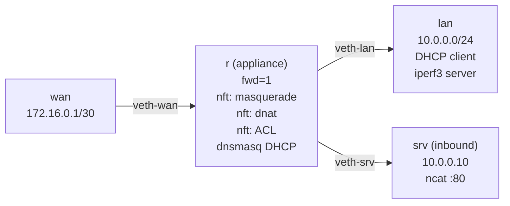

# Lab A03 — Full Appliance and Health Sweep

Part of **[Lab A03 — Common Network-Admin Tasks](./README.md)**. Read the README first for the [container setup](./README.md#the-setup), prerequisites, and cleanup conventions.

This is the capstone lab. Instead of exploring a single feature, you build a complete network appliance from namespace primitives and then run a multi-probe health sweep to verify every layer is working under load.

The appliance does everything a small branch router-firewall-DHCP-server combination does:
- **Routing and forwarding** between a `wan` and `lan` namespace.
- **Masquerade (PAT)** for outbound LAN traffic.
- **DNAT (port-forwarding)** for an inbound service.
- **Stateful ACL** — drop all uninitiated inbound, pass established+related.
- **DHCP server** for LAN hosts.

After building it, you run an `iperf3` throughput test, inspect interface counters, and verify the conntrack table is populated — the patterns you'd run against any production device after a change.



## Build the appliance

### Step 1 — Namespaces and links

```bash
ip netns add wan
ip netns add r
ip netns add lan
ip netns add srv

# wan ↔ r
ip link add veth-wan-r type veth peer name veth-r-wan
ip link set veth-wan-r netns wan
ip link set veth-r-wan netns r
ip -n wan addr add 172.16.0.1/30 dev veth-wan-r
ip -n r   addr add 172.16.0.2/30 dev veth-r-wan
ip -n wan link set veth-wan-r up
ip -n r   link set veth-r-wan up

# r ↔ lan  (lan gets DHCP — no static address yet)
ip link add veth-lan-r type veth peer name veth-r-lan
ip link set veth-lan-r netns lan
ip link set veth-r-lan netns r
ip -n r addr add 10.0.0.1/24 dev veth-r-lan
ip -n r link set veth-r-lan up
ip -n lan link set veth-lan-r up

# r ↔ srv  (static — srv is a known server)
ip link add veth-srv-r type veth peer name veth-r-srv
ip link set veth-srv-r netns srv
ip link set veth-r-srv netns r
ip -n srv addr add 10.0.0.10/24 dev veth-srv-r
ip -n r   addr add 10.0.0.2/24  dev veth-r-srv    # second addr on LAN-side
ip -n srv link set veth-srv-r up
ip -n r   link set veth-r-srv up
ip -n srv route add default via 10.0.0.1
```

### Step 2 — IP forwarding and default route

```bash
ip netns exec r sysctl -w net.ipv4.ip_forward=1
# wan namespace — default out through r
ip -n wan route add default via 172.16.0.2
```

### Step 3 — NFtables (ACL + NAT)

```bash
ip netns exec r nft -f - <<'EOF'
table ip filter {
    chain forward {
        type filter hook forward priority 0; policy drop;

        # Allow established/related (return traffic)
        ct state established,related accept

        # Allow LAN-initiated outbound
        iifname "veth-r-lan" oifname "veth-r-wan" accept
        iifname "veth-r-srv" oifname "veth-r-wan" accept

        # Allow inbound to DNAT target (srv:80) — after dnat rewrites daddr
        iifname "veth-r-wan" ip daddr 10.0.0.10 tcp dport 80 accept
    }
}

table ip nat {
    chain prerouting {
        type nat hook prerouting priority -100;
        # DNAT: WAN port 8080 → srv:80
        iifname "veth-r-wan" tcp dport 8080 dnat to 10.0.0.10:80
    }
    chain postrouting {
        type nat hook postrouting priority 100;
        oifname "veth-r-wan" masquerade
    }
}
EOF
```

Verify the ruleset:

```bash
ip netns exec r nft list ruleset
```

### Step 4 — DHCP server

```bash
cat > /tmp/dnsmasq-r.conf <<'EOF'
interface=veth-r-lan
interface=veth-r-srv
bind-interfaces
except-interface=lo
port=0
no-resolv
dhcp-range=10.0.0.100,10.0.0.200,1h
dhcp-option=3,10.0.0.1
dhcp-leasefile=/tmp/leases-r.txt
pid-file=/tmp/dnsmasq-r.pid
EOF

ip netns exec r dnsmasq -C /tmp/dnsmasq-r.conf
```

### Step 5 — Acquire a DHCP lease on lan

```bash
ip netns exec lan dhclient -v veth-lan-r -lf /tmp/dhclient-lan.leases
sleep 1
ip -n lan addr show veth-lan-r   # should show 10.0.0.100-200
```

### Step 6 — Service on srv

Start a simple TCP listener on `srv` to test DNAT:

```bash
ip netns exec srv ncat -l -k -p 80 -e /bin/cat &
```

## Run the health sweep

### Layer 3 — connectivity

```bash
# LAN → WAN (masquerade path)
ip netns exec lan ping -c 3 172.16.0.1

# WAN → srv via DNAT (port-forward path)
echo "health-check" | ip netns exec wan ncat 172.16.0.2 8080

# Verify conntrack sees both NAT flows
ip netns exec r conntrack -L 2>/dev/null | grep -E 'SNAT|DNAT|ESTABLISHED'
```

### Layer 4 — iperf3 throughput

```bash
# Start iperf3 server on lan
ip netns exec lan iperf3 -s -D --logfile /tmp/iperf3-server.log

# Run a 5-second LAN→WAN test through the appliance
# (lan sends to wan — traffic crosses r with masquerade)
ip netns exec wan iperf3 -s -1 -D --logfile /tmp/iperf3-wan.log
sleep 1
ip netns exec lan iperf3 -c 172.16.0.1 -t 5 -J > /tmp/iperf3-result.json

cat /tmp/iperf3-result.json | jq '.end.sum_received.bits_per_second / 1e6 | round'
# Should show a reasonable Mbps figure (>100 Mbps in a veth environment)
```

### Interface counters

```bash
# Before the test, snapshot r's counters
ip -n r -s -s link show veth-r-wan

# After iperf: check that TX/RX bytes increased
ip -n r -s -s link show veth-r-wan
```

### ACL verification — ensure drop policy is active

```bash
# Uninitiated inbound to random port — should be dropped
ip netns exec wan ncat -zw 1 172.16.0.2 9999 && echo "ERROR: should have been dropped" || echo "OK: dropped"
```

## Test your work

```bash
./tests/test.sh 12
```

The test verifies: `ip_forward` is on in `r`; nft has masquerade and dnat rules in the nat table; ACL forward chain has `policy drop`; conntrack shows NAT flows after probes; the DHCP lease file exists with an IP in range; `iperf3` result JSON reports non-zero throughput; per-interface TX/RX byte counters on `r` are non-zero.

## Optional extension

Add VLAN tagging on the WAN side to simulate a tagged ISP handoff:

```bash
ip -n r link add link veth-r-wan name veth-r-wan.100 type vlan id 100
ip -n r addr flush dev veth-r-wan
ip -n r addr add 172.16.0.2/30 dev veth-r-wan.100
ip -n r link set veth-r-wan.100 up
```

And update the wan side to match:

```bash
ip -n wan link add link veth-wan-r name veth-wan-r.100 type vlan id 100
ip -n wan addr flush dev veth-wan-r
ip -n wan addr add 172.16.0.1/30 dev veth-wan-r.100
ip -n wan link set veth-wan-r.100 up
```

## Comprehension questions

<details>
<summary>Answers (click to expand)</summary>

**1. In the nftables ruleset, why does the DNAT rule go in `prerouting` and the masquerade rule go in `postrouting`?**

`prerouting` runs before the routing decision — DNAT rewrites the destination address so that the routing system sees the real internal destination (10.0.0.10) and sends the packet to the correct interface. If DNAT happened after routing, the packet would have already been forwarded (or dropped) based on the unmodified WAN address. `postrouting` runs after routing, just before the packet leaves — masquerade replaces the source address with the outgoing interface's address, which is only known at that point.

**2. Why does the `ct state established,related accept` rule go at the top of the forward chain?**

Conntrack lookup is fast — the kernel checks the connection table first. If the rule is at the bottom, every established-return packet must traverse all the other rules before reaching the `ct state` accept. Putting it first short-circuits evaluation for all established traffic (which in practice is the vast majority of packets on a running router). The `policy drop` ensures anything that doesn't match any rule is dropped.

**3. What does `iperf3 -J` produce and why is it useful for automation?**

`-J` outputs the test result as structured JSON instead of human-readable text. This allows a test script to parse it with `jq` and extract exact values (`bits_per_second`, `retransmits`, `lost_packets`) for assertion without parsing variable-width text columns. In the health sweep pattern, you capture the JSON, archive it, and assert `bits_per_second > threshold` — the same pattern used by network monitoring scripts that run iperf3 against a site after every maintenance window.

</details>

## Teardown

```bash
kill "$(cat /tmp/dnsmasq-r.pid 2>/dev/null)" 2>/dev/null || true
pkill iperf3 2>/dev/null || true
pkill ncat 2>/dev/null || true
for ns in wan r lan srv; do ip netns del "$ns" 2>/dev/null; done; true
