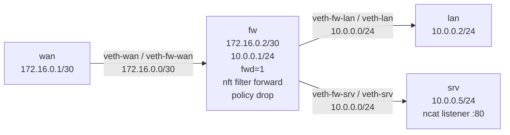

# Lab A03 — Stateful ACL and Capture

Part of **[Lab A03 — Common Network-Admin Tasks](./README.md)**. Read the README first for the [container setup](./README.md#the-setup), prerequisites, and cleanup conventions.

This lab builds an `nftables` forward chain with `policy drop` and a `ct state established,related accept` rule, creating a stateful firewall on a forwarding namespace. It also demonstrates `tcpdump` filtering to show only traffic between two specific hosts.



`fw` forwards between `wan` and the `lan`/`srv` side, with a stateful ACL that drops all new inbound connections except SSH (tcp/22). Return traffic for established connections is allowed. You will probe with `ncat` to verify the ACL works.

## Build the topology

```bash
ip netns add wan
ip netns add fw
ip netns add lan
ip netns add srv

# wan ↔ fw  (172.16.0.0/30)
ip link add veth-wan type veth peer name veth-fw-wan
ip link set veth-wan netns wan
ip link set veth-fw-wan netns fw

ip -n wan addr add 172.16.0.1/30 dev veth-wan
ip -n fw  addr add 172.16.0.2/30 dev veth-fw-wan
ip -n wan link set veth-wan up
ip -n fw  link set veth-fw-wan up

# fw ↔ lan  (10.0.0.0/24)
ip link add veth-fw-lan type veth peer name veth-lan
ip link set veth-fw-lan netns fw
ip link set veth-lan netns lan

ip -n fw  addr add 10.0.0.1/24 dev veth-fw-lan
ip -n lan addr add 10.0.0.2/24 dev veth-lan
ip -n fw  link set veth-fw-lan up
ip -n lan link set veth-lan up

# fw ↔ srv  (10.0.0.0/24 — second host on same LAN subnet)
ip link add veth-fw-srv type veth peer name veth-srv
ip link set veth-fw-srv netns fw
ip link set veth-srv netns srv

ip -n fw  addr add 10.0.0.254/24 dev veth-fw-srv
ip -n srv addr add 10.0.0.5/24 dev veth-srv
ip -n fw  link set veth-fw-srv up
ip -n srv link set veth-srv up

# Forwarding and default routes
ip netns exec fw sysctl -w net.ipv4.ip_forward=1
ip -n wan route add default via 172.16.0.2
ip -n lan route add default via 10.0.0.1
ip -n srv route add default via 10.0.0.254
```

## Part A — Build the stateful ACL

```bash
# Create the filter table and a forward chain with drop policy
ip netns exec fw nft add table inet filter
ip netns exec fw nft add chain inet filter forward \
    '{ type filter hook forward priority 0; policy drop; }'

# Allow return traffic for connections initiated from inside
ip netns exec fw nft add rule inet filter forward \
    ct state established,related accept

# Allow SSH from WAN to anywhere
ip netns exec fw nft add rule inet filter forward \
    iif "veth-fw-wan" tcp dport 22 accept
```

Verify the ruleset:

```bash
ip netns exec fw nft list ruleset
ip netns exec fw nft list chain inet filter forward
```

You should see the chain with `policy drop` and two rules.

## Part B — Test the ACL

Start a listener on `srv` that simulates a non-SSH service:

```bash
# Terminal 1: listener on port 80
ip netns exec srv ncat -l -p 80 -k &

# Terminal 2: listener on port 22 (SSH-like)
ip netns exec srv ncat -l -p 22 -k &
```

Test from `wan`:

```bash
# This should FAIL (port 80 not permitted from wan inbound)
ip netns exec wan ncat -z -w 2 10.0.0.5 80 && echo "CONNECTED" || echo "REFUSED/TIMEOUT"

# This should SUCCEED (port 22 is permitted)
ip netns exec wan ncat -z -w 2 10.0.0.5 22 && echo "CONNECTED" || echo "REFUSED/TIMEOUT"

# lan→wan should succeed for established return traffic
# (First establish a connection from lan outward)
ip netns exec lan ping -c 1 172.16.0.1    # lan-initiated; should succeed
```

## Part C — Capture between two specific hosts

While pinging from `lan` to `wan`, capture only that conversation on `fw`:

```bash
# In the background, capture on fw's wan-facing interface, filtering by the two hosts
ip netns exec fw tcpdump -i veth-fw-wan \
    'host 172.16.0.1 and host 10.0.0.2' -n -c 10 &

# Trigger some traffic
ip netns exec lan ping -c 5 172.16.0.1

# Wait for tcpdump to finish; kill it if needed
wait; kill %1 2>/dev/null || true
```

## Test your work

```bash
./tests/test.sh 2
```

The test auto-discovers the forwarding namespace, parses the `nft` ruleset (JSON), verifies the `ct state established,related` rule exists, checks the chain policy is `drop`, probes an allowed port from the outside (expects success) and a blocked port (expects failure), and verifies capture works on the forwarding interface.

## Optional extension

1. Add a rule that rate-limits ICMP: `ip netns exec fw nft add rule inet filter forward icmp type echo-request limit rate 5/second accept`. Ping from `wan` with `ping -f` (flood) and observe drops.

2. Add a logging rule: `ip netns exec fw nft add rule inet filter forward log prefix '"fw-drop: "' counter drop`. Watch `/proc/net/nf_log` or `dmesg` for drop logs.

## Comprehension questions

<details>
<summary>Answers (click to expand)</summary>

**1. What is the difference between `ct state new accept` and no ct state rule at all?**

Without a `ct state` rule, new connection attempts are subject to whatever other rules exist. `ct state new accept` explicitly allows new connections. `ct state established,related accept` allows return/related traffic (e.g., ICMP frag-needed, FTP data channel) without explicitly permitting new sessions. The combination is: permit existing flows, then evaluate new connections against explicit rules.

**2. Why does `policy drop` go on the chain, not the table?**

In nftables, the **chain** is the attachment point to the kernel hook. The `policy` is a chain-level property that applies when no rule matches. A table is just a namespace for chains and has no hook/policy of its own. You can have chains with `policy accept` and `policy drop` in the same table.

**3. Why does `tcpdump -i any 'host A and host B'` add a "cooked" header?**

The `any` pseudo-interface captures from all interfaces, but they may have different link-layer types. To unify them, Linux uses the `SLL` (Socket Link Layer) cooked format, which replaces the original Ethernet header. This changes the DLT type in the pcap file from 1 (Ethernet) to 113 (SLL). Tools like Wireshark handle it; some network tools expect DLT 1 and fail.

</details>

## Teardown

```bash
for ns in wan fw lan srv; do ip netns del "$ns"; done
```

---

Next: **[Lab A03 — VLAN Trunk](./lab-3-vlan-trunk.md)** builds two VLAN-aware bridges with a tagged trunk between them.
