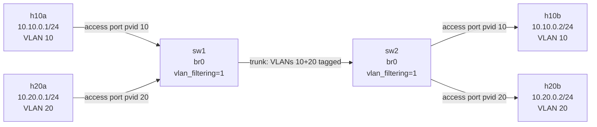

# Lab A03 — VLAN Trunk

Part of **[Lab A03 — Common Network-Admin Tasks](./README.md)**. Read the README first for the [container setup](./README.md#the-setup), prerequisites, and cleanup conventions.

This lab builds two VLAN-aware bridges joined by a tagged trunk veth. Hosts on VLAN 10 reach each other across the trunk; hosts on VLAN 20 reach each other across the trunk; and cross-VLAN traffic is blocked at the bridge level.



## Build the topology

```bash
# Namespaces
ip netns add sw1
ip netns add sw2
ip netns add h10a
ip netns add h20a
ip netns add h10b
ip netns add h20b

# --- sw1: create bridge with VLAN filtering ---
ip -n sw1 link add br0 type bridge
ip -n sw1 link set br0 type bridge vlan_filtering 1
ip -n sw1 link set br0 up

# h10a access port (VLAN 10, untagged in/out)
ip link add veth-sw1-10a type veth peer name veth-10a
ip link set veth-sw1-10a netns sw1
ip link set veth-10a netns h10a
ip -n sw1 link set veth-sw1-10a master br0
ip -n sw1 link set veth-sw1-10a up
bridge -n sw1 vlan add vid 10 dev veth-sw1-10a pvid untagged
bridge -n sw1 vlan del vid 1 dev veth-sw1-10a

# h20a access port (VLAN 20, untagged in/out)
ip link add veth-sw1-20a type veth peer name veth-20a
ip link set veth-sw1-20a netns sw1
ip link set veth-20a netns h20a
ip -n sw1 link set veth-sw1-20a master br0
ip -n sw1 link set veth-sw1-20a up
bridge -n sw1 vlan add vid 20 dev veth-sw1-20a pvid untagged
bridge -n sw1 vlan del vid 1 dev veth-sw1-20a

# --- sw2: create bridge with VLAN filtering ---
ip -n sw2 link add br0 type bridge
ip -n sw2 link set br0 type bridge vlan_filtering 1
ip -n sw2 link set br0 up

# h10b access port (VLAN 10)
ip link add veth-sw2-10b type veth peer name veth-10b
ip link set veth-sw2-10b netns sw2
ip link set veth-10b netns h10b
ip -n sw2 link set veth-sw2-10b master br0
ip -n sw2 link set veth-sw2-10b up
bridge -n sw2 vlan add vid 10 dev veth-sw2-10b pvid untagged
bridge -n sw2 vlan del vid 1 dev veth-sw2-10b

# h20b access port (VLAN 20)
ip link add veth-sw2-20b type veth peer name veth-20b
ip link set veth-sw2-20b netns sw2
ip link set veth-20b netns h20b
ip -n sw2 link set veth-sw2-20b master br0
ip -n sw2 link set veth-sw2-20b up
bridge -n sw2 vlan add vid 20 dev veth-sw2-20b pvid untagged
bridge -n sw2 vlan del vid 1 dev veth-sw2-20b

# --- Trunk between sw1 and sw2 (VLANs 10 and 20 tagged) ---
ip link add veth-trunk1 type veth peer name veth-trunk2
ip link set veth-trunk1 netns sw1
ip link set veth-trunk2 netns sw2
ip -n sw1 link set veth-trunk1 master br0
ip -n sw2 link set veth-trunk2 master br0
ip -n sw1 link set veth-trunk1 up
ip -n sw2 link set veth-trunk2 up
bridge -n sw1 vlan add vid 10 dev veth-trunk1
bridge -n sw1 vlan add vid 20 dev veth-trunk1
bridge -n sw1 vlan del vid 1 dev veth-trunk1
bridge -n sw2 vlan add vid 10 dev veth-trunk2
bridge -n sw2 vlan add vid 20 dev veth-trunk2
bridge -n sw2 vlan del vid 1 dev veth-trunk2

# --- Host addresses ---
ip -n h10a addr add 10.10.0.1/24 dev veth-10a; ip -n h10a link set veth-10a up
ip -n h20a addr add 10.20.0.1/24 dev veth-20a; ip -n h20a link set veth-20a up
ip -n h10b addr add 10.10.0.2/24 dev veth-10b; ip -n h10b link set veth-10b up
ip -n h20b addr add 10.20.0.2/24 dev veth-20b; ip -n h20b link set veth-20b up
```

## Verify

```bash
# VLAN port membership
bridge -n sw1 vlan show
bridge -n sw2 vlan show

# Same-VLAN reach across the trunk
ip netns exec h10a ping -c 3 10.10.0.2   # VLAN 10: h10a → h10b — should succeed
ip netns exec h20a ping -c 3 10.20.0.2   # VLAN 20: h20a → h20b — should succeed

# Cross-VLAN should fail (no routing, different broadcast domains)
ip netns exec h10a ping -c 2 -W 1 10.20.0.1   # should fail

# See tags on the trunk with tcpdump
ip netns exec sw1 tcpdump -i veth-trunk1 -e -c 10 -n &
ip netns exec h10a ping -c 2 10.10.0.2
ip netns exec h20a ping -c 2 10.20.0.2
wait; kill %1 2>/dev/null || true
```

You should see frames tagged with `vlan 10` and `vlan 20` in the tcpdump output.

## Test your work

```bash
./tests/test.sh 3
```

The test verifies VLAN filtering is on, same-VLAN hosts reach each other, cross-VLAN hosts cannot reach each other, and the trunk carries traffic tagged with two distinct VLAN IDs (proving the 802.1Q encapsulation, not a same-subnet shortcut).

## Optional extension

Add an SVI (switched virtual interface) for VLAN 10 on `sw1`:

```bash
ip -n sw1 link add link br0 name br0.10 type vlan id 10
ip -n sw1 addr add 10.10.0.254/24 dev br0.10
ip -n sw1 link set br0.10 up
bridge -n sw1 vlan add vid 10 dev br0 self     # bridge device membership
```

Now `sw1` itself has an IP on VLAN 10 and can ping `h10a`.

## Comprehension questions

<details>
<summary>Answers (click to expand)</summary>

**1. What does `pvid` mean on a bridge port?**

`pvid` (Port VLAN ID) is the VLAN assigned to untagged ingress traffic on that port. When an untagged frame arrives on a port with `pvid 10`, the bridge tags it with VLAN 10 internally. On egress, ports with `pvid untagged` strip the tag before sending. This is the access-port behaviour.

**2. Why must you delete VLAN 1 from each port?**

When a Linux bridge port is enslaved, it defaults to `pvid 1` (VLAN 1, untagged). If you add VIDs 10 and 20 but don't delete VLAN 1, hosts can communicate untagged via VLAN 1, breaking your intended segmentation. Always clean up the default VLAN on each port explicitly.

**3. How does `bridge vlan show` differ from `bridge fdb show`?**

`bridge vlan show` shows the VLAN membership table (which VLANs are permitted on which ports, whether ingress/egress is tagged or untagged). `bridge fdb show` shows the MAC forwarding database (which MAC addresses the bridge has learned, on which port, and in which VLAN). The VLAN table is static configuration; the FDB is dynamic (learned from traffic).

</details>

## Teardown

```bash
for ns in sw1 sw2 h10a h20a h10b h20b; do ip netns del "$ns"; done
```

---

Next: **[Lab A03 — Bonding](./lab-4-bonding.md)** bonds two interfaces in active-backup and 802.3ad LACP modes.
