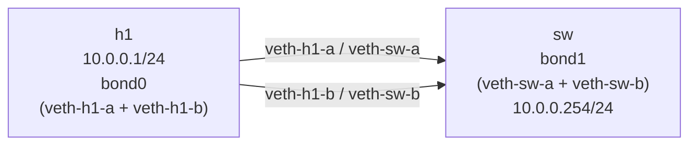

# Lab A03 — Bonding

Part of **[Lab A03 — Common Network-Admin Tasks](./README.md)**. Read the README first for the [container setup](./README.md#the-setup), prerequisites, and cleanup conventions.

This lab builds a bonded interface in active-backup mode and then replaces it with an 802.3ad LACP bond. Because LACP requires a partner on both ends, both sides of the veth must be bonded.



Both `h1` and `sw` will bond their two veths. Active-backup runs first (no partner requirement); then the lab rebuilds with LACP so you can see the partner-MAC negotiation in `/proc/net/bonding`.

## Preflight

Check that the `bonding` module is available on your host:

```bash
modprobe bonding && echo "bonding OK" || echo "bonding module not available on host"
```

## Part A — Active-backup bond

```bash
ip netns add h1
ip netns add sw

# Create the two veth pairs
ip link add veth-h1-a type veth peer name veth-sw-a
ip link add veth-h1-b type veth peer name veth-sw-b

ip link set veth-h1-a netns h1
ip link set veth-h1-b netns h1
ip link set veth-sw-a netns sw
ip link set veth-sw-b netns sw

# --- h1 bond ---
ip -n h1 link add bond0 type bond
ip -n h1 link set bond0 type bond mode active-backup miimon 100
# Member interfaces must be DOWN before enslaving
ip -n h1 link set veth-h1-a down
ip -n h1 link set veth-h1-b down
ip -n h1 link set veth-h1-a master bond0
ip -n h1 link set veth-h1-b master bond0
ip -n h1 addr add 10.0.0.1/24 dev bond0
ip -n h1 link set bond0 up

# --- sw bond ---
ip -n sw link add bond1 type bond
ip -n sw link set bond1 type bond mode active-backup miimon 100
ip -n sw link set veth-sw-a down
ip -n sw link set veth-sw-b down
ip -n sw link set veth-sw-a master bond1
ip -n sw link set veth-sw-b master bond1
ip -n sw addr add 10.0.0.254/24 dev bond1
ip -n sw link set bond1 up
```

Verify active-backup:

```bash
ip netns exec h1 cat /proc/net/bonding/bond0
# Look for: Bonding Mode: fault-tolerance (active-backup)
#           Currently Active Slave: veth-h1-a (or veth-h1-b)

ip netns exec h1 ping -c 3 10.0.0.254   # should succeed

# Read the active slave
cat /sys/class/net/bond0/bonding/active_slave 2>/dev/null ||
    ip netns exec h1 cat /sys/class/net/bond0/bonding/active_slave
```

## Part B — Rebuild with 802.3ad LACP

Tear down the active-backup bonds and rebuild with LACP:

```bash
ip netns del h1; ip netns del sw
ip netns add h1; ip netns add sw

ip link add veth-h1-a type veth peer name veth-sw-a
ip link add veth-h1-b type veth peer name veth-sw-b
ip link set veth-h1-a netns h1; ip link set veth-h1-b netns h1
ip link set veth-sw-a netns sw;  ip link set veth-sw-b netns sw

# h1 LACP bond
ip -n h1 link add bond0 type bond
ip -n h1 link set bond0 type bond mode 802.3ad miimon 100 lacp_rate fast
ip -n h1 link set veth-h1-a down; ip -n h1 link set veth-h1-a master bond0
ip -n h1 link set veth-h1-b down; ip -n h1 link set veth-h1-b master bond0
ip -n h1 addr add 10.0.0.1/24 dev bond0
ip -n h1 link set bond0 up

# sw LACP bond — MUST also be in 802.3ad for LACP to negotiate
ip -n sw link add bond1 type bond
ip -n sw link set bond1 type bond mode 802.3ad miimon 100 lacp_rate fast
ip -n sw link set veth-sw-a down; ip -n sw link set veth-sw-a master bond1
ip -n sw link set veth-sw-b down; ip -n sw link set veth-sw-b master bond1
ip -n sw addr add 10.0.0.254/24 dev bond1
ip -n sw link set bond1 up
```

Verify LACP:

```bash
ip netns exec h1 cat /proc/net/bonding/bond0
# Look for: Bonding Mode: IEEE 802.3ad Dynamic Link Aggregation
#           Partner Mac Address: <non-zero MAC>
#           Number of ports: 2
#           Aggregator ID: ...

ip netns exec h1 ping -c 3 10.0.0.254
```

## Test your work

```bash
./tests/test.sh 4
```

The test discovers the namespace with a bond interface, reads `/proc/net/bonding/`, confirms the mode matches what was configured (active-backup or 802.3ad), verifies an active slave exists, and checks end-to-end reachability.

> **Note:** Run the test after Part B (LACP) for the strictest assertions. The test checks for a non-zero partner MAC to confirm LACP negotiated.

## Optional extension

Simulate a link failure in active-backup mode (without the automated test):

```bash
# In Part A, bring down the active slave
ip -n h1 link set veth-h1-a down
ip netns exec h1 cat /proc/net/bonding/bond0   # Active slave should switch
ip netns exec h1 ping -c 3 10.0.0.254           # Still reachable via veth-h1-b
ip -n h1 link set veth-h1-a up                  # Restore
```

## Comprehension questions

<details>
<summary>Answers (click to expand)</summary>

**1. Why must member interfaces be DOWN before enslaving them to a bond?**

The bonding driver takes ownership of the interface's MAC and link state. If the interface is up when enslaved, the driver must drop existing connections and may leave the interface in an inconsistent state. The requirement to bring them down first is a safety guard in the kernel bonding driver.

**2. Why does LACP require a bonded partner on the other end?**

LACP (IEEE 802.3ad) is a negotiation protocol: both ends exchange LACPDUs to agree on which links to aggregate. A single non-bonded interface does not speak LACP and will not reply to LACPDUs; the bond will sit in a "churn" or "defaulted" state. Only when both ends negotiate successfully does the aggregator become active.

**3. What is `miimon` and what does it detect?**

`miimon` is a periodic carrier-detection interval (in milliseconds). The bonding driver polls the MII (Media Independent Interface) register of each member to check whether the cable has a physical link. It detects link-down (no carrier) but not application-layer failures (e.g., the far end is up but dropping all packets). `arp_interval` / `arp_ip_target` adds ARP-based detection for those cases.

</details>

## Teardown

```bash
for ns in h1 sw; do ip netns del "$ns"; done
```

---

Next: **[Lab A03 — NAT and Port-Forward](./lab-5-nat-pat.md)** configures masquerade outbound NAT and DNAT inbound port-forwarding using `nftables`.
