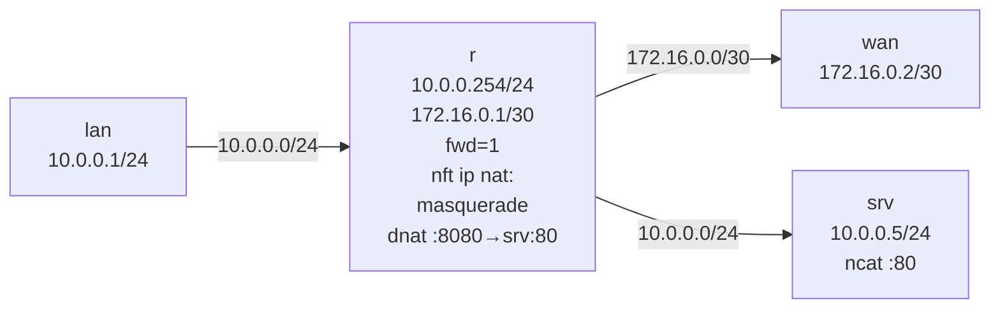

# Lab A03 — NAT and Port-Forward

Part of **[Lab A03 — Common Network-Admin Tasks](./README.md)**. Read the README first for the [container setup](./README.md#the-setup), prerequisites, and cleanup conventions.

This lab configures masquerade outbound NAT (a LAN host reaches the WAN with its source address rewritten to the router's WAN IP) and DNAT (a WAN host reaches an internal service via a port-forward on the router). `conntrack -L` shows the kernel's view of the translated flows.



## Build the topology

```bash
ip netns add lan
ip netns add r
ip netns add wan
ip netns add srv

# r ↔ lan  (10.0.0.0/24)
ip link add veth-r-lan type veth peer name veth-lan
ip link set veth-r-lan netns r; ip link set veth-lan netns lan
ip -n r   addr add 10.0.0.254/24 dev veth-r-lan
ip -n lan addr add 10.0.0.1/24   dev veth-lan
ip -n r   link set veth-r-lan up; ip -n lan link set veth-lan up

# r ↔ wan  (172.16.0.0/30)
ip link add veth-r-wan type veth peer name veth-wan
ip link set veth-r-wan netns r; ip link set veth-wan netns wan
ip -n r   addr add 172.16.0.1/30 dev veth-r-wan
ip -n wan addr add 172.16.0.2/30 dev veth-wan
ip -n r   link set veth-r-wan up; ip -n wan link set veth-wan up

# r ↔ srv  (10.0.0.0/24 — second LAN host)
ip link add veth-r-srv type veth peer name veth-srv
ip link set veth-r-srv netns r; ip link set veth-srv netns srv
ip -n r   addr add 10.0.0.253/24 dev veth-r-srv
ip -n srv addr add 10.0.0.5/24   dev veth-srv
ip -n r   link set veth-r-srv up; ip -n srv link set veth-srv up

# Routing
ip netns exec r sysctl -w net.ipv4.ip_forward=1
ip -n lan route add default via 10.0.0.254
ip -n srv route add default via 10.0.0.253
ip -n wan route add 10.0.0.0/24 via 172.16.0.1   # return path (needed for DNAT responses)
```

## Part A — Outbound NAT (masquerade)

```bash
ip netns exec r nft add table ip nat
ip netns exec r nft add chain ip nat postrouting \
    '{ type nat hook postrouting priority 100; }'
ip netns exec r nft add rule ip nat postrouting \
    oifname "veth-r-wan" masquerade
```

Test outbound NAT:

```bash
# Ping from lan through r to wan
ip netns exec lan ping -c 3 172.16.0.2

# On r, conntrack should show a SNAT tuple
ip netns exec r conntrack -L 2>/dev/null | grep SNAT || \
    ip netns exec r conntrack -L 2>/dev/null   # look for src=10.0.0.1, dnat lines
```

## Part B — DNAT (port-forward)

Start a service listener on `srv`:

```bash
ip netns exec srv ncat -l -p 80 -k &
```

Add the DNAT rule:

```bash
ip netns exec r nft add chain ip nat prerouting \
    '{ type nat hook prerouting priority -100; }'
ip netns exec r nft add rule ip nat prerouting \
    iif "veth-r-wan" tcp dport 8080 dnat to 10.0.0.5:80
```

Test the port-forward:

```bash
# From wan, connect to r's wan IP port 8080 → should reach srv:80
ip netns exec wan ncat -z -w 3 172.16.0.1 8080 && echo "CONNECTED to DNAT" || echo "FAILED"

# Conntrack shows the DNAT entry
ip netns exec r conntrack -L 2>/dev/null | grep -i dnat
```

Verify the full ruleset:

```bash
ip netns exec r nft list table ip nat
```

## Test your work

```bash
./tests/test.sh 5
```

The test finds the forwarding namespace with a nat table, parses the `nft` JSON ruleset for `masquerade` in postrouting and `dnat` in prerouting, drives both outbound and inbound flows, then checks `conntrack -L` for matching entries.

## Optional extension

Add a firewall chain to the NAT scenario: after DNAT, the packet still passes through the forward hook. Add a rule in the forward chain that allows the DNAT-ed flow but blocks everything else from WAN:

```bash
ip netns exec r nft add table inet filter
ip netns exec r nft add chain inet filter forward \
    '{ type filter hook forward priority 0; policy drop; }'
ip netns exec r nft add rule inet filter forward ct state established,related accept
ip netns exec r nft add rule inet filter forward ct state new tcp dport 80 accept
```

Now only the DNAT-forwarded HTTP traffic is allowed inbound.

## Comprehension questions

<details>
<summary>Answers (click to expand)</summary>

**1. What is the difference between `masquerade` and `snat to <ip>`?**

Both rewrite the source address. `snat to 1.2.3.4` pins the translated address to a specific IP at rule-compile time. `masquerade` looks up the egress interface's current IP at packet time — if the interface's IP changes (DHCP), masquerade stays correct while `snat to` would be stale. Use `masquerade` when the WAN IP is dynamic; use `snat to` when it is static for slightly lower overhead.

**2. Why does `conntrack -L` show nothing until the first packet flows?**

Conntrack entries are created on the first packet of a new flow. The NAT rule installing `masquerade` does not pre-populate conntrack; it tells the kernel what to do when a packet arrives. Send one ping or curl to trigger the first entry.

**3. Why must the server's default route point through the router?**

For DNAT to work end-to-end, the server (`srv`) must return its response through the same router that DNATed the incoming packet. If `srv` sent responses directly to the `wan` client, conntrack would not see the response and could not de-NAT it, so the `wan` client would receive packets from `srv`'s real IP instead of the router's IP and would discard them as unexpected.

</details>

## Teardown

```bash
for ns in lan r wan srv; do ip netns del "$ns"; done
```

---

Next: **[Lab A03 — Port Mirror / SPAN](./lab-6-mirror-span.md)** uses `tc clsact` and `mirred` to copy frames to a monitor interface.
