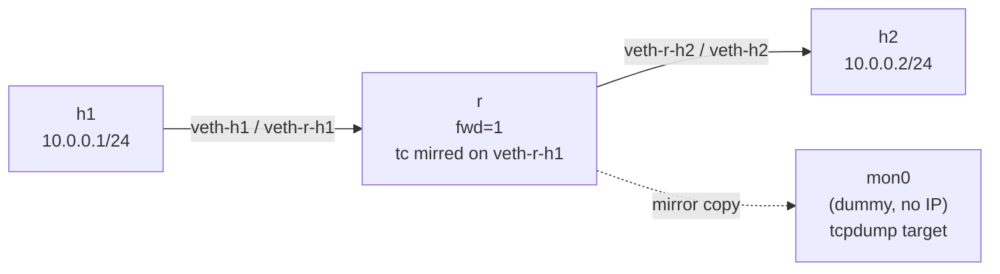

# Lab A03 — Port Mirror / SPAN

Part of **[Lab A03 — Common Network-Admin Tasks](./README.md)**. Read the README first for the [container setup](./README.md#the-setup), prerequisites, and cleanup conventions.

This lab attaches a `tc clsact` qdisc and a `mirred` filter to a transit interface, copying every frame to a `dummy` monitor interface where you can sniff with `tcpdump` — the Linux equivalent of a SPAN session.



All traffic through `r` on the `veth-r-h1` interface is mirrored to `mon0`. The original traffic continues to flow normally — the mirror is a copy.

## Preflight

Check that the `act_mirred` and `cls_matchall` modules are available:

```bash
modprobe act_mirred  && echo "act_mirred OK"
modprobe cls_matchall && echo "cls_matchall OK"
modprobe sch_clsact  && echo "sch_clsact OK"
```

## Build the topology

```bash
ip netns add h1
ip netns add r
ip netns add h2

# h1 ↔ r  (10.0.0.0/24 — first segment)
ip link add veth-h1 type veth peer name veth-r-h1
ip link set veth-h1 netns h1
ip link set veth-r-h1 netns r
ip -n h1 addr add 10.0.0.1/24 dev veth-h1
ip -n r  addr add 10.0.0.254/24 dev veth-r-h1
ip -n h1 link set veth-h1 up
ip -n r  link set veth-r-h1 up

# r ↔ h2  (10.0.1.0/24 — second segment)
ip link add veth-h2 type veth peer name veth-r-h2
ip link set veth-h2 netns h2
ip link set veth-r-h2 netns r
ip -n h2 addr add 10.0.1.1/24 dev veth-h2
ip -n r  addr add 10.0.1.254/24 dev veth-r-h2
ip -n h2 link set veth-h2 up
ip -n r  link set veth-r-h2 up

ip netns exec r sysctl -w net.ipv4.ip_forward=1
ip -n h1 route add default via 10.0.0.254
ip -n h2 route add default via 10.0.1.254

# Monitor interface inside r's namespace
ip -n r link add mon0 type dummy
ip -n r link set mon0 up
```

## Configure the mirror

```bash
# Attach the clsact qdisc — this is the hook point for both ingress and egress
ip netns exec r tc qdisc add dev veth-r-h1 clsact

# Mirror ingress (packets arriving from h1) to mon0
ip netns exec r tc filter add dev veth-r-h1 ingress \
    matchall action mirred egress mirror dev mon0

# Mirror egress (packets leaving toward h1) to mon0 as well
ip netns exec r tc filter add dev veth-r-h1 egress \
    matchall action mirred egress mirror dev mon0
```

Verify the filter is installed:

```bash
ip netns exec r tc -s qdisc show dev veth-r-h1
ip netns exec r tc -s filter show dev veth-r-h1 ingress
ip netns exec r tc -s filter show dev veth-r-h1 egress
```

## Verify the mirror

Start `tcpdump` on the monitor interface, then generate traffic:

```bash
# Background tcpdump on the monitor
ip netns exec r tcpdump -i mon0 -n -c 20 &

# Traffic between h1 and h2
ip netns exec h1 ping -c 5 10.0.1.1

# Wait for tcpdump
wait; kill %1 2>/dev/null || true
```

You should see ICMP frames appear on `mon0` that are copies of the h1↔h2 traffic. The traffic also flows normally — `h1` should get replies from `h2`.

## Test your work

```bash
./tests/test.sh 6
```

The test finds the namespace with a `clsact` qdisc, parses `tc filter` JSON for a `mirred` action, then drives h1→h2 pings and verifies that `tcpdump` on the monitor interface captures copies of the ICMP traffic.

## Optional extension

Mirror only a specific traffic class: replace `matchall` with a BPF or protocol filter:

```bash
# Mirror only ICMP (instead of all traffic)
ip netns exec r tc filter add dev veth-r-h1 ingress \
    protocol ip u32 match ip protocol 1 0xff \
    action mirred egress mirror dev mon0
```

## Comprehension questions

<details>
<summary>Answers (click to expand)</summary>

**1. What is `clsact` and why do you need it before adding a `mirred` filter?**

`clsact` is a queuing discipline (qdisc) that provides ingress and egress classification hooks. The `mirred` action (and other `tc` actions) must be attached to a qdisc's classifier. Without `clsact`, there is no hook to attach the `matchall` filter to. `clsact` is lightweight — it does not buffer or rate-limit traffic, it just provides the attachment point.

**2. Is the original traffic affected by the mirror?**

No. `action mirred egress mirror` is a *copy* operation — the frame is duplicated and sent to the mirror target, while the original continues its normal forwarding path. This differs from `redirect`, which replaces the original forwarding with redirection to the target.

**3. How does this compare to a RSPAN (Remote SPAN) in hardware?**

In hardware, RSPAN adds a VLAN tag to mirrored frames and sends them over the production network to a remote collector. Linux `tc mirred` mirrors within the same host (or namespace). To do remote mirroring on Linux, you would combine `mirred` with a VXLAN or GRE interface as the mirror target — the mirrored frame is encapsulated and sent to a remote collector.

</details>

## Teardown

```bash
for ns in h1 r h2; do ip netns del "$ns"; done
```

---

Next: **[Lab A03 — DHCP Server and Relay](./lab-7-dhcp.md)** runs `dnsmasq` as a DHCP server and `dhcrelay` as a relay across subnets.
