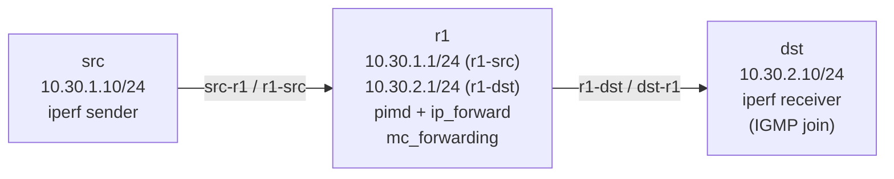

# Lab A04 Multicast-1 — FRR `pimd` PIM-SM

Sub-lab 1 of 2 · [← Lab A04 Multicast](README.md) · Next: [lab-2-smcroute-static →](lab-2-smcroute-static.md)

Pairs with: [Article 4 §7 — Multicast](../../wiki/article-04-routing-daemons.md)

**Goal:** Enable PIM-SM on a Linux router using FRR's `pimd`. Observe the complete multicast data path: receiver sends an IGMP join → pimd registers the (S,G) → kernel installs an mroute entry → stream flows from source to receiver. Verify at each layer.

## Topology



## Build the topology

```bash
# Create namespaces
ip netns add src
ip netns add r1
ip netns add dst

# src — r1 link
ip link add src-r1 type veth peer name r1-src
ip link set src-r1 netns src
ip link set r1-src netns r1
ip netns exec src ip addr add 10.30.1.10/24 dev src-r1
ip netns exec r1  ip addr add 10.30.1.1/24  dev r1-src
ip netns exec src ip link set src-r1 up
ip netns exec r1  ip link set r1-src up

# r1 — dst link
ip link add r1-dst type veth peer name dst-r1
ip link set r1-dst netns r1
ip link set dst-r1 netns dst
ip netns exec r1  ip addr add 10.30.2.1/24  dev r1-dst
ip netns exec dst ip addr add 10.30.2.10/24 dev dst-r1
ip netns exec r1  ip link set r1-dst up
ip netns exec dst ip link set dst-r1 up

# Loopbacks
for ns in src r1 dst; do ip netns exec $ns ip link set lo up; done

# Default routes on hosts
ip netns exec src ip route add default via 10.30.1.1
ip netns exec dst ip route add default via 10.30.2.1

# Forwarding sysctls on router
ip netns exec r1 sysctl -qw net.ipv4.ip_forward=1
ip netns exec r1 sysctl -qw net.ipv4.conf.all.mc_forwarding=1

# Verify unicast reachability
ip netns exec src ping -c1 -W2 10.30.2.10
```

## Part A — Enable `mc_forwarding` and verify

```bash
ip netns exec r1 sysctl net.ipv4.ip_forward
# Expected: net.ipv4.ip_forward = 1

ip netns exec r1 sysctl net.ipv4.conf.all.mc_forwarding
# Expected: net.ipv4.conf.all.mc_forwarding = 1
```

**Watch out for:** `mc_forwarding` is a separate knob from `ip_forward`. Many guides only set `ip_forward` and then wonder why multicast does not forward. The kernel routing path for multicast is distinct from unicast; `mc_forwarding` gates it separately.

## Part B — Start FRR with pimd

Create the per-namespace config:

```bash
mkdir -p /etc/frr/r1
cat > /etc/frr/r1/daemons << 'EOF'
zebra=yes
bgpd=no
ospfd=no
ospf6d=no
pimd=yes
bfdd=no
vrrpd=no
staticd=yes
EOF
touch /etc/frr/r1/frr.conf
cat > /etc/frr/r1/vtysh.conf << 'EOF'
service integrated-vtysh-config
EOF

systemctl start frr@r1
sleep 3
systemctl is-active frr@r1
```

Configure PIM-SM in vtysh:

```bash
ip netns exec r1 vtysh -N r1 << 'EOF'
configure terminal
ip multicast-routing
interface r1-src
 ip pim
 ip igmp
exit
interface r1-dst
 ip pim
 ip igmp
exit
ip pim rp 10.30.1.1 224.0.0.0/4
end
write memory
EOF
```

Verify PIM state:

```bash
ip netns exec r1 vtysh -N r1 -c 'show ip pim interface'
# Expected: r1-src and r1-dst listed with PIM enabled

ip netns exec r1 vtysh -N r1 -c 'show ip pim rp-info'
# Expected: RP 10.30.1.1 for group-range 224.0.0.0/4
```

## Part C — Issue an IGMP join and start the receiver

On `dst`, start an iperf receiver bound to the multicast group. Binding to a multicast group triggers an IGMP join:

```bash
# Terminal 1 (or tmux pane): run receiver in dst
ip netns exec dst iperf -s -u -B 239.1.1.1 -i 1 &
sleep 2
```

Verify the IGMP join was received by pimd:

```bash
ip netns exec r1 vtysh -N r1 -c 'show ip igmp groups'
# Expected: 239.1.1.1 listed on r1-dst
```

Verify the kernel's multicast membership table on `dst`:

```bash
ip netns exec dst ip maddr show dev dst-r1
# Expected: 239.1.1.1 listed
```

**What you are seeing:** The iperf receiver called `setsockopt(IP_ADD_MEMBERSHIP, ...)`. The kernel added the group to the interface's membership list and sent an IGMPv3 Membership Report. pimd saw the report on `r1-dst` and updated its IGMP group table.

## Part D — Start the source and check the mroute table

Source a UDP multicast stream from `src`:

```bash
# Terminal 2: run sender in src (TTL=32 to cross the router; -t 60 = 60 second stream)
ip netns exec src iperf -c 239.1.1.1 -u -T 32 -t 60 -i 5 &
sleep 3
```

Now check the mroute tables at two layers:

```bash
# FRR's view (PIM control plane)
ip netns exec r1 vtysh -N r1 -c 'show ip mroute'
# Expected: (10.30.1.10, 239.1.1.1)  IIF: r1-src  OIL: r1-dst

# Kernel's view (the actual FIB entry pimd installed)
ip netns exec r1 ip mroute show
# Expected: (10.30.1.10, 239.1.1.1)  Iif: r1-src  Oifs: r1-dst
```

The two outputs show the **same entry from two perspectives** — this is the RIB-vs-FIB distinction for multicast: pimd owns the routing decision (RIB), kernel owns the forwarding entry (FIB).

Verify dst is receiving:

```bash
# In the dst iperf window you should see:
# [  3] 0.0-5.0 sec  ... Mbytes  ... Mbits/sec  x.xx ms  0/NNN (0%)
```

Zero loss, positive bandwidth = stream is flowing through the mroute.

## Part E — Journal correlation

Because FRR runs under `frr@r1.service`, all PIM/IGMP events land in the journal:

```bash
journalctl -u frr@r1 --since '5 min ago' | grep -iE '(pim|igmp|mroute)'
```

You should see lines like:
```
pimd: IGMP (10.30.2.10,r1-dst) Join 239.1.1.1
pimd: PIM (S,G)=(10.30.1.10,239.1.1.1) installed
```

## Test your work

```bash
./tests/multicast/test.sh 1
```

**Note:** The checker requires an active iperf stream for the (S,G) check (Part E). Run the iperf commands above before running the checker.

## Comprehension questions

<details>
<summary>Why is `mc_forwarding` a separate sysctl from `ip_forward`?</summary>

Unicast forwarding and multicast forwarding use different kernel code paths and different forwarding tables. `ip_forward` gates the unicast forwarding path (netfilter FORWARD chain); `mc_forwarding` gates the multicast forwarding path (the mroute socket and kernel multicast FIB). You can have a host that unicast-forwards but does not multicast-forward (e.g., a firewall that passes unicast but blocks multicast forwarding), or vice versa. They are independent knobs by design.
</details>

<details>
<summary>What is the Rendezvous Point (RP) and why does a single-router lab need one?</summary>

In PIM-SM, the RP is the meeting point where sources register their streams and receivers join. In a production network, the RP is a separate router. In this single-router lab, r1 is its own RP — it is both the source-facing router and the RP. This simplification works because the SPT (shortest-path tree) switchover from the shared tree to the source tree is instantaneous when source and RP are the same router. The FRR command `ip pim rp 10.30.1.1 224.0.0.0/4` tells pimd to treat r1's own address as RP for all multicast groups.
</details>

<details>
<summary>What happens to the (S,G) entry if the iperf source stops?</summary>

The kernel mroute entry ages out after `cache_bypass_threshold` seconds (default 300 s). pimd removes the (S,G) from its routing table after the last OIF prune (IGMP leave or timeout). The `ip mroute show` entry disappears, and if the source restarts, pimd re-installs a fresh (S,G) entry.
</details>

## Teardown

```bash
pkill -f 'iperf' 2>/dev/null || true
systemctl stop frr@r1 2>/dev/null || true
ip netns del src 2>/dev/null || true
ip netns del r1  2>/dev/null || true
ip netns del dst 2>/dev/null || true
rm -rf /etc/frr/r1 2>/dev/null || true
```

Next: [lab-2-smcroute-static.md](lab-2-smcroute-static.md) — same topology, static mroute without a control plane.
