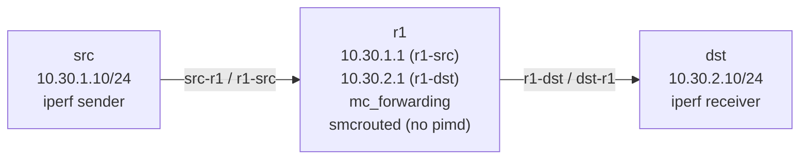

# Lab A04 Multicast-2 — `smcroute` Static Mroute

Sub-lab 2 of 2 · [← lab-1-pim-sm](lab-1-pim-sm.md) · [← Lab A04 Multicast](README.md)

Pairs with: [Article 4 §7 — Multicast](../../wiki/article-04-routing-daemons.md)

**Goal:** Forward a multicast stream using `smcroute` — a static multicast route installed directly into the kernel without any control plane (no PIM, no IGMP). Understand *when* this matters (embedded systems, fixed topologies, one-socket-per-netns constraint) and verify the kernel mroute table matches the static rule.

## When to use smcroute instead of pimd

| Situation | Use pimd | Use smcroute |
|-----------|----------|-------------|
| Dynamic group membership (receivers join/leave) | ✓ | – |
| Multiple routers; need RP/SPT | ✓ | – |
| Single router, fixed (S,G), no group dynamics | – | ✓ |
| Embedded or read-only system; no FRR installed | – | ✓ |
| Already running pimd in the same namespace | ✓ keep pimd | conflict — cannot add smcroute |

The one-socket constraint: only one process per namespace can hold the multicast forwarding socket. pimd and smcrouted cannot both run in the same namespace.

## Topology

Same three-namespace topology as sub-lab 1:



## Build the topology

If you just finished sub-lab 1, tear it down first (pimd must not be running):

```bash
pkill -f 'iperf' 2>/dev/null || true
systemctl stop frr@r1 2>/dev/null || true
ip netns del src 2>/dev/null || true
ip netns del r1  2>/dev/null || true
ip netns del dst 2>/dev/null || true
rm -rf /etc/frr/r1 2>/dev/null || true
```

Build fresh:

```bash
ip netns add src
ip netns add r1
ip netns add dst

ip link add src-r1 type veth peer name r1-src
ip link set src-r1 netns src
ip link set r1-src netns r1
ip netns exec src ip addr add 10.30.1.10/24 dev src-r1
ip netns exec r1  ip addr add 10.30.1.1/24  dev r1-src
ip netns exec src ip link set src-r1 up
ip netns exec r1  ip link set r1-src up

ip link add r1-dst type veth peer name dst-r1
ip link set r1-dst netns r1
ip link set dst-r1 netns dst
ip netns exec r1  ip addr add 10.30.2.1/24  dev r1-dst
ip netns exec dst ip addr add 10.30.2.10/24 dev dst-r1
ip netns exec r1  ip link set r1-dst up
ip netns exec dst ip link set dst-r1 up

for ns in src r1 dst; do ip netns exec $ns ip link set lo up; done

ip netns exec src ip route add default via 10.30.1.1
ip netns exec dst ip route add default via 10.30.2.1

ip netns exec r1 sysctl -qw net.ipv4.ip_forward=1
ip netns exec r1 sysctl -qw net.ipv4.conf.all.mc_forwarding=1
```

## Part A — Verify no pimd running

`smcrouted` needs the multicast forwarding socket, which pimd would already hold:

```bash
ip netns exec r1 pgrep pimd && echo "pimd is running - stop it first" || echo "OK: pimd not running"
```

## Part B — Start smcrouted

```bash
ip netns exec r1 smcrouted -n -l debug &
sleep 1
ip netns exec r1 smcroutectl show status
```

`smcrouted` acquired the mroute socket but has not installed any routes yet. The mroute table is empty:

```bash
ip netns exec r1 ip mroute show
# Expected: (empty — no (S,G) rules yet)
```

## Part C — Install a static (S,G) rule

`smcroutectl add` takes: `<src-interface> <source-ip> <group> <dst-interface>`. This directly translates to an IOS `ip mroute <source> <group> <incoming-interface> <outgoing-interface>` static multicast route:

```bash
ip netns exec r1 smcroutectl add r1-src 10.30.1.10 239.1.1.1 r1-dst
```

Verify the rule was installed:

```bash
# smcroute's own view
ip netns exec r1 smcroutectl show mroute

# Kernel's view (the FIB entry smcrouted installed via the mroute socket)
ip netns exec r1 ip mroute show
# Expected: (10.30.1.10, 239.1.1.1)  Iif: r1-src  Oifs: r1-dst
```

**The key difference from sub-lab 1:** there was no IGMP join, no PIM signaling, no RP. smcrouted installed the (S,G) directly into the kernel forwarding table. The kernel will forward any packet from `10.30.1.10` to `239.1.1.1` arriving on `r1-src` out through `r1-dst` — regardless of whether any receiver has joined.

## Part D — Start the stream and verify forwarding

Start a receiver on dst:

```bash
ip netns exec dst iperf -s -u -B 239.1.1.1 -i 5 &
sleep 2
```

Note: even without IGMP (smcroute doesn't run IGMP), `iperf -s -u -B` on dst still issues a join to keep the kernel from dropping the multicast locally. The join does **not** go to r1 — there is no IGMP querier.

Start the source:

```bash
ip netns exec src iperf -c 239.1.1.1 -u -T 32 -t 60 -i 5 &
sleep 3
```

Verify the mroute entry is populated (kernel tracks packet counts after traffic starts):

```bash
ip netns exec r1 ip mroute show
# Expected: (S,G) entry with non-zero packet counts (after first packets arrive)
```

Verify dst is receiving:

```bash
# The dst iperf window should show incoming UDP traffic
# [  3] 0.0-5.0 sec ... Mbytes ... Mbits/sec ... ms  0/NNN (0%)
```

## Part E — The static rule survives daemon restart

One advantage of `smcroute` over pimd: the static rule in `smcroute.conf` survives a daemon restart without re-convergence:

```bash
# Write the rule to smcroute.conf
cat > /etc/smcroute.conf << 'EOF'
mroute from r1-src source 10.30.1.10 group 239.1.1.1 to r1-dst
EOF

# Restart smcrouted and verify the rule is restored from the config file
ip netns exec r1 smcroutectl kill 2>/dev/null || pkill smcrouted
sleep 1
ip netns exec r1 smcrouted -n -f /etc/smcroute.conf -l debug &
sleep 1
ip netns exec r1 ip mroute show
# Expected: (S,G) entry immediately restored — no re-convergence wait
```

pimd would need to re-run the PIM bootstrap, re-learn IGMP group membership, and re-install (S,G) entries — taking seconds. smcroute restores in under 100 ms.

## Test your work

```bash
./tests/multicast/test.sh 2
```

The checker verifies:
- `mc_forwarding=1` and `ip_forward=1` in the router namespace
- pimd is **not** running (no socket conflict)
- smcrouted process is running
- Kernel mroute table has at least one (S,G) entry
- The mroute entry has an outgoing interface (traffic can flow)

## Comprehension questions

<details>
<summary>If smcroute can forward without IGMP, why does it matter that the receiver runs iperf with `-B 239.1.1.1`?</summary>

The kernel drops multicast packets on an interface where no process has joined the group — the traffic never reaches `dst`. `iperf -s -B 239.1.1.1` calls `setsockopt(IP_ADD_MEMBERSHIP)` on `dst`'s interface, which tells the kernel to accept the group locally. This is a local socket operation, not an IGMP signal to the router. smcroute still forwards blindly on r1; the join is only needed so dst's kernel doesn't discard the packets before iperf can read them.
</details>

<details>
<summary>How would you add a second destination interface to fan out a stream to two receivers?</summary>

`smcroutectl add r1-src 10.30.1.10 239.1.1.1 r1-dst1 r1-dst2`. smcroute supports multiple outgoing interfaces per (S,G) rule. The kernel mroute entry will list both in the Oifs field.
</details>

<details>
<summary>What is `(*,G)` and why doesn't smcroute support it?</summary>

`(*,G)` is a wildcard PIM entry: "forward multicast group G regardless of source." It is used in PIM-SM when the source is unknown (shared tree via RP). Computing and maintaining `(*,G)` requires a control plane — the router must respond to PIM Register messages, update OIFs when receivers join/leave, and prune when they leave. smcroute has no control plane. It only knows `(S,G)` — explicit source-and-group pairs that you configure statically. For `(*,G)`, you need pimd.
</details>

## Teardown

```bash
pkill -f 'iperf' 2>/dev/null || true
ip netns exec r1 smcroutectl kill 2>/dev/null || pkill smcrouted 2>/dev/null || true
ip netns del src 2>/dev/null || true
ip netns del r1  2>/dev/null || true
ip netns del dst 2>/dev/null || true
rm -f /etc/smcroute.conf 2>/dev/null || true
```
