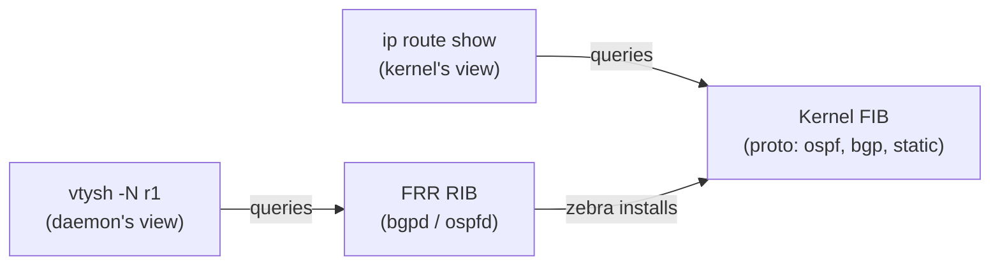

# Lab A04 — Lab 1: RIB vs FIB (vtysh primer)

Pairs with: [Article 4 §§1–2](../../wiki/article-04-routing-daemons.md#routing-daemons-on-linux)

Return to [Lab A04 README](./README.md) for setup instructions.

## What this section teaches

The single most important mental-model shift for an IOS engineer working with FRR: the RIB lives in the daemon (queried via `vtysh`) and the FIB lives in the kernel (queried via `ip route show`). They are different data stores. Understanding that distinction — and internalizing the two commands that access each — is the prerequisite for everything else in this lab.



## Build the topology

The topology is already built by `/lab/setup.sh`. Confirm it is ready:

```bash
ip netns list                               # should show r1, r2, r3
systemctl status 'frr@*' --no-pager        # all three should be active
```

## Part A — Open vtysh and orient yourself

```bash
# Connect to r1's FRR instance
/lab/frrvtysh r1

# You are now at the vtysh prompt. Type familiar commands:
r1# show version
r1# show running-config
r1# show ip route                           # FRR's combined RIB+FIB view
r1# end
r1# exit
```

The `show ip route` output looks like a Cisco routing table. Lines starting with `C` are connected routes. FRR is reading both what it knows about the network (RIB) and what it has installed in the kernel (FIB) to produce this view.

## Part B — The two queries, side by side

```bash
# Query 1: FRR's RIB via vtysh
ip netns exec r1 vtysh -N r1 -c 'show ip route'

# Query 2: kernel FIB via ip route show
ip -n r1 route show
```

Compare the two outputs. At this stage (no routing protocol configured yet), they should agree — only connected and kernel routes, no `proto ospf` or `proto bgp` entries. That is the baseline.

The `proto` field on each kernel route tells you who installed it:

```bash
ip -n r1 route show proto kernel     # address assignment installed these
ip -n r1 route show proto static     # 'ip route add' installed these
ip -n r1 route show proto ospf       # ospfd will install these after Lab 2
ip -n r1 route show proto bgp        # bgpd will install these after Labs 3–4
```

## Part C — Verify connected routes are consistent

```bash
# Interfaces and their addresses in r1
ip -n r1 addr show

# Connected subnets in the FIB
ip -n r1 route show proto kernel

# Same in vtysh
ip netns exec r1 vtysh -N r1 -c 'show ip route connected'
```

The kernel's connected routes (automatically created when you assign an address to an interface) should match the connected routes `zebra` reports in vtysh.

## Test your work

```bash
./tests/routing/test.sh 1
```

The checker confirms FRR sockets are present, vtysh is reachable, and the kernel FIB is non-empty. A clean pass means the infrastructure for the rest of the lab is in place.

## Comprehension questions

<details>
<summary>Answers (click to expand)</summary>

**Q: Why does `ip route show` only show the FIB, not the RIB?**
A: `ip route show` queries the kernel's netlink routing table directly — the FIB. FRR's RIB lives in user-space daemon processes (`bgpd`, `ospfd`, etc.) and is only accessible through their own CLIs (`vtysh`). The kernel has no knowledge of the daemon's path-selection state or protocol-specific attributes.

**Q: What does `proto ospf` mean on a route in `ip route show`?**
A: It means the route was installed by the OSPF daemon (`ospfd` via `zebra`). The `proto` field records who wrote the route. You can filter by it: `ip route show proto ospf` shows only OSPF-learned routes, `ip route show proto bgp` shows only BGP-learned routes.

**Q: If a BGP session is Established, can a prefix be in the RIB but not the FIB?**
A: Yes. Common causes: the prefix lost best-path selection (another protocol has a lower administrative distance), the prefix was received but suppressed by a route-map, or the daemon is still converging. `show ip bgp 10.0.0.1/32` shows RIB state; `ip route show 10.0.0.1/32` shows FIB state. If the route is in the RIB but not the FIB, start with `show ip bgp 10.0.0.1/32` to see the best-path decision.

</details>

## Teardown

No teardown needed — the topology persists for the next section.

---

Next: [Lab 2 — OSPF Adjacency](./lab-2-ospf.md)
