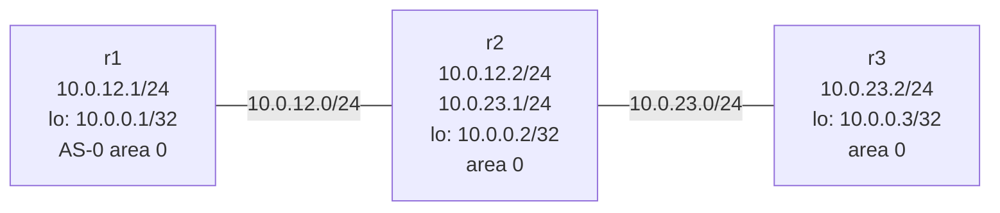

# Lab A04 — Lab 2: First OSPF Adjacency

Pairs with: [Article 4 §3](../../wiki/article-04-routing-daemons.md#first-ospf-adjacency)

Return to [Lab A04 README](./README.md) for setup instructions.

## What this section teaches

Configure OSPF between `r1`, `r2`, and `r3`. Watch the adjacency form through its state machine. Confirm that OSPF-learned routes appear in the kernel FIB with `proto ospf` — the first concrete exercise of the RIB-vs-FIB distinction.



## Build the topology

Topology is already up from `setup.sh`. Verify:

```bash
ip netns list                        # r1, r2, r3
systemctl is-active frr@r1           # active
```

## Part A — Configure OSPF on r1 and r2

Configure r1:

```bash
/lab/frrvtysh r1
r1# configure terminal
r1(config)# router ospf
r1(config-router)# ospf router-id 10.0.0.1
r1(config-router)# network 10.0.12.0/24 area 0
r1(config-router)# network 10.0.0.1/32 area 0
r1(config-router)# passive-interface r1-lo
r1(config-router)# end
r1# write
r1# exit
```

Configure r2:

```bash
/lab/frrvtysh r2
r2# configure terminal
r2(config)# router ospf
r2(config-router)# ospf router-id 10.0.0.2
r2(config-router)# network 10.0.12.0/24 area 0
r2(config-router)# network 10.0.23.0/24 area 0
r2(config-router)# network 10.0.0.2/32 area 0
r2(config-router)# passive-interface r2-lo
r2(config-router)# end
r2# write
r2# exit
```

## Part B — Watch the adjacency form

```bash
# Watch the state machine in real time (updates every 5s)
watch -n5 "ip netns exec r1 vtysh -N r1 -c 'show ip ospf neighbor'"
```

You should see the state column progress: `Down` → `Init` → `2-Way` → `ExStart` → `Exchange` → `Loading` → `Full`. On a direct veth pair this converges in a few seconds.

When the state is `Full`, OSPF is working:

```bash
ip netns exec r1 vtysh -N r1 -c 'show ip ospf neighbor'
```

## Part C — Examine the LSDB and FIB

```bash
# The OSPF LSDB — what ospfd knows about the network
ip netns exec r1 vtysh -N r1 -c 'show ip ospf database'

# The RIB in vtysh — what FRR thinks the best paths are
ip netns exec r1 vtysh -N r1 -c 'show ip route'

# The FIB in the kernel — what is actually forwarding traffic
ip -n r1 route show proto ospf
```

The third command is the key one: `ip route show proto ospf` shows only the routes that `ospfd` (via `zebra`) installed into the kernel FIB. If the OSPF adjacency is Full but this output is empty, the routes exist in the RIB but have not been promoted to the FIB.

## Part D — Extend to r3

Add r3 to the OSPF domain so all three routers can see each other's loopbacks:

```bash
/lab/frrvtysh r3
r3# configure terminal
r3(config)# router ospf
r3(config-router)# ospf router-id 10.0.0.3
r3(config-router)# network 10.0.23.0/24 area 0
r3(config-router)# network 10.0.0.3/32 area 0
r3(config-router)# passive-interface r3-lo
r3(config-router)# end
r3# write
r3# exit
```

After convergence, `r1` should have routes to `10.0.0.2/32`, `10.0.23.0/24`, and `10.0.0.3/32` via OSPF:

```bash
ip -n r1 route show proto ospf

# Ping r3's loopback from r1 — traverses r2 as forwarder
ip netns exec r1 ping -c 3 10.0.0.3
```

## Test your work

```bash
./tests/routing/test.sh 2
```

The checker auto-discovers the namespace with a Full OSPF neighbor, confirms `proto ospf` routes are in the kernel FIB, and pings OSPF-learned loopbacks.

## Comprehension questions

<details>
<summary>Answers (click to expand)</summary>

**Q: Why is `passive-interface r1-lo` needed?**
A: The `network 10.0.0.1/32 area 0` statement tells OSPF to advertise the loopback's prefix and also to try to send OSPF hellos on that interface. A loopback has no physical neighbor to hear those hellos, so they would time out and waste resources. `passive-interface` stops OSPF from sending hellos on the interface while still including the prefix in the LSDB.

**Q: The `show ip route` output in vtysh says `O` for OSPF routes. `ip route show proto ospf` shows the same routes. Are these the same data?**
A: Almost, but not exactly. `vtysh`'s `show ip route` shows FRR's combined view: it reads from zebra's installed-route database (which mirrors the kernel FIB) plus any RIB-only routes. `ip route show proto ospf` queries the kernel directly. In steady state they agree; during convergence they may briefly differ.

**Q: What would happen if r2 had `ip_forward=0` in its namespace?**
A: The OSPF adjacency between r1↔r2 and r2↔r3 would still form (OSPF uses multicast on directly connected links, not forwarded traffic), but packets from r1 destined for r3's loopback would be dropped at r2 — the kernel would refuse to forward them. The symptom would be: OSPF shows correct adjacencies and routes, `ip route show proto ospf` on r1 shows 10.0.0.3/32, but ping from r1 to 10.0.0.3 fails. Check `ns_forwarding r2`.

</details>

## Teardown

No teardown needed — OSPF configuration persists for the next section. r3's OSPF will be the underlay for the BGP sessions in Labs 3 and 4.

---

Next: [Lab 3 — First BGP Session](./lab-3-bgp.md)
