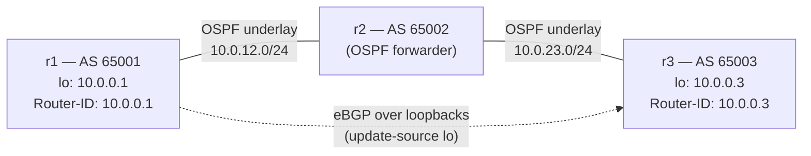

# Lab A04 — Lab 3: First BGP Session (Numbered eBGP)

Pairs with: [Article 4 §4](../../wiki/article-04-routing-daemons.md#first-bgp-session)

Return to [Lab A04 README](./README.md) for setup instructions. Requires Lab 2 (OSPF) to be complete.

## What this section teaches

Configure eBGP between `r1` (AS 65001) and `r3` (AS 65003) over the OSPF-learned underlay. Watch the session reach `Established`. Confirm the peer's loopback prefix appears in the kernel FIB as `proto bgp` — the second RIB-vs-FIB exercise, but this time across a routing-daemon boundary.



## Build the topology

OSPF from Lab 2 must be running. Verify:

```bash
ip -n r1 route show proto ospf       # should include 10.0.0.3/32 (r3's loopback)
ip netns exec r1 ping -c2 10.0.0.3  # should succeed
```

## Part A — Configure eBGP on r1 and r3

Configure r1:

```bash
/lab/frrvtysh r1
r1# configure terminal
r1(config)# router bgp 65001
r1(config-router)# bgp router-id 10.0.0.1
r1(config-router)# neighbor 10.0.0.3 remote-as 65003
r1(config-router)# neighbor 10.0.0.3 update-source r1-lo
r1(config-router)# neighbor 10.0.0.3 ebgp-multihop 2
r1(config-router)# address-family ipv4 unicast
r1(config-router-af)# network 10.0.0.1/32
r1(config-router-af)# neighbor 10.0.0.3 activate
r1(config-router-af)# exit-address-family
r1(config-router)# end
r1# write
r1# exit
```

Configure r3:

```bash
/lab/frrvtysh r3
r3# configure terminal
r3(config)# router bgp 65003
r3(config-router)# bgp router-id 10.0.0.3
r3(config-router)# neighbor 10.0.0.1 remote-as 65001
r3(config-router)# neighbor 10.0.0.1 update-source r3-lo
r3(config-router)# neighbor 10.0.0.1 ebgp-multihop 2
r3(config-router)# address-family ipv4 unicast
r3(config-router-af)# network 10.0.0.3/32
r3(config-router-af)# neighbor 10.0.0.1 activate
r3(config-router-af)# exit-address-family
r3(config-router)# end
r3# write
r3# exit
```

## Part B — Watch the session establish

BGP is slower than OSPF to come up — it uses TCP and goes through `OpenSent → OpenConfirm → Established`:

```bash
# Poll until Established (usually 30–60 seconds from config)
watch -n5 "ip netns exec r1 vtysh -N r1 -c 'show ip bgp summary'"
```

The output should show `10.0.0.3` in the neighbor table with `Established` state and an uptime counter.

If the session stays in `Active`, check:
1. The OSPF underlay — `ping 10.0.0.3` from r1 must succeed
2. The `update-source` — `show ip bgp neighbors 10.0.0.3 | grep 'Local host'` should show r1's loopback IP
3. `ebgp-multihop` — eBGP defaults to TTL 1; peering over loopbacks (2 hops) requires multihop

## Part C — Examine the RIB and FIB

```bash
# BGP RIB on r1 — what bgpd knows
ip netns exec r1 vtysh -N r1 -c 'show ip bgp'

# Kernel FIB on r1 — what was promoted
ip -n r1 route show proto bgp

# Confirm the route is reachable
ip netns exec r1 ping -c 3 10.0.0.3
```

The `show ip bgp` output shows the full BGP table with attributes (next-hop, AS path, local-pref, weight, community). The `ip route show proto bgp` shows only the routes that zebra successfully installed in the kernel. The two should agree in steady state; during convergence or after a route-map change, they may briefly differ.

## Test your work

```bash
./tests/routing/test.sh 3
```

The checker confirms: session Established, at least one prefix in FIB with `proto bgp`, and that prefix is reachable via ping.

## Comprehension questions

<details>
<summary>Answers (click to expand)</summary>

**Q: Why does eBGP between loopbacks need `ebgp-multihop`?**
A: eBGP defaults to sending BGP UPDATE messages with TTL=1 (GTSM / single-hop protection). A packet from r1's loopback to r3's loopback must traverse r2 — that is two hops, so the TTL would be decremented to 0 at r2 and the packet dropped. `ebgp-multihop 2` tells bgpd to send with TTL=2, allowing the packet to reach r3.

**Q: What is the difference between `show ip bgp` and `ip route show proto bgp`?**
A: `show ip bgp` is the BGP RIB — all prefixes bgpd knows about, including routes received from the peer that did not win best-path selection. `ip route show proto bgp` is the kernel FIB — only the routes that bgpd via zebra installed into the kernel after winning best-path. A route can exist in the BGP RIB but not the FIB if it lost best-path or if an admin-distance preference blocked it.

**Q: What would happen if you forgot `update-source r1-lo`?**
A: BGP would try to source the TCP connection from r1's connected interface address (10.0.12.1, the address toward r2), not the loopback. r3 would receive a TCP SYN from 10.0.12.1 but its neighbor config says `neighbor 10.0.0.1` — a different address — so it would drop the connection. Symptom: session stays in `Active` even though the OSPF underlay route to 10.0.0.3 is correct.

</details>

## Teardown

No teardown needed. The BGP config you just saved will be replaced in Lab 4 with unnumbered BGP. You can leave it as-is and Lab 4 will tear down the numbered config explicitly.

---

Next: [Lab 4 — BGP Unnumbered](./lab-4-bgp-unnumbered.md)
