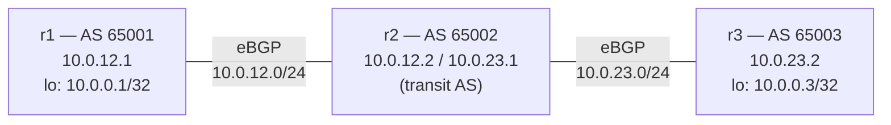

# Lab A04 — Lab 3: First BGP Session (Numbered eBGP)

Pairs with: [Article 4 §4](../../wiki/article-04-routing-daemons.md#first-bgp-session)

Return to [Lab A04 README](./README.md) for setup instructions. Requires Lab 2 (OSPF) to be complete.

## What this section teaches

Configure eBGP between `r1` (AS 65001), `r2` (AS 65002), and `r3` (AS 65003) over directly connected links. Watch the session reach `Established`. Confirm that BGP-learned loopback prefixes appear in the kernel FIB as `proto bgp` — the second RIB-vs-FIB exercise, now with BGP as the protocol owner.



## Build the topology

OSPF from Lab 2 must be running. Verify:

```bash
ip -n r1 route show proto ospf       # must have routes to r2 and r3 subnets
ip netns exec r1 ping -c2 10.0.23.2  # verify r1→r3 unicast path via r2
```

## Part A — Configure eBGP

**Watch out for:** FRR 8.x requires `no bgp ebgp-requires-policy` on eBGP sessions or you must configure explicit route maps. For this learning lab, we disable the policy requirement so prefixes exchange freely.

Configure r1:

```bash
/lab/frrvtysh r1
r1# configure terminal
r1(config)# router bgp 65001
r1(config-router)# bgp router-id 10.0.0.1
r1(config-router)# no bgp ebgp-requires-policy
r1(config-router)# neighbor 10.0.12.2 remote-as 65002
r1(config-router)# address-family ipv4 unicast
r1(config-router-af)# network 10.0.0.1/32
r1(config-router-af)# neighbor 10.0.12.2 activate
r1(config-router-af)# exit-address-family
r1(config-router)# end
r1# write
r1# exit
```

Configure r2 (transit AS — peers with both r1 and r3):

```bash
/lab/frrvtysh r2
r2# configure terminal
r2(config)# router bgp 65002
r2(config-router)# bgp router-id 10.0.0.2
r2(config-router)# no bgp ebgp-requires-policy
r2(config-router)# neighbor 10.0.12.1 remote-as 65001
r2(config-router)# neighbor 10.0.23.2 remote-as 65003
r2(config-router)# address-family ipv4 unicast
r2(config-router-af)# neighbor 10.0.12.1 activate
r2(config-router-af)# neighbor 10.0.23.2 activate
r2(config-router-af)# exit-address-family
r2(config-router)# end
r2# write
r2# exit
```

Configure r3:

```bash
/lab/frrvtysh r3
r3# configure terminal
r3(config)# router bgp 65003
r3(config-router)# bgp router-id 10.0.0.3
r3(config-router)# no bgp ebgp-requires-policy
r3(config-router)# neighbor 10.0.23.1 remote-as 65002
r3(config-router)# address-family ipv4 unicast
r3(config-router-af)# network 10.0.0.3/32
r3(config-router-af)# neighbor 10.0.23.1 activate
r3(config-router-af)# exit-address-family
r3(config-router)# end
r3# write
r3# exit
```

## Part B — Watch the sessions establish

BGP is slower than OSPF — it uses TCP and goes through `OpenSent → OpenConfirm → Established`:

```bash
# Poll until Established (usually 15–30 seconds from config)
watch -n5 "ip netns exec r1 vtysh -N r1 -c 'show ip bgp summary'"
```

The output should show `10.0.12.2` in the neighbor table with `Established` state and a `PfxRcd` count of `1` (r3's loopback, transited through r2).

If the session stays in `Active`, check:
1. The direct link — `ping -c2 10.0.12.2` from r1 must succeed
2. The AS numbers — mismatched `remote-as` keeps the session in `OpenSent` loop

## Part C — Examine the RIB and FIB

```bash
# BGP RIB on r1 — what bgpd knows (includes AS path, next-hop, weight)
ip netns exec r1 vtysh -N r1 -c 'show ip bgp'

# Kernel FIB on r1 — only routes promoted by zebra
ip -n r1 route show proto bgp

# Confirm reachability
ip netns exec r1 ping -c 3 10.0.0.3
```

The `show ip bgp` output shows every route bgpd received with its full attributes. The `ip route show proto bgp` shows only what was installed into the kernel — the intersection of best-path selection and zebra's RIB install. The two agree in steady state; during convergence or after a policy change, they may briefly differ.

**Key observation:** r3's loopback `10.0.0.3/32` arrives at r1 with next-hop `10.0.23.2` (r3's interface toward r2). BGP reports the original next-hop unchanged; OSPF has a route to `10.0.23.0/24` so zebra can resolve it and install the route. Check with:

```bash
ip netns exec r1 vtysh -N r1 -c 'show ip bgp 10.0.0.3/32'
# Note: next-hop is 10.0.23.2 (r3's link IP, not the loopback)
```

## Test your work

```bash
./tests/routing/test.sh 3
```

The checker confirms: session Established on all three routers, at least one prefix in FIB with `proto bgp`, and that prefix is reachable via ping.

## Comprehension questions

<details>
<summary>Answers (click to expand)</summary>

**Q: What is the difference between `show ip bgp` and `ip route show proto bgp`?**

`show ip bgp` is the BGP RIB — every prefix bgpd knows about, including routes received from peers that did not win best-path. `ip route show proto bgp` is the kernel FIB — only routes that bgpd via zebra installed into the kernel after winning best-path. A route exists in the BGP RIB but not the FIB if it lost best-path (another protocol has a better route) or if it is inaccessible (next-hop cannot be resolved).

**Q: Why does `no bgp ebgp-requires-policy` matter in FRR 8.x?**

Starting in FRR 8.0, eBGP sessions require explicit inbound and outbound route-maps (or `no bgp ebgp-requires-policy`) to protect against accidental full-table transit. Without this setting, sessions come up but `PfxRcd` stays at `(Policy)` — routes are received but not processed. In production, replace `no bgp ebgp-requires-policy` with explicit route-maps that filter what you accept and advertise.

**Q: r2 is in AS 65002 and passes prefixes from AS 65001 to AS 65003. What prevents routing loops?**

The AS path. Each BGP UPDATE carries an `AS_PATH` attribute listing every AS the route has traversed. When r1 receives an UPDATE via r2 from r3, the AS path is `65002 65003`. If r1 were to advertise this back to r2, r2 would see its own AS (65002) in the path and reject it (loop prevention). This is why BGP is safe to use between autonomous systems that don't fully trust each other.

**Q: What is the BGP administrative distance (AD) relative to OSPF?**

eBGP has AD 20 and OSPF has AD 110 in FRR defaults. When both protocols know a route, BGP wins (lower AD = preferred). In this lab, the loopback `10.0.0.3/32` is known via OSPF (as a host route) AND via BGP. BGP's AD 20 beats OSPF's AD 110, so the kernel shows `proto bgp` for that entry. Check with `ip -n r1 route show` — the loopback prefix should say `proto bgp`, not `proto ospf`.

</details>

## Teardown

No teardown needed. The BGP config persists for Lab 4 (BGP unnumbered), which will remove the numbered config and replace it.

---

Next: [Lab 4 — BGP Unnumbered](./lab-4-bgp-unnumbered.md)
