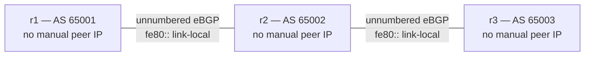

# Lab A04 — Lab 4: BGP Unnumbered

Pairs with: [Article 4 §5](../../wiki/article-04-routing-daemons.md#bgp-unnumbered)

Return to [Lab A04 README](./README.md) for setup instructions.

## What this section teaches

Replace the numbered BGP session from Lab 3 with interface-based (unnumbered) eBGP over IPv6 link-local addresses. No manual peer IP is configured — `neighbor r1-r2 interface remote-as external`. The session still advertises IPv4 prefixes. This is the fabric-default that every Containerlab and EVPN topology in later articles will assume.



## Build the topology

Remove the numbered BGP config from Lab 3 and replace it with unnumbered:

## Part A — Replace numbered BGP with unnumbered on all three routers

Configure r1:

```bash
/lab/frrvtysh r1
r1# configure terminal
r1(config)# no router bgp 65001
r1(config)# router bgp 65001
r1(config-router)# bgp router-id 10.0.0.1
r1(config-router)# neighbor r1-r2 interface remote-as external
r1(config-router)# address-family ipv4 unicast
r1(config-router-af)# network 10.0.0.1/32
r1(config-router-af)# neighbor r1-r2 activate
r1(config-router-af)# exit-address-family
r1(config-router)# address-family ipv6 unicast
r1(config-router-af)# neighbor r1-r2 activate
r1(config-router-af)# exit-address-family
r1(config-router)# end
r1# write
r1# exit
```

Configure r2 (middle router — peers with both r1 and r3):

```bash
/lab/frrvtysh r2
r2# configure terminal
r2(config)# router bgp 65002
r2(config-router)# bgp router-id 10.0.0.2
r2(config-router)# neighbor r2-r1 interface remote-as external
r2(config-router)# neighbor r2-r3 interface remote-as external
r2(config-router)# address-family ipv4 unicast
r2(config-router-af)# network 10.0.0.2/32
r2(config-router-af)# neighbor r2-r1 activate
r2(config-router-af)# neighbor r2-r3 activate
r2(config-router-af)# exit-address-family
r2(config-router)# address-family ipv6 unicast
r2(config-router-af)# neighbor r2-r1 activate
r2(config-router-af)# neighbor r2-r3 activate
r2(config-router-af)# exit-address-family
r2(config-router)# end
r2# write
r2# exit
```

Configure r3:

```bash
/lab/frrvtysh r3
r3# configure terminal
r3(config)# no router bgp 65003
r3(config)# router bgp 65003
r3(config-router)# bgp router-id 10.0.0.3
r3(config-router)# neighbor r3-r2 interface remote-as external
r3(config-router)# address-family ipv4 unicast
r3(config-router-af)# network 10.0.0.3/32
r3(config-router-af)# neighbor r3-r2 activate
r3(config-router-af)# exit-address-family
r3(config-router)# address-family ipv6 unicast
r3(config-router-af)# neighbor r3-r2 activate
r3(config-router-af)# exit-address-family
r3(config-router)# end
r3# write
r3# exit
```

## Part B — Confirm the session is up

```bash
# Watch for Established — may take 30–60 seconds
watch -n5 "ip netns exec r1 vtysh -N r1 -c 'show ip bgp summary'"
```

The neighbor table should show the peer identified by interface name (e.g. `r1-r2/0`), not by IP address. State should be `Established`.

## Part C — Observe the IPv6 link-local next-hop

This is the key observation: IPv4 prefixes arrive over an IPv6 link-local transport.

```bash
# BGP table — look at the NEXT_HOP field
ip netns exec r1 vtysh -N r1 -c 'show ip bgp'

# The next-hop for r3's loopback (10.0.0.3/32) should be a fe80:: address
ip netns exec r1 vtysh -N r1 -c 'show ip bgp 10.0.0.3/32'

# The kernel FIB reflects this — the nexthop in ip route show is also fe80::
ip -n r1 route show proto bgp

# IPv6 link-local addresses on the peering interface
ip -n r1 -6 addr show dev r1-r2
```

## Part D — Confirm IPv4 reachability still works

```bash
# End-to-end: r1 pings r3's loopback, arriving over an IPv6 link-local transport
ip netns exec r1 ping -c 3 10.0.0.3
```

## Test your work

```bash
./tests/routing/test.sh 4
```

The checker confirms: interface-based session Established, fe80:: next-hops in the BGP table, IPv4 prefixes in the kernel FIB.

## Comprehension questions

<details>
<summary>Answers (click to expand)</summary>

**Q: If no peer IP is configured, how does FRR know who to peer with?**
A: FRR discovers the peer's IPv6 link-local address via IPv6 Neighbor Discovery (NDP) on the interface. It then uses that fe80:: address as the TCP destination for the BGP connection. The `interface remote-as external` statement tells FRR to do this automatically for any peer it discovers on that interface.

**Q: Why does BGP unnumbered still need IPv6 enabled, even for an IPv4-only network?**
A: The transport layer (the TCP session) uses IPv6 link-local. The protocol data (the BGP UPDATEs) carry IPv4 NLRI. IPv6 must be enabled on the interface so that NDP can discover the peer and so the TCP connection can be established over IPv6. The actual packet forwarding in the data plane remains IPv4.

**Q: What does `address-family ipv6 unicast / neighbor r1-r2 activate` do?**
A: It enables the IPv6 address family on the BGP session. FRR's unnumbered BGP requires the IPv6 address family to be activated on the neighbor so that the link-local next-hop exchange (via the IPv6 next-hop attribute in the IPv4 NLRI) works correctly. Without this, the IPv4 prefixes would arrive with an incorrect next-hop.

</details>

## Teardown

No teardown needed. The unnumbered BGP sessions persist for Lab 5 (BFD).

---

Next: [Lab 5 — BFD-Accelerated Failover](./lab-5-bfd.md)
