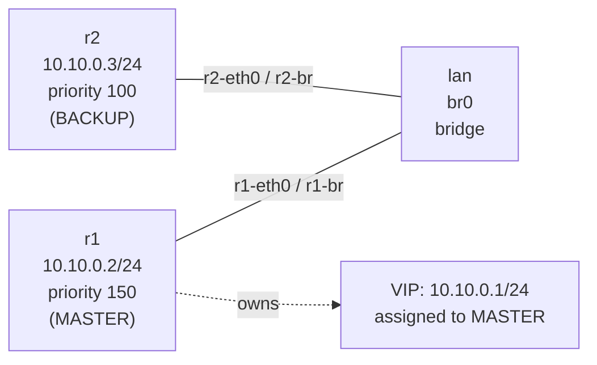

# Lab A04 VRRP-1 — `keepalived`

Sub-lab 1 of 2 · [← Lab A04 VRRP](README.md) · Next: [lab-2-frr-vrrpd →](lab-2-frr-vrrpd.md)

Pairs with: [Article 4 §5b — VRRP on Linux](../../wiki/article-04-routing-daemons.md)

**Goal:** Run two `keepalived` instances sharing a virtual IP. Observe the MASTER election, VIP assignment, and live failover. Understand that the virtual IP is a real address on Linux — not a phantom — and verify it with `ip addr show`.

## Topology



## Build the topology

```bash
# Bridge namespace + bridge
ip netns add lan
ip netns exec lan ip link add br0 type bridge
ip netns exec lan ip link set br0 up

# r1
ip netns add r1
ip link add r1-eth0 type veth peer name r1-br
ip link set r1-eth0 netns r1
ip link set r1-br netns lan
ip netns exec lan ip link set r1-br master br0 up
ip netns exec r1 ip addr add 10.10.0.2/24 dev r1-eth0
ip netns exec r1 ip link set r1-eth0 up
ip netns exec r1 ip link set lo up

# r2 (mirror of r1)
ip netns add r2
ip link add r2-eth0 type veth peer name r2-br
ip link set r2-eth0 netns r2
ip link set r2-br netns lan
ip netns exec lan ip link set r2-br master br0 up
ip netns exec r2 ip addr add 10.10.0.3/24 dev r2-eth0
ip netns exec r2 ip link set r2-eth0 up
ip netns exec r2 ip link set lo up

# Verify: r1 can reach r2
ip netns exec r1 ping -c1 -W2 10.10.0.3
```

## Part A — Configure and start keepalived

Write the config files:

```bash
cat > /tmp/r1-keepalived.conf << 'EOF'
vrrp_instance VI_1 {
    state MASTER
    interface r1-eth0
    virtual_router_id 51
    priority 150
    advert_int 1
    authentication {
        auth_type PASS
        auth_pass changeme
    }
    virtual_ipaddress {
        10.10.0.1/24
    }
}
EOF

cat > /tmp/r2-keepalived.conf << 'EOF'
vrrp_instance VI_1 {
    state BACKUP
    interface r2-eth0
    virtual_router_id 51
    priority 100
    advert_int 1
    authentication {
        auth_type PASS
        auth_pass changeme
    }
    virtual_ipaddress {
        10.10.0.1/24
    }
}
EOF
```

Start keepalived in each namespace:

```bash
ip netns exec r1 keepalived -f /tmp/r1-keepalived.conf --log-console --dont-fork &
ip netns exec r2 keepalived -f /tmp/r2-keepalived.conf --log-console --dont-fork &
sleep 3
```

Wait 3 seconds for the election to complete. Then verify:

```bash
ip netns exec r1 ip addr show r1-eth0
# Expect: 10.10.0.2/24 (real IP) AND 10.10.0.1/24 (VIP) — two addresses

ip netns exec r2 ip addr show r2-eth0
# Expect: 10.10.0.3/24 only — VIP is not here
```

The VIP `10.10.0.1` is a **real IP address** assigned to the MASTER's interface. Run `ip addr show` on a Cisco router with VRRP and you see only the real IP; the virtual IP is a phantom. On Linux, the virtual IP is real — it's in `ip addr show`, and it disappears on failover.

## Part B — Watch the failover

Open a second shell (or tmux pane) and start a continuous ping to the VIP from the LAN namespace:

```bash
ip netns exec lan ping -i 0.5 10.10.0.1 &
```

Now kill r1's keepalived:

```bash
pkill -f r1-keepalived.conf
```

Watch: within `3 × advert_int + skew` seconds (~3–4 s at `advert_int=1`), r2 takes over:

```bash
ip netns exec r2 ip addr show r2-eth0
# Expect: 10.10.0.3/24 AND 10.10.0.1/24
```

The ping loses at most 2–4 packets. Bring r1 back:

```bash
ip netns exec r1 keepalived -f /tmp/r1-keepalived.conf --log-console --dont-fork &
sleep 3
ip netns exec r1 ip addr show r1-eth0
# Expect: VIP back on r1 (priority 150 preempts r2's 100)
```

## Part C — Capture the protocol

In the LAN namespace, sniff VRRP advertisements:

```bash
ip netns exec lan tcpdump -nni br0 -c 10 vrrp
```

You'll see packets to `224.0.0.18` (the VRRP multicast group) from the MASTER's IP every `advert_int` seconds. Each packet carries: VRID=51, priority=150, authentication type. When the MASTER disappears, BACKUP transitions to MASTER and begins advertising at priority=100.

**Watch out for:** VRRP packets need raw socket access. Inside the container, `--privileged` provides this. On a hardened host without `CAP_NET_RAW`, tcpdump won't see VRRP.

## Test your work

```bash
./tests/vrrp/test.sh 1
```

The checker verifies:
- VIP `10.10.0.1` assigned to exactly one namespace (MASTER)
- VIP absent from BACKUP
- VRRP advertisement packets visible on `br0` (passive capture)
- VIP pingable from the LAN namespace

## Comprehension questions

<details>
<summary>Why does the virtual IP appear in `ip addr show` on the MASTER but not on IOS?</summary>

On IOS, the virtual IP is implemented in the switching/routing ASIC as a secondary ARP responder — the interface does not carry the address as a configured IP. On Linux, keepalived simply calls `ip addr add` (or `rtnetlink`) to assign the VIP to the interface. From the kernel's perspective, it is no different from any other address. This is why you can `ping` the VIP from the MASTER's own namespace — it is locally assigned.
</details>

<details>
<summary>What determines how quickly the BACKUP detects MASTER failure and takes over?</summary>

The BACKUP waits for `master_down_interval = 3 × advert_int + skew_time`. With `advert_int = 1 s`, that is roughly 3.1–3.6 s. Reducing `advert_int` helps, but VRRPv2 is limited to 1-second integers. Switch to `version 3` and you can set `advert_int` in centiseconds (e.g. `0.1 s` → sub-second failover). FRR's `vrrpd` similarly uses `advertisement-interval` in milliseconds when configured with v3.
</details>

<details>
<summary>After r1 restarts and reclaims the VIP, what happens to open TCP connections from the LAN?</summary>

From the LAN's perspective, the VIP moved back to r1's MAC address. ARP is updated (keepalived sends a gratuitous ARP after preemption). Existing TCP flows that were being served by r2 will see an RST or timeout, because the connection state (sequence numbers, etc.) is not synchronized between keepalived nodes. VRRP itself is a first-hop mechanism — not a connection-state sync mechanism. For stateful failover, add `conntrackd` to sync netfilter connection tracking between MASTER and BACKUP.
</details>

## Teardown

```bash
pkill keepalived 2>/dev/null || true
ip netns del r1 2>/dev/null || true
ip netns del r2 2>/dev/null || true
ip netns del lan 2>/dev/null || true
```

Next: [lab-2-frr-vrrpd.md](lab-2-frr-vrrpd.md) — same topology, FRR's built-in vrrpd instead of keepalived.
