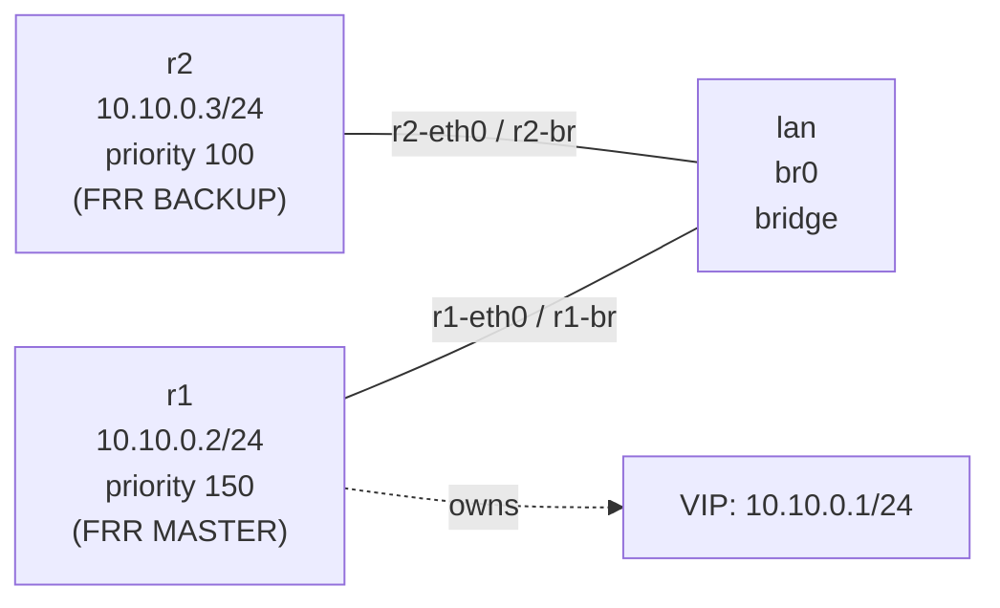

# Lab A04 VRRP-2 — FRR `vrrpd`

Sub-lab 2 of 2 · [← lab-1-keepalived](lab-1-keepalived.md) · [← Lab A04 VRRP](README.md)

Pairs with: [Article 4 §5b — VRRP on Linux](../../wiki/article-04-routing-daemons.md)

**Goal:** Replace keepalived with FRR's built-in `vrrpd` daemon. The semantics are identical — same VRRPv3 election, same VIP, same `ip addr show` proof — but configuration happens in `vtysh` alongside your OSPF/BGP config. The exercise is a direct comparison to sub-lab 1.

## Topology

Same three-namespace topology as sub-lab 1:



## Build the topology

If you just finished sub-lab 1, tear it down first:

```bash
pkill keepalived 2>/dev/null || true
ip netns del r1 2>/dev/null || true
ip netns del r2 2>/dev/null || true
ip netns del lan 2>/dev/null || true
```

Build fresh:

```bash
# Bridge namespace + bridge
ip netns add lan
ip netns exec lan ip link add br0 type bridge
ip netns exec lan ip link set br0 up

# r1
ip netns add r1
ip link add r1-eth0 type veth peer name r1-br
ip link set r1-eth0 netns r1
ip link set r1-br netns lan
ip netns exec lan ip link set r1-br master br0 up
ip netns exec r1 ip addr add 10.10.0.2/24 dev r1-eth0
ip netns exec r1 ip link set r1-eth0 up
ip netns exec r1 ip link set lo up

# r2
ip netns add r2
ip link add r2-eth0 type veth peer name r2-br
ip link set r2-eth0 netns r2
ip link set r2-br netns lan
ip netns exec lan ip link set r2-br master br0 up
ip netns exec r2 ip addr add 10.10.0.3/24 dev r2-eth0
ip netns exec r2 ip link set r2-eth0 up
ip netns exec r2 ip link set lo up
```

## Part A — Create per-namespace FRR configs

FRR needs a config directory and a daemons file for each namespace. The container's `frr@.service` template will read from `/etc/frr/<ns>/`:

```bash
for ns in r1 r2; do
    mkdir -p /etc/frr/$ns
    # Enable only zebra and vrrpd (BFD not needed here)
    cat > /etc/frr/$ns/daemons << EOF
zebra=yes
bgpd=no
ospfd=no
ospf6d=no
ripd=no
ripngd=no
isisd=no
pimd=no
ldpd=no
nhrpd=no
eigrpd=no
babeld=no
sharpd=no
pbrd=no
bfdd=no
fabricd=no
vrrpd=yes
staticd=yes
EOF
    touch /etc/frr/$ns/frr.conf
    cat > /etc/frr/$ns/vtysh.conf << EOF
service integrated-vtysh-config
EOF
done
```

## Part B — Start FRR instances and configure vrrpd

Start FRR in each namespace via the systemd template unit:

```bash
systemctl start frr@r1 frr@r2
sleep 3
systemctl is-active frr@r1 frr@r2
```

Configure VRRP via vtysh (the container ships a `frrvtysh` wrapper: `frrvtysh r1 -c '...'`):

```bash
# r1 — MASTER (priority 150)
ip netns exec r1 vtysh -N r1 << 'EOF'
configure terminal
interface r1-eth0
 vrrp 51 version 3
 vrrp 51 priority 150
 vrrp 51 advertisement-interval 1000
 vrrp 51 preempt
 vrrp 51 ip 10.10.0.1
exit
end
write memory
EOF

# r2 — BACKUP (priority 100)
ip netns exec r2 vtysh -N r2 << 'EOF'
configure terminal
interface r2-eth0
 vrrp 51 version 3
 vrrp 51 priority 100
 vrrp 51 advertisement-interval 1000
 vrrp 51 preempt
 vrrp 51 ip 10.10.0.1
exit
end
write memory
EOF
```

Wait a couple of seconds for election:

```bash
sleep 3
ip netns exec r1 vtysh -N r1 -c 'show vrrp'
ip netns exec r2 vtysh -N r2 -c 'show vrrp'
```

Expected output from `show vrrp` on r1:
```
VRID 51
  State:                     Master
  Interface:                 r1-eth0
  VRRP interface (v3):       -
  Primary IP:                10.10.0.2
  Priority:                  150
  Effective Priority:        150
  Advertisement interval:    1000 ms
  ...
```

## Part C — Verify the VIP the Linux way

FRR's `vrrpd` assigns the VIP via `rtnetlink`, just like keepalived. Check:

```bash
ip netns exec r1 ip addr show r1-eth0
# Expect: 10.10.0.2/24 (real IP) + 10.10.0.1/24 (VIP as a real address)

ip netns exec r2 ip addr show r2-eth0
# Expect: 10.10.0.3/24 only
```

**The IOS comparison:** In IOS, `show vrrp` shows the VIP and state; `show interface` does not show the VIP. On Linux, both `show vrrp` (vtysh) and `ip addr show` (kernel) show the VIP on the MASTER — because it is actually assigned.

## Part D — Observe the protocol

Sniff VRRP advertisements from the LAN namespace:

```bash
ip netns exec lan tcpdump -nni br0 -c 10 vrrp
```

The format is identical to sub-lab 1 — VRRPv3 to `224.0.0.18`, VRID=51, priority=150 from r1. The wire format is the same regardless of which daemon generates it. This means a `keepalived` BACKUP can interoperate with an FRR `vrrpd` MASTER for the same VRID.

## Part E — Journal integration (bonus)

Because FRR runs under `frr@<ns>.service`, all vrrpd events go to the journal:

```bash
journalctl -u 'frr@*' --since '1 min ago' | grep -i vrrp
```

Stop r1's FRR to trigger failover and watch in real time:

```bash
# Terminal 1
journalctl -u 'frr@*' -f | grep -i vrrp

# Terminal 2
systemctl stop frr@r1
# Watch r2 transition to MASTER in the journal
```

This is the journal-correlation lesson from Article 4 §8 applied to VRRP: the daemon event (vrrpd state change) and the kernel event (VIP address add/remove via rtnetlink) appear in `journalctl` within milliseconds of each other.

## Test your work

```bash
./tests/vrrp/test.sh 2
```

The checker verifies:
- FRR vrrpd reports MASTER state in `show vrrp`
- VIP `10.10.0.1` assigned to the MASTER namespace in `ip addr show`
- VRRP advertisement packets visible on `br0`

## Comprehension questions

<details>
<summary>When would you choose FRR `vrrpd` over `keepalived`?</summary>

When FRR is already running for your routing daemons (OSPF, BGP). Using `vrrpd` means one fewer daemon process, one config file to maintain (`vtysh` manages everything), and unified logging through `journalctl -u 'frr@*'`. If you are not running FRR, `keepalived` is the standard choice — it is mature, widely packaged, and well-documented.
</details>

<details>
<summary>Can a keepalived MASTER and FRR vrrpd BACKUP share the same VRID?</summary>

Yes. VRRP is a wire protocol (RFC 5798); both implementations speak the same packets on the LAN. As long as VRID, `virtual_router_id`, authentication, and advertisement interval match, a keepalived MASTER and an FRR vrrpd BACKUP will interoperate. This is sometimes used during a migration — replace keepalived incrementally without a maintenance window.
</details>

<details>
<summary>What `vtysh` commands show the current VRRP state for all VRIDs?</summary>

`show vrrp` (all VRIDs on all interfaces) or `show vrrp interface <iface>` (filtered). The JSON variant `show vrrp json` is parseable by `jq` — used by the test checker to determine MASTER/BACKUP programmatically.
</details>

## Teardown

```bash
systemctl stop frr@r1 frr@r2 2>/dev/null || true
ip netns del r1 2>/dev/null || true
ip netns del r2 2>/dev/null || true
ip netns del lan 2>/dev/null || true
rm -rf /etc/frr/r1 /etc/frr/r2 2>/dev/null || true
```
