# Interfaces, Namespaces, and Topologies in Linux

[[article-01-linux-for-network-engineers|Article 1]] gave you the translation table: enough vocabulary to read a Linux box and run the everyday `show`-equivalents without thinking. This article goes one layer down. By the end you will have built a working router and a working switch out of `iproute2` alone, and you will know the kernel object model that every Linux networking tool — Containerlab, Docker, Kubernetes CNIs, Cilium, FRR — is built on top of.

The point is to meet the primitives before the abstractions. Containerlab is a YAML wrapper around the same `ip netns` and `ip link add veth` commands you are about to type by hand. Kubernetes pods are network namespaces. AWS VPCs are routing-table-per-tenant on top of a managed VXLAN underlay. None of those technologies is mysterious once you have spent an afternoon composing namespaces, veth pairs, and bridges yourself, and the goal of this article is to put that afternoon into your hands.

The labs sit in [`labs/lab-a02-topologies/`](../labs/lab-a02-topologies/) — three of them, building a router, a switch, and a small composed network. Read this article first for the model; run the labs to feel it.

## The kernel object model

In working on this article and gaining a better understanding of namespaces, I learned a lot about Linux in general. One of the interesting notes that will kind of make sense from the section below is that all of the processes running on linux have all of their stats located in the /proc folder. If you dig into it, the current running process can look at /proc/self which will give that process its own information including which namespaces (not just network) it belongs to — the symlinks at /proc/self/ns/net, /proc/self/ns/mnt, /proc/self/ns/pid and friends each point at a kernel-object inode that identifies the namespace the process is currently in. From a base ubuntu desktop (my box), I see /proc/self/net/dev (the network namespace's device list, surfaced through /proc/self) and printing that file, I see all of my same devices listed that I would get from `ip link show` with some stats about them.  Reading [this](https://blog.quarkslab.com/digging-into-linux-namespaces-part-1.html) article and then chatting with Claude about it and reading redhat's docs on namespaces, I gained a lot of understanding and hope you follow the same path even though it's a lot more than you probably need to know for doing networking in linux.

Linux exposes every network interface as the same kind of kernel object: a name, an index, a type, an MTU, a MAC for Layer-2 interfaces, and zero or more IP addresses. There is no built-in distinction between a "physical interface" and a "logical interface." A NIC, a VLAN subinterface, a software bridge, and a WireGuard tunnel are all the same shape of object as far as the kernel is concerned. They differ only in what they do when a packet enters them.

The `ip link add ... type X` family of commands creates them. The type list is long; this article walks the ones you will likely meet on a production Linux box.

The general shape for any interface type is the same four moves:

1. **Create** with `ip link add`.
2. **Place** with `ip link set <iface> netns <ns>` if it should live somewhere other than the host namespace.
3. **Address** with `ip addr add 10.0.0.1/24 dev <iface>` once it is in its final namespace.
4. **Bring up** with `ip link set <iface> up`.

Order matters less than you might expect. The kernel is happy to let you address a down interface; the link just will not pass traffic until it is up. Commit this four-move idiom to muscle memory the way you committed `conf t / interface / no shut / ip address`. Every topology you will ever build in Linux is some loop over this sequence. Noting here that just like IOS, this isn't persistent and we'll use Netplan later to apply this so it'll stick without the ability to just `write mem`.

The other part of the objects from the kernel is that processes are objects too. They exist in the /proc file system just like the devices listed above. We'll see shortly that `ip netns exec` forks a new /bin/bash already attached to a given network namespace (via the `setns(2)` syscall) before exec'ing the shell, so the new process lives in that network namespace while still sharing the host's mount, PID, and user namespaces — isolated for networking, unisolated for everything else.
## Network namespaces

A network namespace is an isolated network stack inside a single Linux kernel. It has its own interfaces, its own routing tables, its own ARP and neighbor tables, its own conntrack state, its own `nftables` rules, and its own `net.*` sysctls (forwarding, reverse-path filtering, and the rest). From inside the namespace, it looks like a fresh machine with its own NIC.

That is a router.

It is also a switch, a host, a VRF, a VPC, or a customer edge, depending on what you put in it and how you wire it to its neighbors. The packaging differs; the primitive is the same.

Worth knowing that "network namespace" is one member of a family. Linux has namespacing as a general kernel primitive. There are `mnt` namespaces (isolated filesystem mounts), `pid` (isolated process trees), `user` (isolated UID/GID maps), `ipc`, `uts`, `cgroup`, and `time`. A container is just a process running with most or all of these namespaces of its own. The network namespace is the only one you, as a network engineer, will spend much time inside, but the family resemblance is useful. When someone says "the container has its own network stack," they mean specifically that the network namespace is isolated to this container.

Two namespaces connected by a `veth` pair (more on those below) is a point-to-point link. Three namespaces in a line, with forwarding enabled on the middle one, is a router topology. Twenty namespaces with FRR running BGP between them is a backbone. You will see this pattern again in [[article-12-containerlab]] (which hides the namespaces behind YAML), in [[article-15-cloud-concepts]] (where we build a VPC out of namespaces and call it a cloud), and in [[article-20-kubernetes-networking]]. Learning it at the bare-metal layer first means that when the abstractions get fancy, you know what they are abstractions of.

Here are the steps to a minimum-viable network namespace:

```
# Create the namespace
ip netns add r1

# Namespace r1, like all namespaces, comes with a loopback device, lo, by default
# Bring that interface up
ip -n r1 link set lo up

# Start a new bash shell whose PID is tied to the new network namespace
ip netns exec r1 bash

# Delete the namespace when done
ip netns del r1
```

We start by creating the namespace, "r1", and then bringing up its loopback interface. Note that some daemons bind automatically to 127.0.0.1 and then silently fail if it isn't up, so it may be valuable to bring up the loopback in any namespace. That's it for creating a namespace. We can then fork a new bash shell that is already inside that namespace.  From there, we can run any of the commands you learned in Article 1 to look at the network stack. Once done, exit the new bash shell and delete the namespace.

Two shortcuts are worth knowing. `ip -n <ns> <subcommand>` runs an `ip` subcommand against a namespace without entering it (`ip -n r1 link show` is the same as `ip netns exec r1 ip link show`, but shorter and the form Linux scripting reaches for). `ip netns exec <ns> <command>` is the universal escape hatch — anything you can run on the host you can run inside a namespace by prefixing it. Together those cover most of what you will type.

Tying back in to the new bash process, we're going to see in the labs how a new process can have a namespace tied to it as just another kernel object in the /proc folder.

## Interface types

The catalogue below walks the types in the order a network engineer is likely to need them. The pattern for each is the same: what it is, how to create one, what it composes with.

### veth — the virtual cable

A `veth` is a pair of interfaces wired back-to-back inside the kernel. Anything written into one comes out the other, with a full receive-side trip up the stack on the way out. Each end has its own MAC and behaves like an independent NIC.

`ip link add v0a type veth peer name v0b` creates the pair with names "v0a" and "v0b". From there each end can be moved into a different namespace, addressed, and brought up like any other interface. `veth` is how you build links *between* namespaces. Single-ended interfaces (bridges, dummies, VLAN subinterfaces) live inside one namespace; `veth` is what crosses.

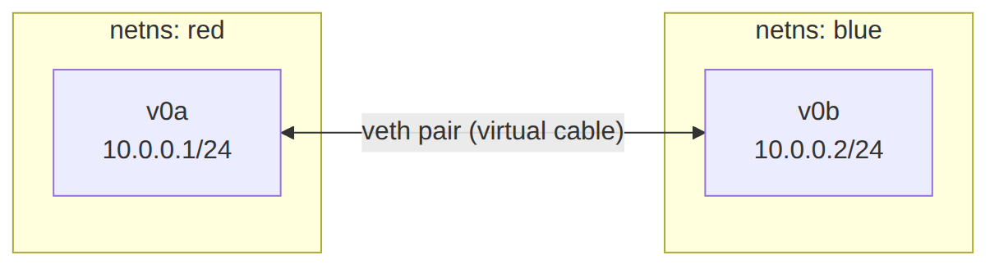

### bridge — the software switch

A `bridge` is an L2 forwarding domain. Frames go in on one enslaved port and out on whichever port the destination MAC was learned on. Enabling 802.1Q VLAN filtering turns it into a managed switch with per-port PVIDs and trunks.

`ip link add br0 type bridge` creates one. `ip link set <iface> master br0` enslaves a port; this is the Linux equivalent of plugging a patch cable into a switch port. Giving the bridge itself an IP turns the box into a host on the bridged subnet — the SVI use case. Enabling `vlan_filtering 1` switches it from "dumb hub-like default" to "real 802.1Q switch" and unlocks the `bridge vlan add` command for per-port tagging.

A bridge plus N `veth` pairs is the switch-with-N-hosts pattern you will see in Lab 2, in every Containerlab topology, and in every Docker bridge network. Spanning Tree is supported as a flag on the bridge (`bridge_stp on`) but is almost always disabled in modern deployments, which prefer L3-to-the-edge designs over L2 loop prevention. [[article-05-production-appliance]] picks up the production sharp edges; this article only needs you to know the flag exists.

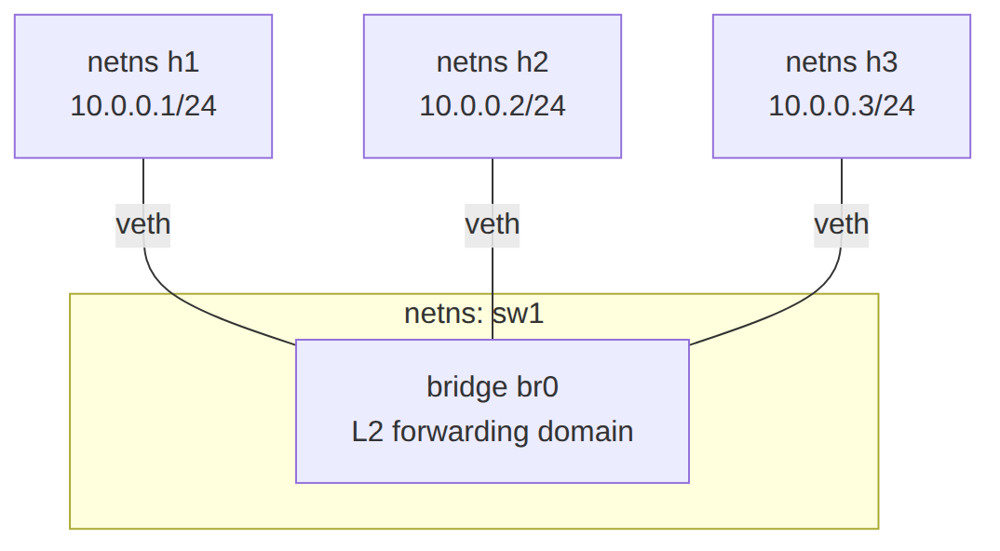

### dummy — the black-hole interface

A `dummy` interface always succeeds and never sends. It is the Linux equivalent of `interface Loopback0` on IOS: a place to bind a stable IP that does not depend on any physical link being up. Use it for router IDs in OSPF and BGP, for anycast service IPs, and for any address that needs to survive an uplink flap.

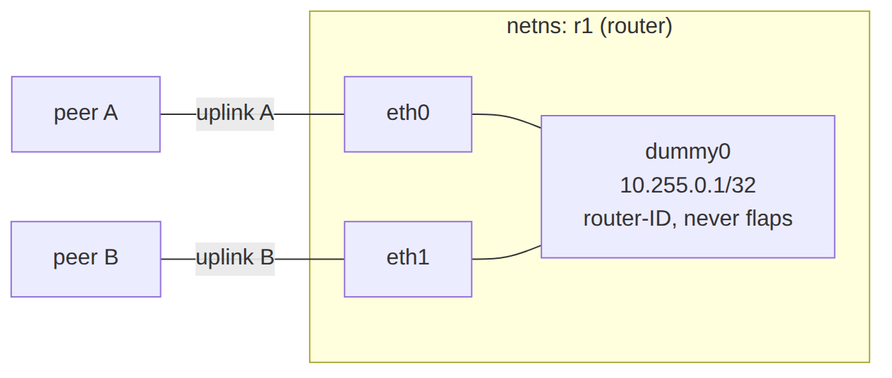

### VLAN subinterface — 802.1Q on a parent

A VLAN interface is stacked on a parent and adds or strips a tag as frames cross it. It shows up as a separate interface in `ip link`, addressable independently of the parent. `ip link add link eth0 name eth0.100 type vlan id 100` is the direct equivalent of IOS `interface eth0.100 / encapsulation dot1Q 100`. Both the parent (`eth0`) and the subinterface (`eth0.100`) are addressable; traffic on the subinterface is tagged on the wire.

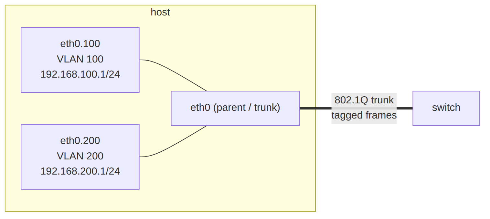

### bond — link aggregation

A `bond` aggregates multiple physical interfaces into one logical interface. LACP, active-backup, and round-robin are the modes you will actually use. The IOS analog is a port-channel; the configuration shape is identical (define a logical interface, enslave members, address the logical interface). The bond's runtime state, including LACP partner info, lives in `/proc/net/bonding/bond0`, which is the file your troubleshooting reflex should land on when a member port is misbehaving.

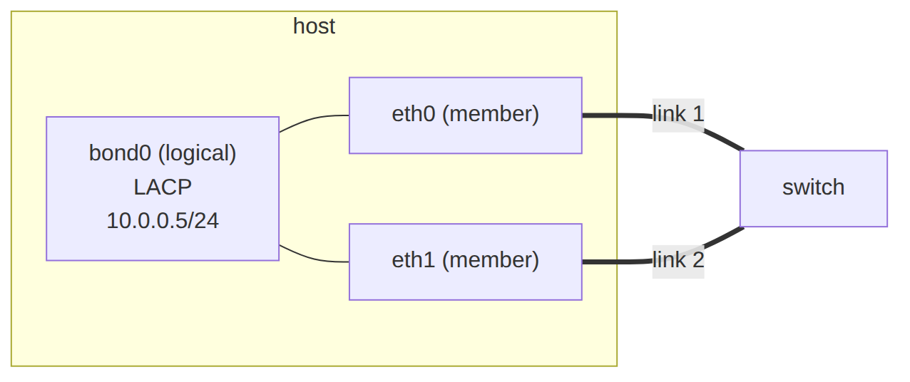

### VXLAN — overlay encapsulation

A `vxlan` interface encapsulates Ethernet frames inside UDP. This is the same VXLAN used in EVPN data-center fabrics. The interface is usually enslaved to a bridge to extend an L2 segment across an L3 underlay. `id` is the VNI; `local` is the VTEP source IP. With FRR speaking BGP-EVPN on top, you have the same VTEP that ships in Arista, Cisco, and Cumulus boxes, using the same kernel code path that Cumulus Linux and SONiC use in production. [[article-17-vxlan-evpn]] gives the full BGP-EVPN treatment; here you only need to know the interface exists and how to create one.

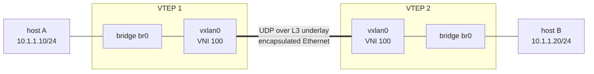

### WireGuard — modern VPN tunnel

A `wireguard` interface is a kernel-mode VPN endpoint, shipped in mainline Linux since 5.6. You address it like any other interface, then push routes for the remote networks through it. Peer keys and endpoints live in the `wg` tool's own configuration; the interface itself is just an interface. The result is that WireGuard composes with everything else in this catalogue: it can live in a namespace, be enslaved to a bridge (rarely), or be selected by `ip rule` for policy routing.

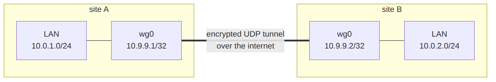

### tun / tap — userspace interfaces

A `tun` is an L3 interface whose other end is a file descriptor in userspace; a `tap` is the same idea at L2. OpenVPN, QEMU's user-mode networking, and most software VPN clients use these. You will rarely create one by hand. They show up when you read `ip link` on a box running VPN client software, and recognizing them saves you a confused minute.

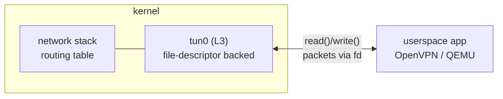

### macvlan and ipvlan — multiple identities on one parent

`macvlan` gives you extra MAC addresses (and therefore extra L2 identities) on a single physical interface. `ipvlan` does the same at L3 with a shared MAC. Containers running with one of these look like real hosts on the physical LAN, with their own MAC and IP, bypassing the host bridge entirely. Worth knowing because Docker's `macvlan` driver and several Kubernetes CNIs are built on this primitive.

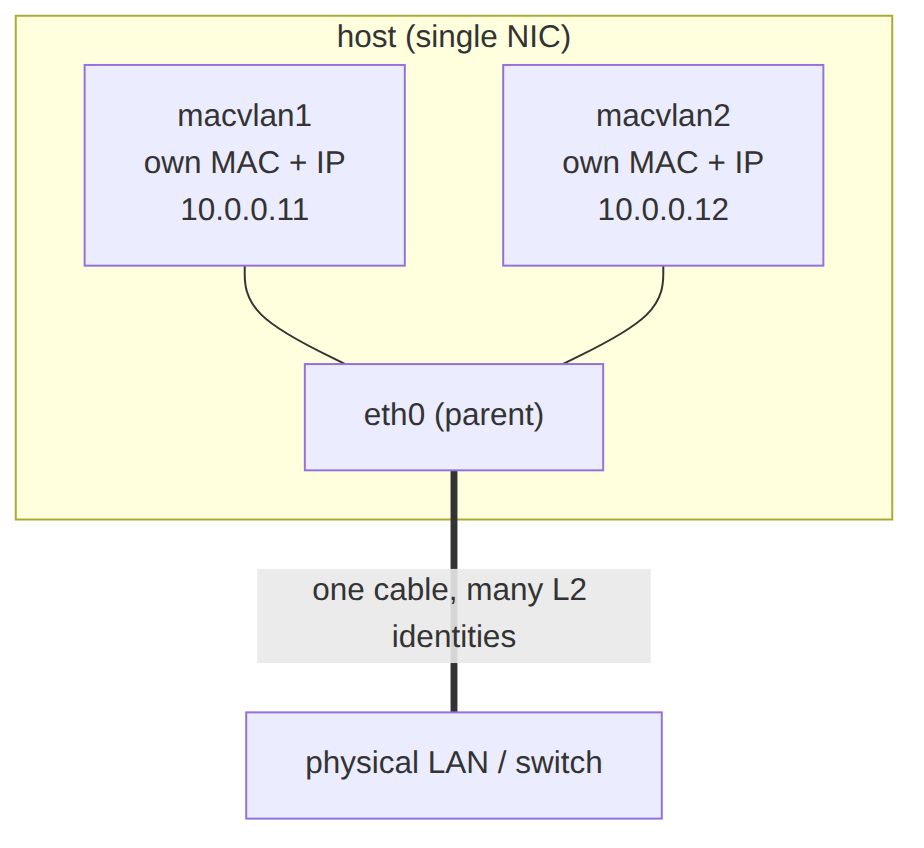

`ipvlan` looks similar but differs in one decisive way: every child shares the *parent's* MAC and is distinguished only by IP. The switch sees a single MAC on the port, which is exactly what you want when the port enforces MAC limits or port security, or in clouds that drop frames from unknown MACs — situations where `macvlan`'s extra MACs would be rejected.

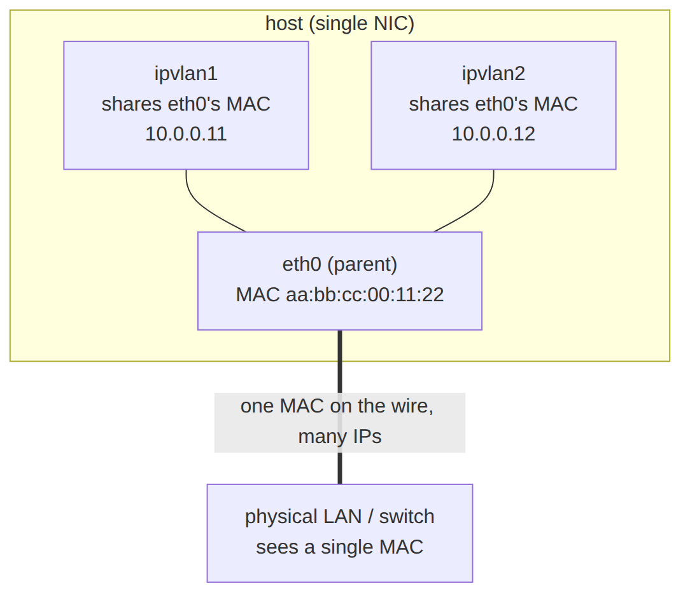

### GRE and IPIP — older tunnels

`gre`, `ipip`, and `ip6tnl` are the legacy point-to-point tunnel types. You will encounter them in older deployments and in some niche use cases (multicast over GRE, vendor interop). The creation shape is the same as everything else above. If you are designing a new overlay today, reach for VXLAN, Geneve, or WireGuard depending on the use case; GRE earns its keep mostly in interop and legacy.

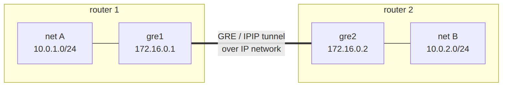

## Wiring interfaces across namespaces

Three rules cover almost every topology you will build:

1. **Move with `ip link set <iface> netns <ns>`.** Any interface can be moved between namespaces at any time. Addresses on the interface move with it; routes do not, because the routing table is per-namespace. Re-add the routes after the move.
2. **Single-ended interfaces live in one namespace.** A bridge, a dummy, a VLAN subinterface, a VXLAN endpoint, a WireGuard interface — each exists in exactly one namespace. To get traffic out, you connect it to something else.
3. **`veth` is how you cross.** Anywhere you would draw a cable between two boxes on a diagram, that is a `veth` pair in Linux. One end in each namespace, brought up, addressed (if L3 interfaces are part of your design).

A useful corollary: the four-line idiom "create a `veth` pair, move one end into a namespace, address both ends, bring them up" is the most-typed sequence in any Linux networking lab. Reaching for it should be automatic by the end of this article.

## The forwarding knob: `sysctl` and `ip_forward`

Wiring two interfaces into a namespace gives you a box with two legs. It does not give you a router. By default Linux behaves as a *host*: a packet that arrives on one interface addressed to someone else is dropped, not forwarded. Turning that behavior on is a single kernel setting, and it is the one line that turns the middle namespace of your topology into an actual router.

`sysctl` is the front end to the kernel's tunable parameters. It's the knobs exposed as files under `/proc/sys/`. The dotted name maps straight to a path: `net.ipv4.ip_forward` is the file `/proc/sys/net/ipv4/ip_forward`. `sysctl net.ipv4.ip_forward` reads it; `sysctl -w net.ipv4.ip_forward=1` writes it. (You could `cat` and `echo >` those files to identical effect, but `sysctl` is just the ergonomic wrapper that also knows the dotted-name syntax.)

Setting `net.ipv4.ip_forward=1` is the single bit that separates "a box with two NICs" from "a router": it tells the kernel to forward IPv4 packets between interfaces according to its routing table instead of dropping anything not meant for itself. IPv6 has its own switch, `net.ipv6.conf.all.forwarding`. 

The part that matters here: **`net.*` sysctls are per-namespace.** `ip_forward` set inside `r1` enables forwarding for `r1` and nothing else. The host and every other namespace keep their own value. A freshly created namespace starts with forwarding off, the safe default, which is precisely why each router namespace has to flip its own knob. Forwarding, reverse-path filtering (`rp_filter`), and most of the `net.*` tree are namespaced the same way interfaces and routing tables are. It is one more thing a namespace "has its own of."

These writes are runtime-only: they live in kernel memory and vanish when the namespace (or the box) goes away. The persistent form, dropping the same settings into `/etc/sysctl.d/` so they survive a reboot, is [[article-05-production-appliance]] territory. Here we set them live and let teardown forget them.

## Inspecting what you built

`ip -n <ns> -br link show` gives columnar interface output for a namespace, the form you want when you are eyeballing state. `ip -n <ns> -d link show <iface>` adds detailed type-specific fields: VLAN ID, VXLAN VNI, bond mode, MACVLAN parent. `ip -n <ns> -br addr show` is the equivalent for addresses. The `-j` modifier from [[article-01-linux-for-network-engineers|Article 1]] applies here too: every one of these commands emits JSON on demand, which is the right surface to feed into anything downstream.

For bridges specifically, `bridge link show` lists which interfaces are enslaved to which bridges, and `bridge fdb show br br0` prints the MAC learning table for `br0`. The latter is the Linux equivalent of `show mac address-table` and the right reflex when something on an L2 segment is not reaching where you expect.

## The labs

Five labs, all built from `iproute2` and the `bridge` command — no vendor software, no routing daemons, no overlays. The labs ship as a single Docker workbench container (same packaging convention as [Lab A01](../labs/lab-a01-translation/)) so you can clone the repo, run one command, and have every tool you need; the topologies themselves live in `ip netns add` namespaces *inside* that container, which is exactly the primitive this article is about. The walkthroughs and expected output live in the lab directory; this section is the framing.

**[Lab A02 — Router out of nothing](../labs/lab-a02-topologies/lab-1-router.md).** Three namespaces in a line (`host`, `r1`, `r2`), two `veth` pairs, static routes, IP forwarding enabled on `r1`. End-to-end ping verified, `tcpdump` on `r1` confirms forwarding. Optional extensions: add a second host on the `r2` side; delete the return route on `r2` and watch asymmetric routing fail in real time. Roughly twenty commands and you have a working router with no vendor software and no license.

**[Lab A02 — Switch out of nothing](../labs/lab-a02-topologies/lab-2-switch.md).** A `bridge` interface inside a `sw1` namespace, three host namespaces attached via veth pairs enslaved as bridge ports. Same-subnet addressing, end-to-end ping verified, MAC learning visible in `bridge fdb show`, ARP behavior visible with `tcpdump -e`. Optional extension: turn on 802.1Q VLAN filtering, place hosts in different VLANs, watch the broadcast domain split.

**[Lab A02 — Compose them](../labs/lab-a02-topologies/lab-3-compose.md).** The bridge from Lab 2 wired to a router leg from Lab 1, with two hosts on each side. The resulting `host — switch — router — switch — host` topology is functionally a small campus or a one-rack data center. Once you have built this by hand, every Containerlab YAML you read after this article is the same shape, written more compactly. That is the point of doing it this way.

**[Lab A02 — SVIs](../labs/lab-a02-topologies/lab-4-svi.md).** A VLAN-aware bridge with a Switched Virtual Interface per VLAN — the same `eth0.100` subinterface primitive, created on a bridge instead of a NIC, and given an IP. Same-VLAN hosts stay on L2; with `ip_forward` on, the bridge routes between its SVIs. That single move turns the L2 switch from Lab 2 into a layer-3 switch, no extra hardware.

**[Lab A02 — Trunks](../labs/lab-a02-topologies/lab-5-trunk.md).** Two VLAN-aware bridges joined by a single 802.1Q trunk — one veth whose bridge ports are tagged in more than one VLAN. Same-VLAN hosts reach each other across the two switches, different VLANs stay isolated despite sharing the wire, and `tcpdump -e` on the trunk shows the VLAN tag doing the multiplexing. Optional extension: add SVIs to route between VLANs across the trunk, the "router on a stick" pattern.

Teardown for all five is `ip netns del <name>` per namespace. Namespaces clean up everything they contain on exit, including bridges, addresses, routes, and enslaved interfaces.

## How LLM agents fit here

Same frame as [[article-01-linux-for-network-engineers|Article 1]], widened by one notch. The agent is still translator and explainer, not actor. You are still typing every command. What changes is that the proposals are now multi-step: a topology change is rarely one `ip` command, it is a sequence of creates, moves, addresses, ups, and verifications.

The prompt shape that works at this scale is shaped around that sequence:

> "I have the following topology: `<sketch>`. I want to add `<thing>`. Walk me through the `ip` and `bridge` commands in order. Do not skip steps. After each step, tell me what `ip -br link` and `ip route show` should show if the step worked."

The "tell me what verification should show" tail is what keeps the loop tight. You run each step, you check the output, you ask the agent to explain anything you do not recognize. If the agent's prediction matches the output, the step worked. If it does not, one of you is wrong and you have a concrete thing to investigate.

The interface catalogue earlier in this article is the vocabulary that lets these prompts be specific. "I need an L2-over-UDP overlay between two hosts" is a better prompt than "I need to connect these two hosts." Specificity in, specificity out. Naming the kernel object you think you want also forces the agent to either confirm your choice or push back on it, which is a useful side effect.

A second prompt shape worth keeping is the menu request from Article 1, applied at the interface layer:

> "I want to give this Linux router a second uplink that load-shares with the first. List the Linux mechanisms that could do this — bond LACP, ECMP via `ip route nexthop`, policy routing with `ip rule` — with a one-sentence trade-off for each. Do not write any commands yet."

That sequence — menu first, choice second, commands third — is the senior-engineer pattern, and it is the one that survives the longest as the agent's tool surface widens later in the series. Article 11 ([[article-12-containerlab]]) is where the sandbox enters the picture; Article 22 ([[article-23-mcp]]) is where the agent gets its hands on real tools. Until then, the reader's hands stay on the keyboard.

## What you should be able to do now

- Create any of the common Linux interface types with `ip link add ... type X` and address them.
- Build a multi-namespace topology from veth pairs and bridges with no tool other than `iproute2`.
- Reason about routing-domain isolation in terms of namespaces the same way you reason about VRFs and physical chassis isolation.
- Recognize that Containerlab, Kubernetes pod networking, and Docker bridge networking are all the same primitives in different wrappers.
- Read `ip -br link`, `ip -d link show`, and `bridge fdb show` output and predict what each is telling you.

## What comes next

[[article-03-common-network-admin-tasks]] is the next article. With the substrate in hand, the next thing the reader needs is the catalogue of recurring jobs: VLAN trunk to a new switch, ACL for a new subnet, NAT for outbound, port mirror, DHCP relay, NTP client. Each one mapped from the IOS command you would have typed to the Linux equivalent, with verification at the end. After Article 3, you can stop reaching for a vendor box for almost anything you used to do on one.
